# 数据收益分配系统 V1.0 用户使用手册

| 文档项 | 内容 |
| --- | --- |
| 软件名称 | 数据收益分配系统 |
| 版本号 | V1.0 |
| 文档类型 | 用户使用手册 |
| 系统定位 | 数据收益分配模拟与审计说明系统 |
| 适用用途 | 软著提交、本地演示、功能说明 |
| 重要声明 | 系统输出结果仅作为收益分配模拟参考，不构成法律结算、财务付款、合同履约或主管单位审批依据。 |

## 一、软件概述

### 1.1 软件名称

数据收益分配系统 V1.0。

### 1.2 软件用途

数据收益分配系统用于完成数据接入、数据资源查看、参与方维护、质量评估、数元计量、贡献度与效用计算、MD-DShap 权重计算、合同比例配置、收益分配模拟、报告导出和审计追溯等操作。用户可以在页面上查看每一步的处理状态，并将计算结果导出为 Markdown、CSV、JSON 或 JSONL，用于本地演示、业务复核和审计说明。

本系统用于收益分配模拟。系统根据质量、使用、贡献、效用和权重信息生成分配参考结果，说明数据资源和参与方在模拟收益分配中的作用。系统不生成付款指令，也不替代合同、法律、财务或主管单位审批流程。

### 1.3 适用对象

- 数据资源管理人员。
- 数据运营人员。
- 数据收益分配业务人员。
- 算法审核人员。
- 审计查看人员。
- 软著演示或本地测试人员。

### 1.4 使用边界

本系统输出结果仅作为收益分配模拟参考，不构成法律结算、财务付款、合同履约、资产评估、正式审计结论或主管单位审批依据。用户在报告、导出文件和审计说明中看到的金额、权重、比例、校验和、快照等内容，均用于模拟展示和追溯说明。

## 二、运行环境与基本配置

### 2.1 硬件环境

| 配置项 | 推荐配置 |
| --- | --- |
| CPU | Intel i3 或同等性能以上处理器 |
| 内存 | 8GB 及以上 |
| 硬盘 | 10GB 及以上可用空间 |
| 网络 | 本地演示可不依赖外网，前后端服务需能在本机端口访问 |

### 2.2 软件环境

| 环境项 | 说明 |
| --- | --- |
| 操作系统 | macOS、Linux 或 Windows。当前截图和手册基于本地 macOS 开发环境生成。 |
| 后端运行环境 | Python。本项目后端以 `backend.dvas.server` 启动，本地 HTTP 服务由 `ThreadingHTTPServer` 和 `DvasApplication` 提供。 |
| 前端运行环境 | Node.js、React、Vite。前端源码位于 `ui_prototype/`。 |
| 数据存储 | P0 本地演示默认使用 JSON runtime state；PostgreSQL 位于 `db/`，作为参考数据库或验收数据库。 |
| 浏览器 | Chrome、Edge 等现代浏览器。 |

### 2.3 启动后端服务

用户在本地终端进入项目根目录后，执行以下命令启动后端服务：

```bash
cd <项目根目录>
python3.12 -m backend.dvas.server
```

后端默认监听 `http://127.0.0.1:8000/api/v1`。如果本机 Python 命令不同，可根据本地环境使用等效的 Python 3.12 命令。

### 2.4 启动前端服务

用户在另一个终端进入前端目录后，执行以下命令：

```bash
cd <项目根目录>/ui_prototype
npm install
npm run dev
```

当前 `package.json` 中的开发命令为 `vite --host 127.0.0.1`。前端默认通过 `VITE_API_BASE_URL` 或 `VITE_DVAS_API_BASE_URL` 读取后端地址；未配置时使用 `http://127.0.0.1:8000/api/v1`。

### 2.5 访问系统

前端服务启动后，用户可以在浏览器访问：

```text
http://127.0.0.1:5173/
```

如果本机 Vite 使用其他端口，应以终端输出的访问地址为准。

### 2.6 登录或进入系统

当前页面包含登录入口。用户输入由系统管理员分配的账号后，可以进入系统首页。登录和用户权限能力属于当前本地演示与 P1 扩展能力，生产环境应替换默认开发账号和密码策略。P0 业务以本地演示、数据接入、计算、报告和审计记录为主。

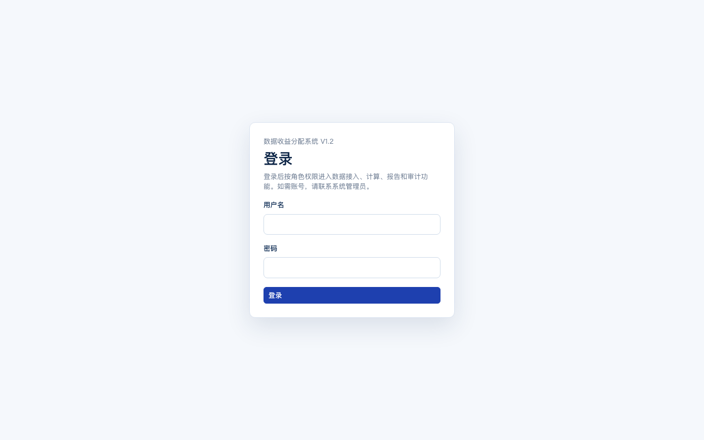

## 三、软件整体操作流程

用户使用本系统时，一般按以下流程操作：

1. 打开浏览器进入系统地址。
2. 登录或进入系统首页。
3. 选择演示数据或上传 JSON 数据包。
4. 查看数据资源。
5. 查看和维护参与方。
6. 执行质量评估。
7. 执行数元计量。
8. 执行贡献度与效用计算。
9. 执行 MD-DShap 权重计算。
10. 配置合同比例方案。
11. 执行收益分配模拟。
12. 导出报告。
13. 查看审计日志。


## 四、系统首页

### 4.1 页面说明

系统首页用于展示当前项目、项目状态、流程进度、风险提示、快捷入口和一键完整计算入口。用户可以通过首页了解当前项目是否已完成数据接入、质量评估、数元计量、效用计算、权重计算、收益分配和报告导出。

### 4.2 操作入口

用户打开系统地址并完成登录后，默认进入系统首页。系统首页对应路由为 `/dashboard`。

### 4.3 页面主要区域

- 当前项目和项目状态。
- 数据资源数量、参与方数量、数元统计金额、当前收益池等概览指标。
- 我的项目、我的上传、我的任务、我的报告等个人工作概览。
- 风险边界和模拟参考声明。
- 选择演示数据、执行完整链路计算等快捷操作。

### 4.4 主要按钮说明

| 按钮名称 | 功能说明 | 点击后效果 | 当前可用性 |
| --- | --- | --- | --- |
| 选择演示数据 | 载入系统内置样例数据。 | 系统生成演示项目、数据包、资源和参与方信息，并刷新首页状态。 | P0 可用 |
| 执行完整链路计算 | 按完整链路执行质量评估、数元计量、贡献效用、MD-DShap 权重和收益分配模拟。 | 前置条件满足时生成阶段结果；缺少合同比例方案或数据接入时会显示错误提示。 | P0 可用 |
| 查看风险边界 | 查看模拟参考和非法律结算提示。 | 系统展示风险边界说明。 | P0 可用 |
| 指标卡片和个人工作卡片 | 查看当前统计、上传、任务或报告概览。 | 系统跳转或展示对应信息区域。 | P0/P1 视权限可见 |

### 4.5 页面截图

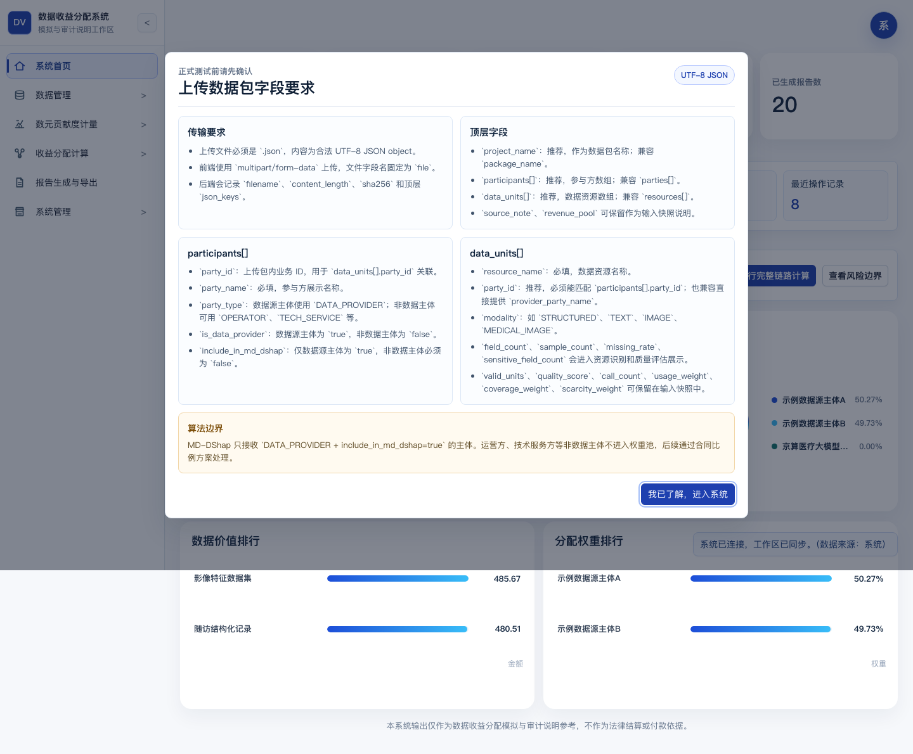

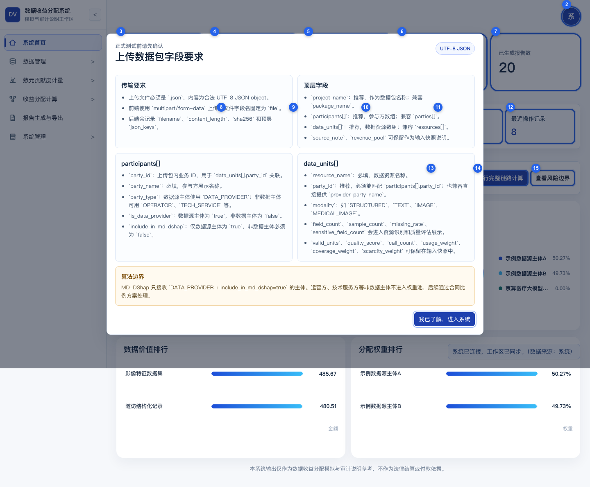

## 五、数据管理

### 5.1 数据接入管理

#### 5.1.1 功能说明

数据接入管理页面用于选择演示数据、上传 JSON 数据包、查看数据包列表、查看校验状态、预览数据包内容以及查看上传失败原因。用户完成数据接入后，系统会生成输入快照，并为后续数据资源识别、参与方维护和质量评估提供基础数据。

#### 5.1.2 操作入口

用户点击左侧导航“数据管理”，再进入“数据接入管理”。页面路由为 `/data/ingestion`。

#### 5.1.3 操作步骤

1. 用户进入数据接入管理页面。
2. 用户点击“使用示例数据”或“上传 JSON”。
3. 系统进行格式和字段校验。
4. 校验通过后，系统生成数据包和输入快照。
5. 校验失败时，用户点击“失败详情”查看错误字段和原因。
6. 用户可以点击“预览”查看数据包摘要。

#### 5.1.4 按钮说明

| 按钮名称 | 功能说明 | 点击后效果 | 当前可用性 |
| --- | --- | --- | --- |
| 下载 CSV 模板 | 下载 CSV 导入模板。 | 系统返回模板文件。 | P1/本地扩展 |
| 下载 XLSX 模板 | 下载 XLSX 导入模板。 | 系统返回模板文件。 | P1/本地扩展 |
| 导入 CSV / 导入 XLSX | 上传模板文件生成数据包。 | 系统校验模板并生成数据包；失败时提示原因。 | P1/本地扩展 |
| 使用示例数据 | 载入内置演示数据。 | 系统生成演示数据包、资源和参与方。 | P0 可用 |
| 上传 JSON | 上传本地 JSON 数据包。 | 系统校验并生成数据包；失败时不生成有效包。 | P0 可用 |
| 全部有权限数据包 / 我上传的 | 切换数据包列表范围。 | 页面刷新对应范围的数据包。 | P1 权限过滤展示 |
| 预览 | 查看数据包摘要。 | 打开或刷新预览区域。 | P0 可用 |
| 失败详情 | 查看校验失败字段和原因。 | 展示错误说明和修复建议。 | P0 可用 |
| 删除 | 删除未锁定数据包。 | 系统提示二次确认，确认后删除并写入审计。 | P0 可用，谨慎操作 |
| 查看数据资源 / 维护参与方 / 启动质量评估 | 进入后续流程页面。 | 系统跳转到对应页面。 | P0 可用 |

#### 5.1.5 页面截图

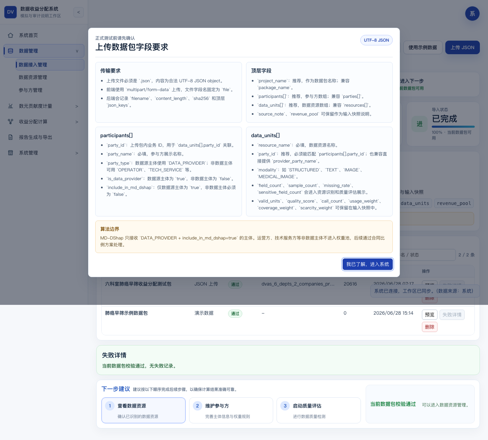

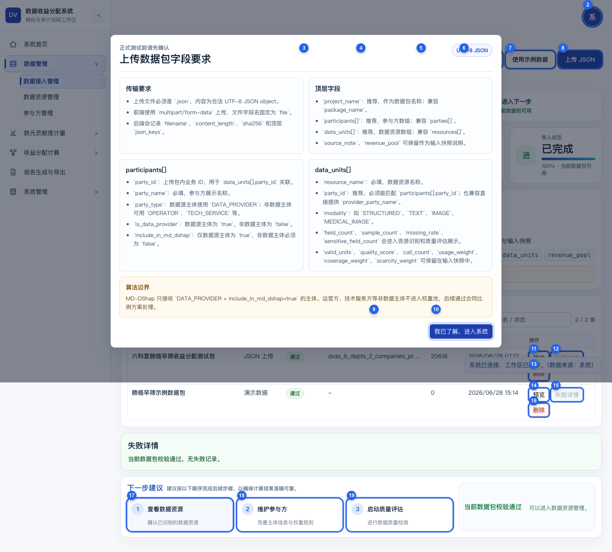

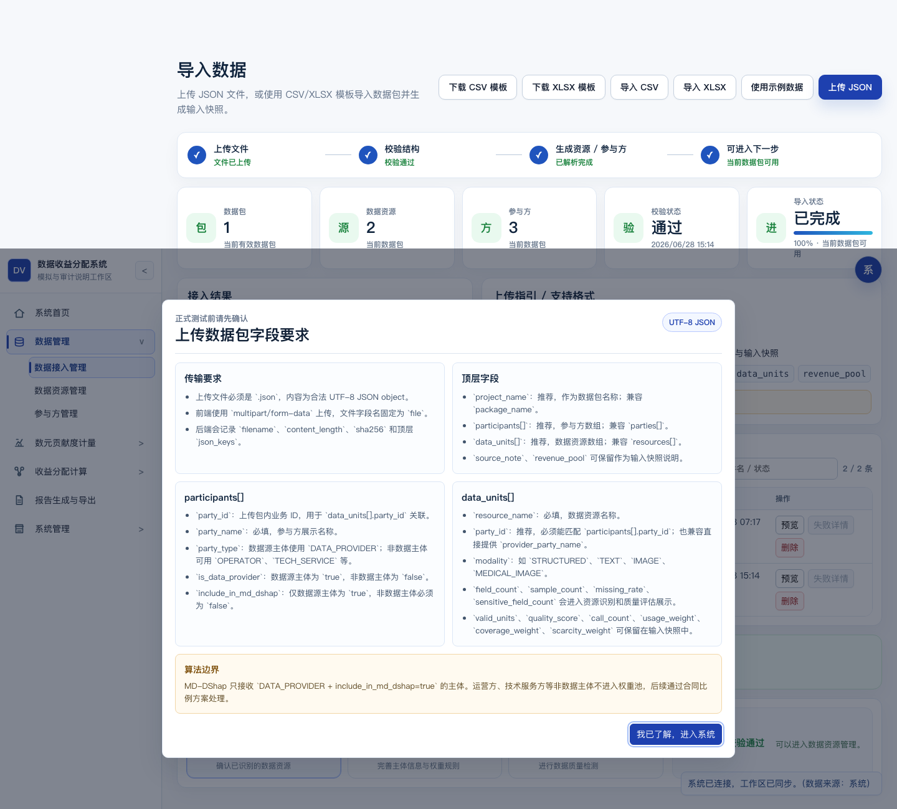

### 5.2 数据资源管理

#### 5.2.1 功能说明

数据资源管理页面用于查看系统识别出的数据资源。页面展示资源名称、资源模态、字段数、样本数、缺失率、关联主体、是否进入计算等信息。用户可以查看资源详情，也可以将资源关联到对应的数据源主体。

#### 5.2.2 操作入口

用户点击左侧导航“数据管理”，进入“数据资源管理”。页面路由为 `/data/resources`。

#### 5.2.3 按钮说明

| 按钮名称 | 功能说明 | 点击后效果 | 当前可用性 |
| --- | --- | --- | --- |
| 导出资源摘要（暂未启用） | 计划用于导出资源摘要。 | 当前后端未提供 P0 资源摘要导出接口，按钮按缺口处理，不生成模拟文件。 | 后端缺口/禁用 |
| 详情 | 查看资源字段、模态和基础统计。 | 打开详情区域或抽屉。 | P0 可用 |
| 关联主体 | 将资源关联到数据源主体。 | 系统保存资源与参与方关系，并用于后续计算前置条件。 | P0 可用 |

#### 5.2.4 页面截图

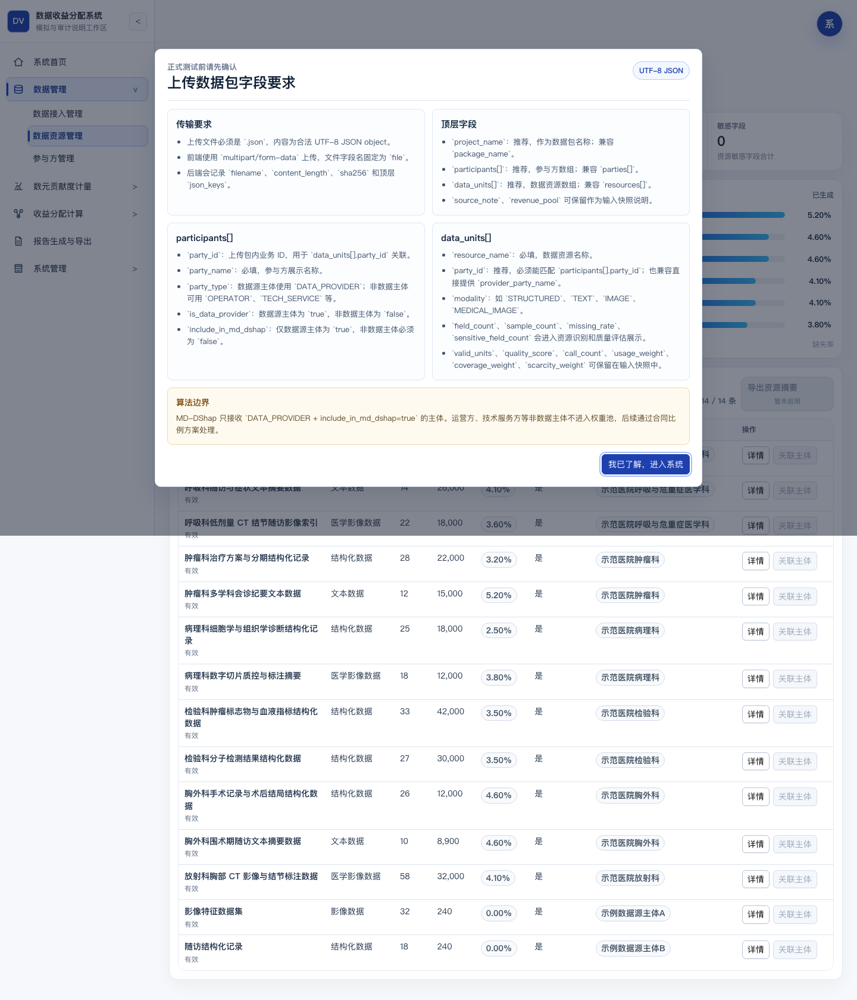

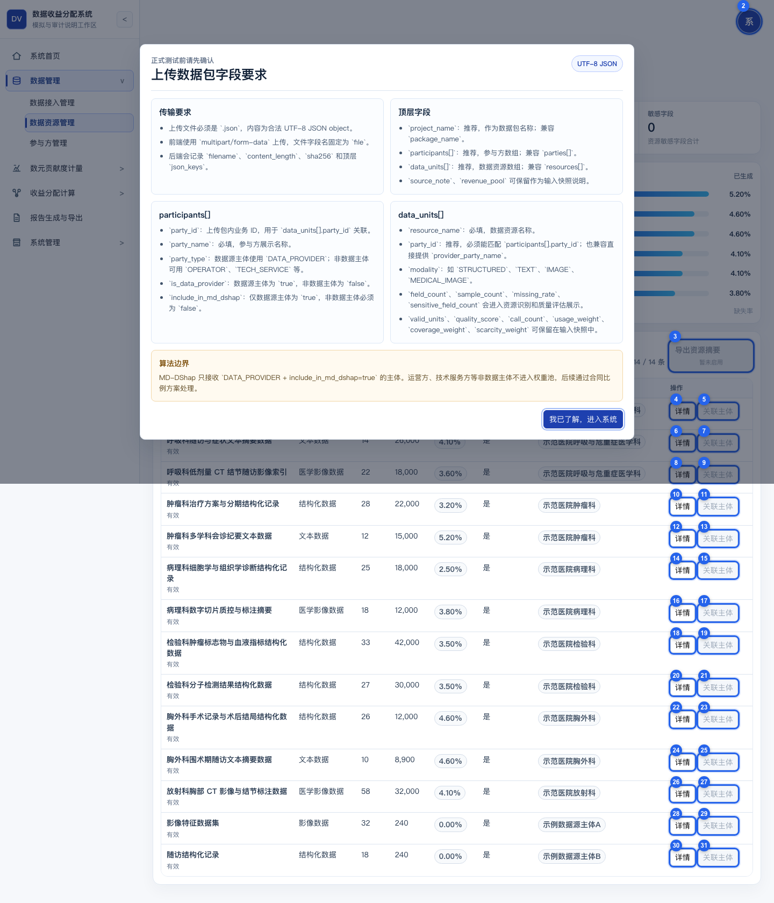

### 5.3 参与方管理

#### 5.3.1 功能说明

参与方管理页面用于查看和维护参与方。页面展示参与方类型、是否数据源主体、是否进入 MD-DShap、启用状态和资源关联数量等信息。数据源主体默认进入数据贡献权重计算；运营服务方、合同服务方等非数据主体不进入 MD-DShap 权重池，而是通过合同比例方案参与收益分配模拟。

#### 5.3.2 操作入口

用户点击左侧导航“数据管理”，进入“参与方管理”。页面路由为 `/data/parties`。

#### 5.3.3 按钮说明

| 按钮名称 | 功能说明 | 点击后效果 | 当前可用性 |
| --- | --- | --- | --- |
| 查看列表与主体状态 | 查看参与方类型、是否数据源主体、是否进入 MD-DShap 和启用状态。 | 页面展示参与方当前状态；贡献、效用和权重结果在对应计算页面或报告中查看。 | P0 可用 |
| 新增参与方 | 创建新的参与方。 | 打开新增表单，保存后生成参与方记录。 | P0 可用 |
| 编辑 | 修改参与方基础信息。 | 打开编辑区域，保存后更新参与方并写入审计。 | P0 可用 |
| 停用 | 停用参与方。 | 系统提示确认，停用后不再作为有效主体参与后续操作。 | P0 可用，谨慎操作 |
| 质量评估管理 / MD-DShap 计算管理 / 收益分配模拟 | 进入后续业务页面。 | 系统跳转到对应页面。 | P0 可用 |

#### 5.3.4 页面截图

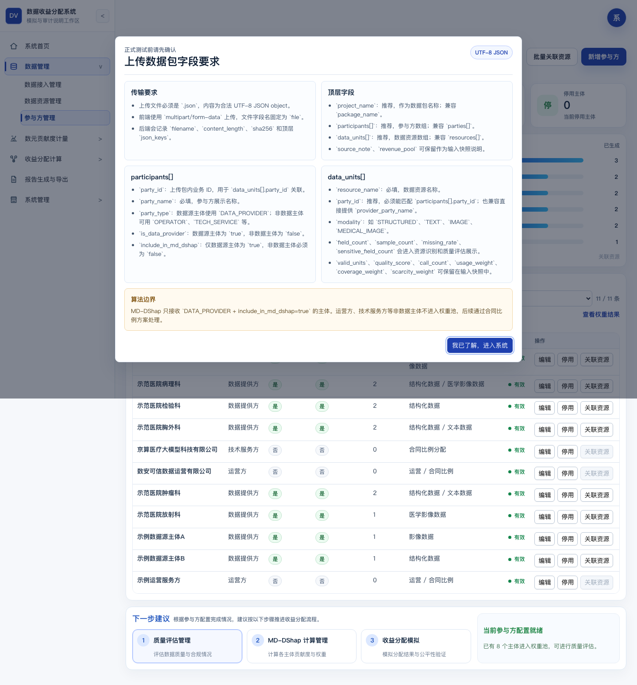

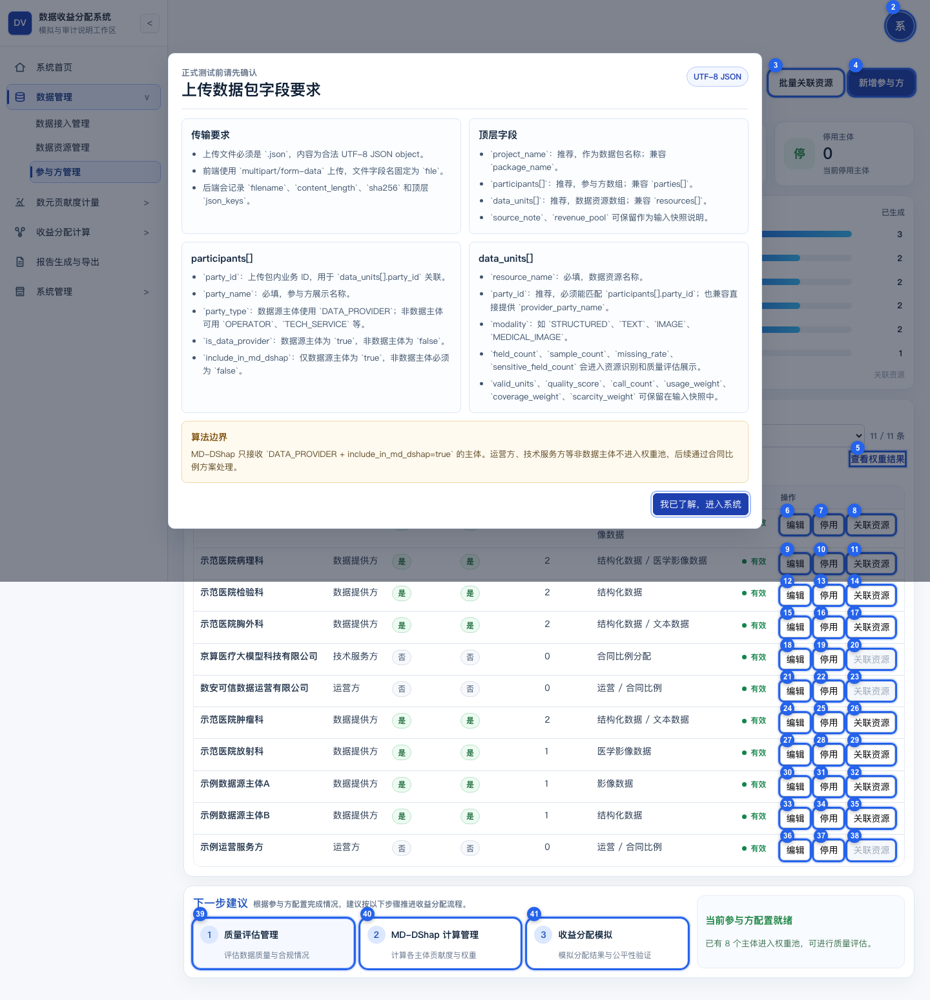

## 六、数元贡献度计量

### 6.1 质量评估管理

#### 6.1.1 功能说明

质量评估管理页面用于执行和查看数据质量评估结果。页面展示质量总分、质量等级、维度得分、资源级评分和证据说明。用户可以查看评分详情，也可以重新评估生成新的质量结果版本。

#### 6.1.2 操作步骤

1. 用户进入“数元贡献度计量 - 质量评估管理”。
2. 用户查看前置条件和已有质量评估结果。
3. 用户点击“重新评估”或相关评估按钮。
4. 系统生成质量评估结果。
5. 用户查看总分、等级、维度得分和证据说明。

#### 6.1.3 按钮说明

| 按钮名称 | 功能说明 | 点击后效果 | 当前可用性 |
| --- | --- | --- | --- |
| 查看证据 | 查看质量评分证据。 | 打开证据说明区域。 | P0 可用 |
| 参数配置 | 查看或配置质量评估参数。 | 打开参数配置说明或跳转参数页面。 | P0/P1 视权限可用 |
| 重新评估 | 重新执行质量评估。 | 系统生成新的评估结果，历史结果保留。 | P0 可用 |
| 查看全部资源评分 | 查看所有资源的质量评分。 | 打开资源评分列表或热力图。 | P0 可用 |
| 查看评分 | 查看某项评分细节。 | 打开评分详情。 | P0 可用 |

#### 6.1.4 页面截图

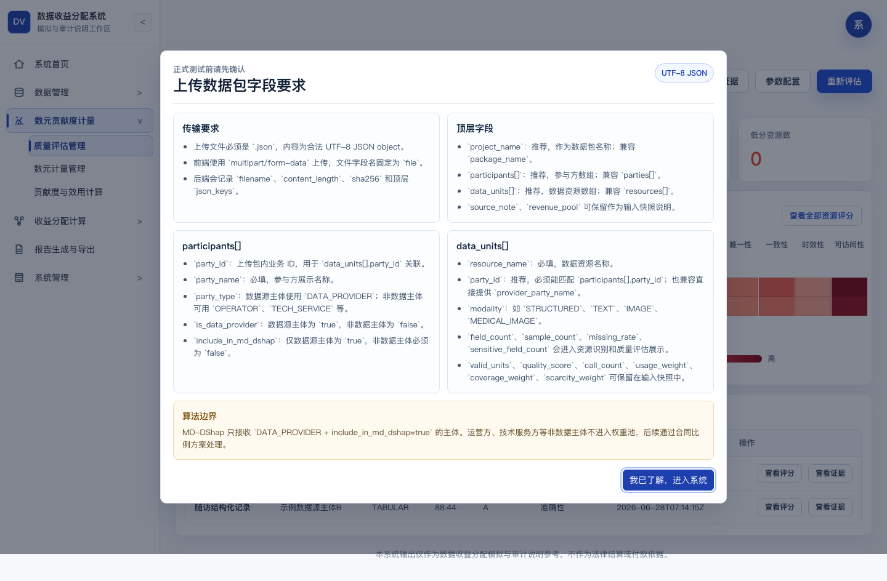

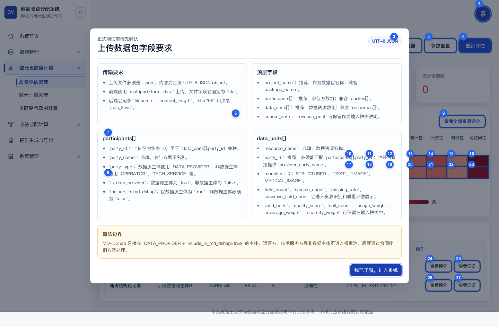

### 6.2 数元计量管理

#### 6.2.1 功能说明

数元计量管理页面用于查看和执行数元计量。页面展示基准价、调用量、质量系数、技术系数、专家系数、发展系数和计量金额等信息。用户完成质量评估后，可以执行数元计量并查看明细。

#### 6.2.2 按钮说明

| 按钮名称 | 功能说明 | 点击后效果 | 当前可用性 |
| --- | --- | --- | --- |
| 查看明细 | 查看数元计量明细。 | 打开明细表或详情区域。 | P0 可用 |
| 执行数元计量 | 按当前参数执行数元计量。 | 系统生成数元计量结果，并推进流程状态。 | P0 可用 |
| 导出计量结果 | 导出计量结果。 | 如后端导出能力可用，则生成结果文件；否则显示不可用提示。 | 视当前接口可用性 |

#### 6.2.3 页面截图

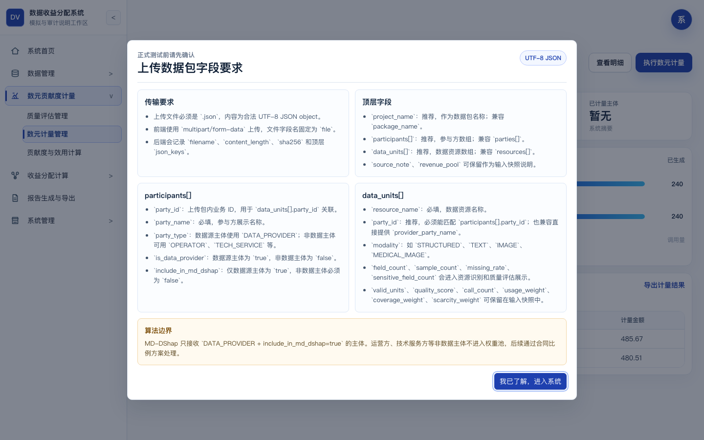

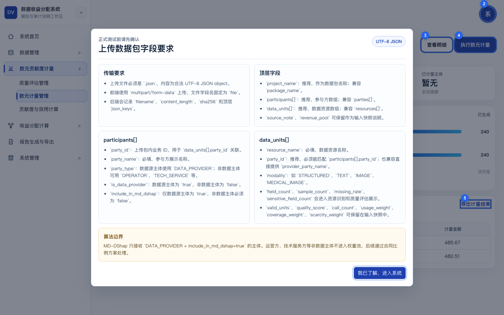

### 6.3 贡献度与效用计算

#### 6.3.1 功能说明

贡献度与效用计算页面用于查看贡献因子、归一化贡献、质量因子、使用因子、场景因子、效用值和计算依据。用户可以查看计算说明、重新计算效用，也可以通过图形控件查看不同主体之间的效用关系。

#### 6.3.2 按钮说明

| 按钮名称 | 功能说明 | 点击后效果 | 当前可用性 |
| --- | --- | --- | --- |
| 查看计算说明 | 查看贡献度和效用计算口径。 | 页面展示说明或打开详情。 | P0 可用 |
| 参数配置 | 查看或配置贡献和效用参数。 | 打开参数配置或说明区域。 | P0/P1 视权限可用 |
| 重新计算 | 重新执行贡献度与效用计算。 | 系统生成新的效用结果。 | P0 可用 |
| 缩小 / 放大 / 重置 | 控制图形视图显示比例。 | 图形区域缩放或恢复默认视图。 | P0 可用 |
| 示例数据源主体A / 示例数据源主体B | 选择或查看主体节点。 | 页面突出显示对应主体信息。 | P0 可用 |
| 查看详情 | 查看主体贡献或效用详情。 | 打开详情区域。 | P0 可用 |
| 查看依据 | 查看计算依据和 trace。 | 打开依据说明或 trace 信息。 | P0 可用 |

#### 6.3.3 页面截图

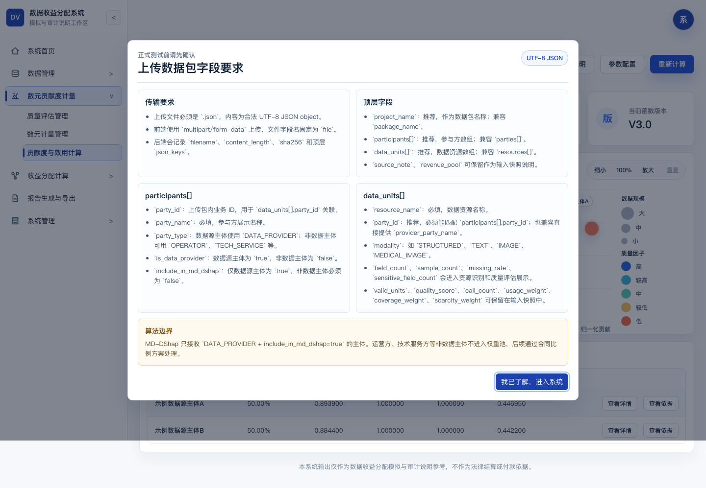

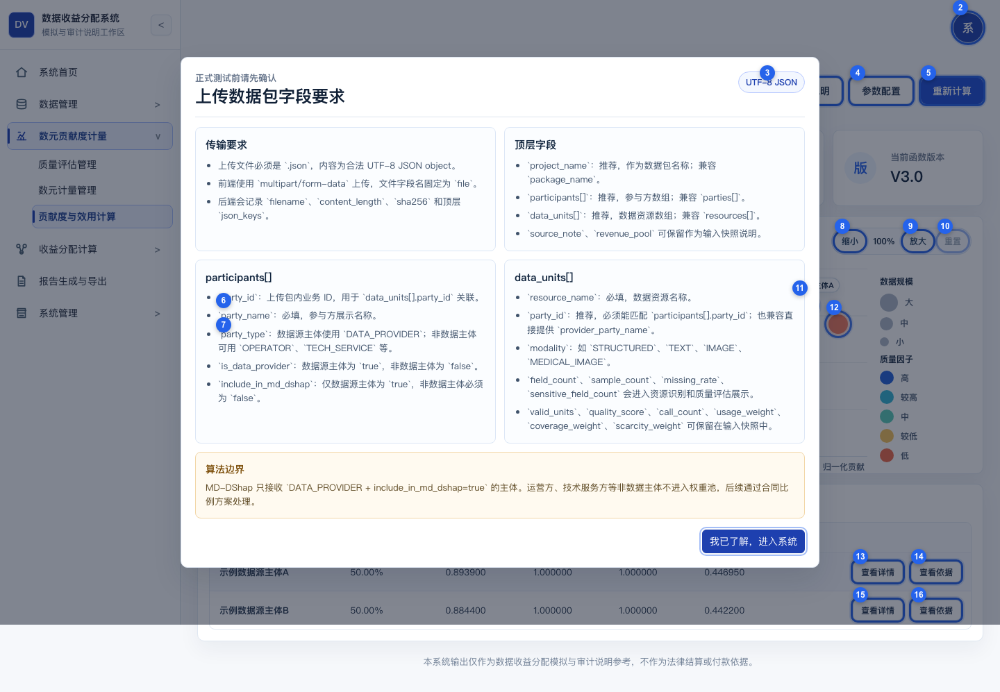

## 七、收益分配计算

### 7.1 MD-DShap 计算管理

#### 7.1.1 功能说明

MD-DShap 计算管理页面用于计算数据源主体之间的贡献权重。MD-DShap 输出的是权重参考，不是最终付款指令。非数据主体不进入 MD-DShap 权重池，系统会在页面中展示参与方集合、任务状态、权重结果、边际贡献和算法审计说明。

#### 7.1.2 操作步骤

1. 用户进入“收益分配计算 - MD-DShap 计算管理”。
2. 用户查看参与方集合，确认数据源主体进入权重池。
3. 用户确认非数据主体不进入权重池。
4. 用户点击“启动计算”。
5. 系统输出参与方权重。
6. 用户查看权重、边际贡献或算法审计说明。

#### 7.1.3 按钮说明

| 按钮名称 | 功能说明 | 点击后效果 | 当前可用性 |
| --- | --- | --- | --- |
| 查看审计 | 查看算法审计说明。 | 打开审计说明或跳转报告导出。 | P0 可用 |
| 查看边际贡献 | 查看边际贡献 trace。 | 打开边际贡献明细。 | P0 可用 |
| 配置参数 | 查看或配置 MD-DShap 参数。 | 打开参数配置区域。 | P0/P1 视权限可用 |
| 启动计算 | 执行 MD-DShap 权重计算。 | 系统生成数据源主体权重结果。 | P0 可用 |
| 我发起的任务 / 当前项目任务 / 全部有权限任务 | 切换任务列表范围。 | 页面刷新任务列表。 | P1 权限过滤展示 |
| 查看摘要明细 / 查看详情 | 查看任务或权重详情。 | 打开详情区域。 | P0 可用 |
| 上一步：贡献与效用计算 | 返回上一流程页面。 | 跳转到贡献度与效用计算。 | P0 可用 |
| 下一步：进入收益分配模拟 | 进入收益分配模拟页面。 | 跳转到收益分配模拟。 | P0 可用 |

#### 7.1.4 页面截图

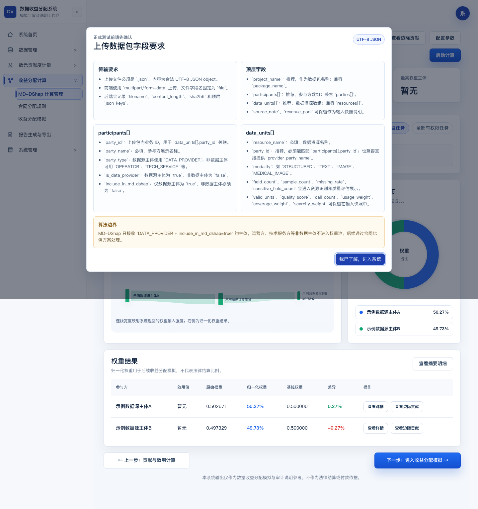

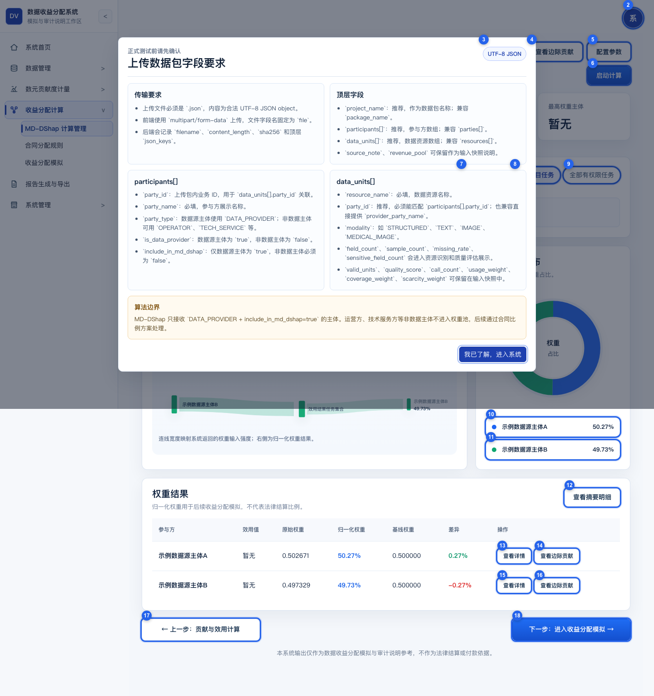

### 7.2 合同分配规则

#### 7.2.1 功能说明

当前系统保留独立的“合同分配规则”页面。该页面的主流程用于维护项目合同比例方案，包括总收益、数据源收益池比例和非数据主体合同比例。保存合同比例方案后，收益分配模拟会先按合同比例划分非数据主体合同金额和数据源主体收益池，再使用 MD-DShap 归一化权重分配数据源主体收益池。

旧式合同约束接口在后端仍可能作为兼容路径存在，但当前项目级合同比例模拟以保存的合同比例方案为准。用户手册不将未接入项目级模拟的旧约束写成当前 P0 主流程能力。

#### 7.2.2 操作步骤

1. 用户进入“收益分配计算 - 合同分配规则”。
2. 用户查看当前合同比例状态。
3. 用户点击“编辑数据源池比例”，设置数据源主体收益池比例。
4. 用户点击“新增非数据主体比例”，为非数据主体配置比例。
5. 用户点击“保存合同比例方案”。
6. 系统校验比例合计是否为 100%。
7. 保存成功后，用户可以点击“去模拟页”或“保存并去收益分配模拟”。

#### 7.2.3 按钮说明

| 按钮名称 | 功能说明 | 点击后效果 | 当前可用性 |
| --- | --- | --- | --- |
| 编辑数据源池比例 | 设置数据源收益池比例。 | 打开编辑区域或抽屉。 | P0 可用 |
| 新增非数据主体比例 | 为非数据主体增加合同比例。 | 打开新增表单。 | P0 可用 |
| 保存合同比例方案 | 保存总收益、数据源池比例和非数据主体比例。 | 后端校验比例合计，成功后返回方案状态。 | P0 可用 |
| 编辑 | 编辑已有比例项。 | 打开编辑区域。 | P0 可用 |
| 移除 | 移除比例项。 | 从草稿中移除，保存后生效。 | P0 可用，谨慎操作 |
| 去模拟页 | 进入收益分配模拟页面。 | 跳转到收益分配模拟。 | P0 可用 |
| 清空配置 | 清空当前项目合同比例方案。 | 系统提示确认，确认后清空方案。 | P0 可用，谨慎操作 |
| 保存并去收益分配模拟 | 保存方案后进入模拟页面。 | 保存成功后跳转。 | P0 可用 |

#### 7.2.4 页面截图

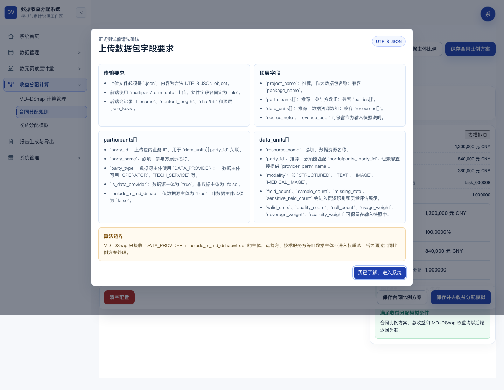

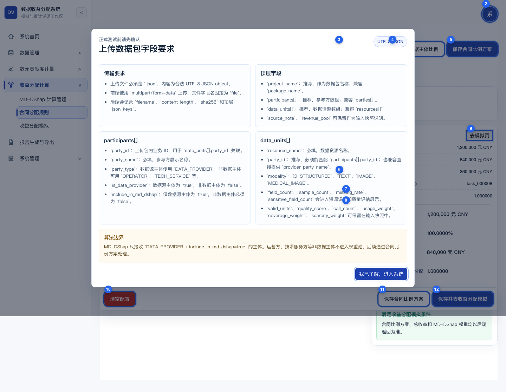

### 7.3 收益分配模拟

#### 7.3.1 功能说明

收益分配模拟页面用于根据已保存的合同比例方案和 MD-DShap 权重结果生成收益分配模拟结果。当前项目级主流程要求先配置并保存合同比例方案；没有合同比例方案时，系统会阻止执行完整链路或收益分配模拟，并提示用户先到合同分配规则页保存方案。

当前收益分配模拟口径是：总收益先按合同比例方案划分非数据主体合同金额和数据源主体收益池；数据源主体收益池再按 MD-DShap 归一化权重分配给数据源主体；最终结果仅为模拟参考，非法律结算。

#### 7.3.2 操作步骤

1. 用户进入“收益分配计算 - 收益分配模拟”。
2. 用户查看当前收益池、合同比例摘要和权重状态。
3. 如缺少合同比例，用户点击“去配置合同分配规则”。
4. 前置条件满足后，用户点击“执行分配模拟”。
5. 系统生成分配结果表。
6. 用户可以点击“锁定方案”锁定当前模拟参考方案。
7. 用户可以点击“导出报告”进入报告生成与导出页面。

#### 7.3.3 按钮说明

| 按钮名称 | 功能说明 | 点击后效果 | 当前可用性 |
| --- | --- | --- | --- |
| 去配置合同分配规则 / 去配置 | 进入合同分配规则页面。 | 跳转到合同比例配置。 | P0 可用 |
| 执行分配模拟 | 生成收益分配模拟结果。 | 系统输出非数据主体合同金额和数据源主体分配金额。 | P0 可用 |
| 去 MD-DShap | 进入 MD-DShap 权重计算页面。 | 跳转到权重计算管理。 | P0 可用 |
| 锁定方案 | 锁定当前模拟参考方案。 | 系统写入确认状态，后续不可直接覆盖历史。 | P0 可用，谨慎操作 |
| 导出报告 | 进入报告生成与导出页面。 | 用户可生成 Markdown、CSV、JSON 或审计日志。 | P0 可用 |

#### 7.3.4 页面截图

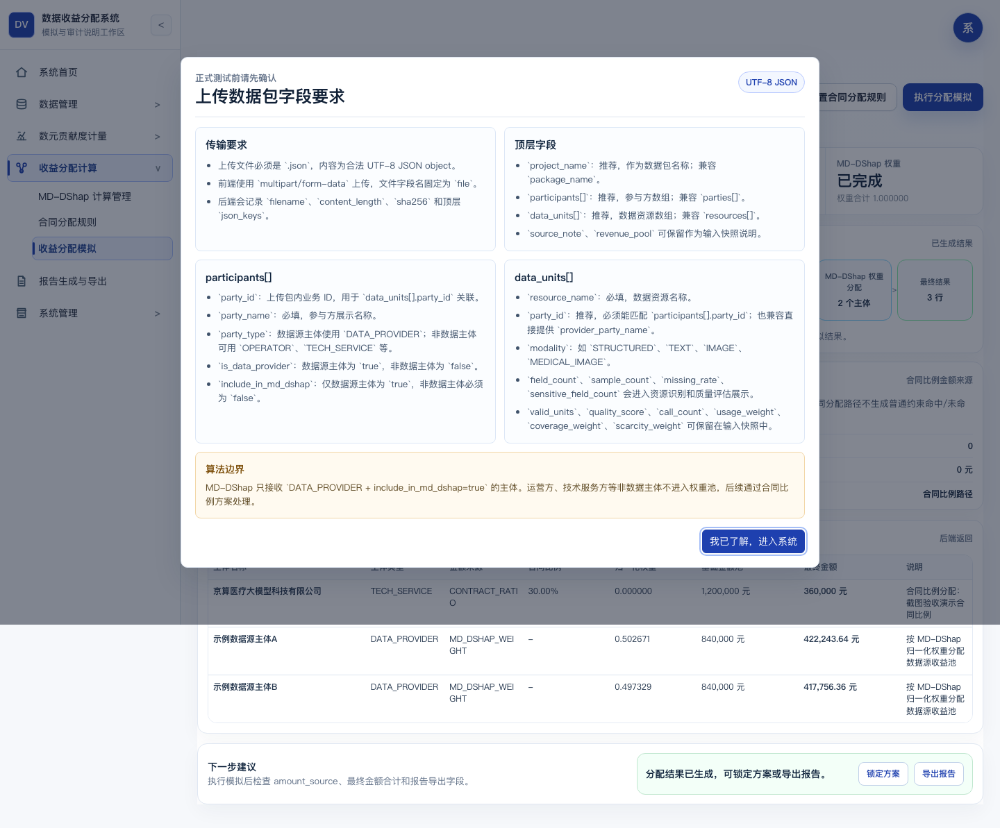

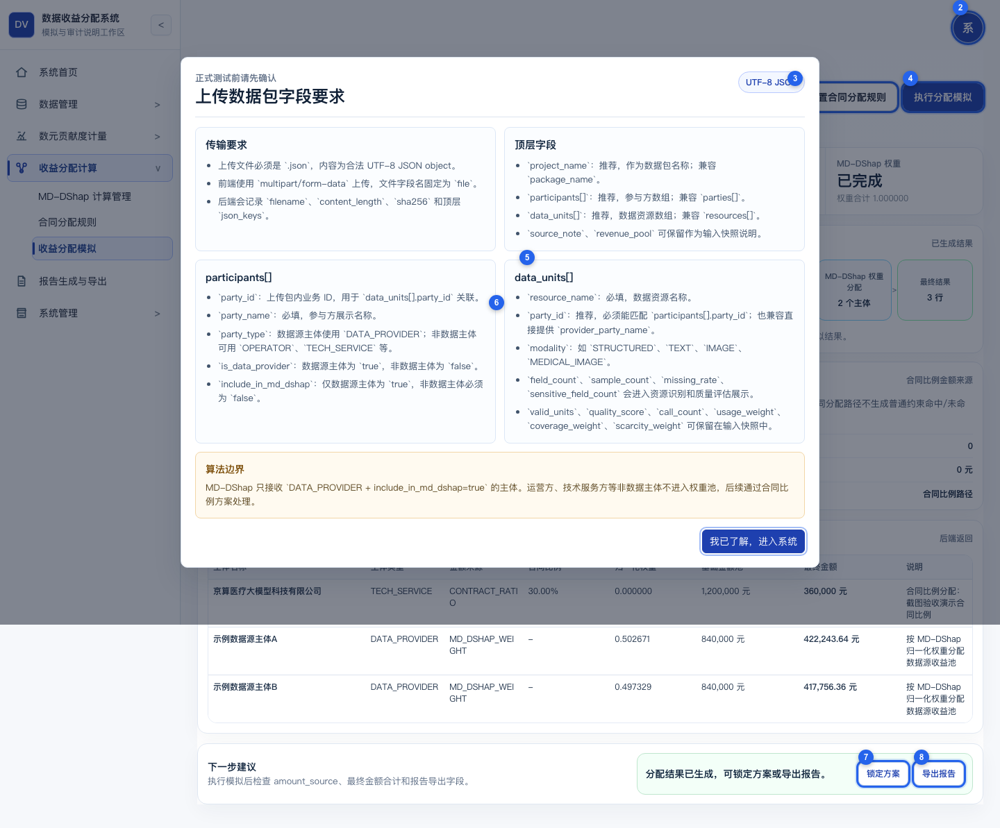

## 八、报告生成与导出

### 8.1 功能说明

报告生成与导出页面用于生成系统计算结果、收益分配报告、明细文件和审计材料。报告和导出文件必须包含“模拟参考，非法律结算”的边界说明。每次导出应生成新的记录、校验和和追溯信息，不应覆盖历史文件。

### 8.2 操作步骤

1. 用户进入“报告生成与导出”。
2. 用户查看可导出的报告类型。
3. 用户点击“预览报告”查看报告摘要。
4. 用户选择 Markdown、CSV、JSON 或算法审计说明等导出方式。
5. 系统生成文件和导出记录。
6. 用户查看详情、下载文件或查看历史报告。

### 8.3 按钮说明

| 按钮名称 | 功能说明 | 点击后效果 | 当前可用性 |
| --- | --- | --- | --- |
| 导出字段 | 查看导出字段范围。 | 展示字段说明。 | P0 可用 |
| 预览报告 | 查看报告内容摘要。 | 展示报告预览，不生成正式文件。 | P0 可用 |
| 全部有权限报告 / 我生成的报告 | 切换报告列表范围。 | 刷新报告列表。 | P1 权限过滤展示 |
| 导出 Markdown | 生成说明性报告。 | 输出 Markdown 报告文件。 | P0 可用 |
| 导出 CSV 明细 | 导出明细表。 | 输出 CSV 文件。 | P0 可用 |
| 导出 JSON 结果 | 导出结构化结果。 | 输出 JSON 文件。 | P0 可用 |
| 导出算法审计说明 | 导出 MD-DShap 算法审计说明。 | 生成算法审计报告。 | P0 可用 |
| 导出收益分配确认书 | 计划导出确认书。 | 当前后端未提供确认书专用导出接口，按钮按缺口处理。 | 后端缺口/禁用 |
| 生成 PDF 报告 | 生成 PDF 报告。 | 属于 P1 本地扩展或后续能力，不作为 P0 必选交付。 | P1 |
| 查看历史报告 | 查看历史报告记录。 | 展示历史报告列表。 | P1/本地扩展 |
| 详情 | 查看报告详情。 | 打开报告详情或文件清单。 | P0/P1 视报告类型可用 |
| 下载 | 下载报告文件。 | 浏览器下载文件。 | P0/P1 视报告类型可用 |
| 归档 | 归档历史报告。 | 系统提示确认后更新报告状态。 | P1/谨慎操作 |

### 8.4 页面截图

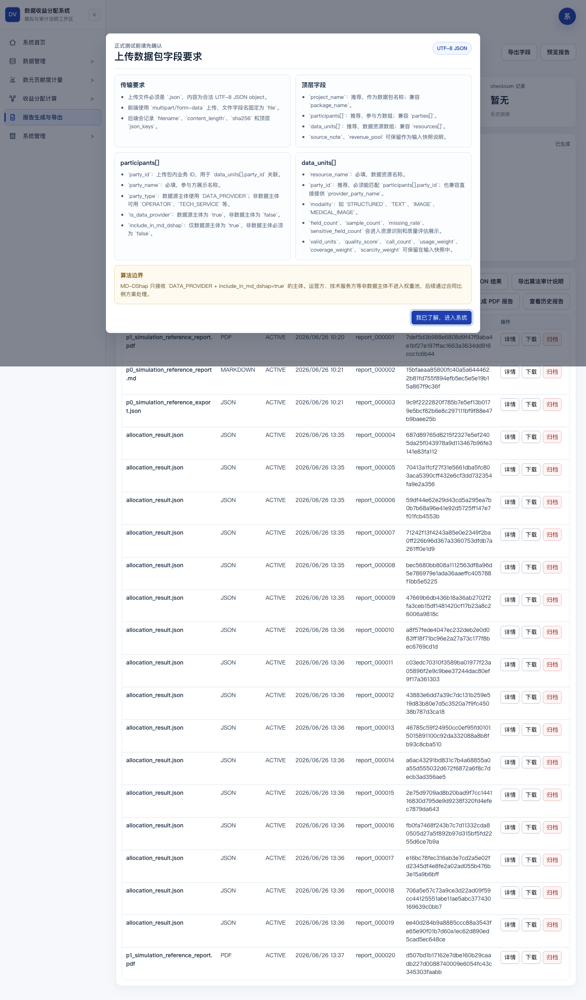

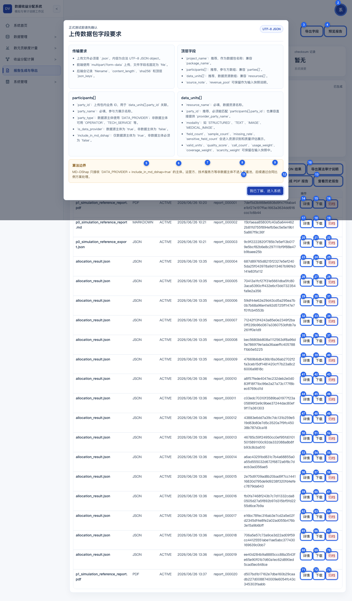

## 九、系统管理

### 9.1 参数配置

#### 9.1.1 功能说明

参数配置页面用于查看和维护系统参数、默认值、风险文案、精度规则和版本信息。部分参数可能只允许查看，部分参数可由具备权限的用户保存新版本。用户修改参数后，应注意新参数只影响后续计算，不应静默改变历史结果。

#### 9.1.2 按钮说明

| 按钮名称 | 功能说明 | 点击后效果 | 当前可用性 |
| --- | --- | --- | --- |
| 查看版本 / 版本 | 查看参数版本。 | 展示参数历史版本或版本说明。 | P0/P1 视权限可用 |
| 查看参数 | 查看参数详情。 | 打开参数详情区域。 | P0 可用 |
| 配置默认值 | 配置参数默认值。 | 打开默认值配置。 | P1/具权限用户 |
| 配置风险文案 | 配置风险提示文案。 | 打开风险文案配置。 | P1/具权限用户 |
| 保存参数版本 | 保存当前参数版本。 | 系统写入新版本并记录审计。 | P1/具权限用户 |

#### 9.1.3 页面截图

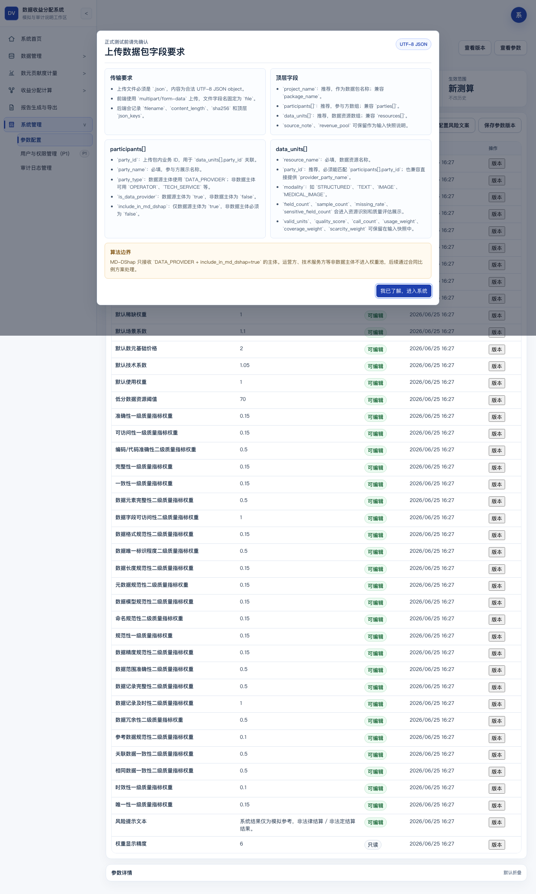

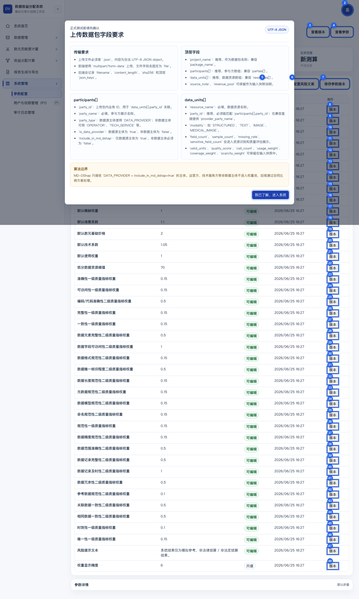

### 9.2 用户与权限管理（P1）

#### 9.2.1 功能说明

用户与权限管理页面用于维护本地 P1 登录用户、角色、按钮权限和接口权限。该页面不属于 P0 必选能力。P0 版本以本地操作员、本地演示和审计记录为主；P1 可扩展登录、角色和权限管理。生产环境必须替换开发账号和密码策略。

#### 9.2.2 按钮说明

| 按钮名称 | 功能说明 | 点击后效果 | 当前可用性 |
| --- | --- | --- | --- |
| 刷新用户 | 重新读取用户列表。 | 页面刷新用户数据。 | P1 可用 |
| 角色管理 | 查看角色列表。 | 展示角色信息。 | P1 可用 |
| 权限矩阵 | 查看权限配置。 | 展示菜单和按钮权限矩阵。 | P1 可用 |
| 审计追溯 | 查看用户权限相关审计。 | 跳转或打开审计信息。 | P1 可用 |
| 新增用户 | 新增登录用户。 | 打开新增用户表单。 | P1 可用，需管理员权限 |
| 重置密码 | 重置用户密码。 | 系统提示或返回临时密码。 | P1 可用，谨慎操作 |
| 禁用 | 禁用用户。 | 系统提示确认后禁用用户。 | P1 可用，谨慎操作 |

#### 9.2.3 页面截图

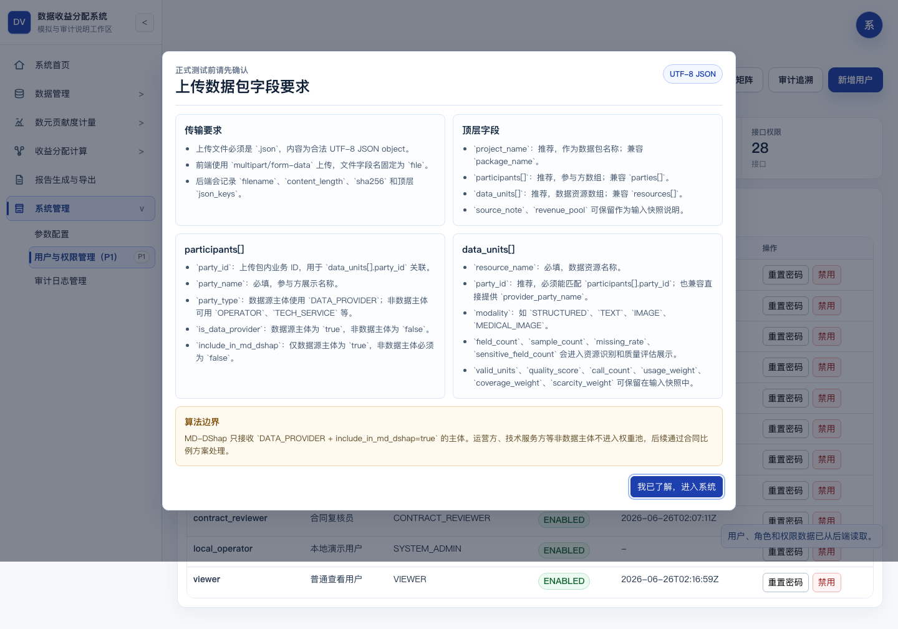

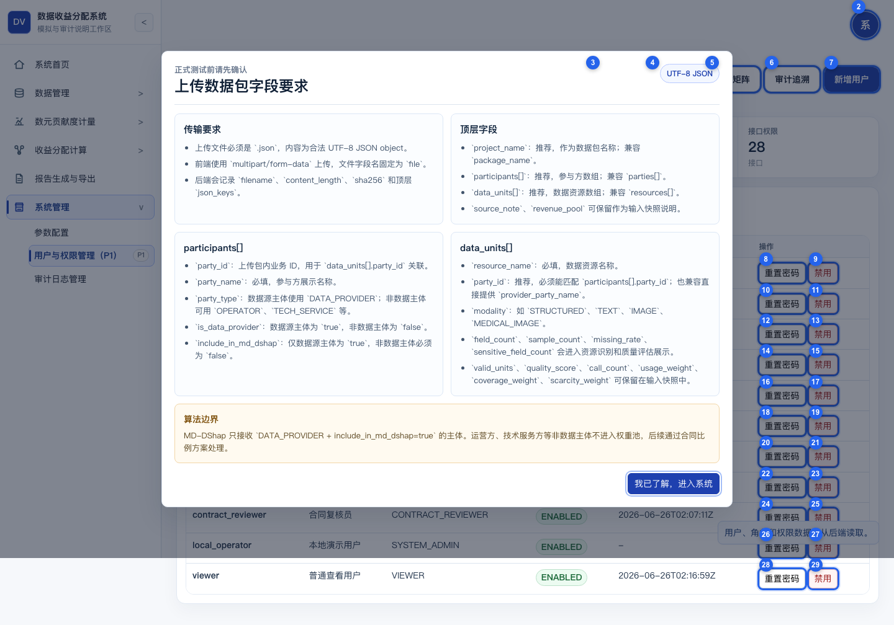

### 9.3 审计日志管理

#### 9.3.1 功能说明

审计日志管理页面用于查看操作记录、计算记录、失败原因、快照信息和导出记录。用户可以查询日志、查看详情、查看快照，也可以导出审计日志。审计日志用于说明系统在本地演示中的操作过程和结果追溯，不构成正式审计报告。

#### 9.3.2 按钮说明

| 按钮名称 | 功能说明 | 点击后效果 | 当前可用性 |
| --- | --- | --- | --- |
| 导出审计日志 | 导出审计记录。 | 系统生成 JSONL 或相关审计文件。 | P0 可用 |
| 查询审计日志 | 按条件查询日志。 | 页面刷新日志列表。 | P0 可用 |
| 详情 | 查看单条日志详情。 | 打开操作前后值、失败原因或快照信息。 | P0 可用 |
| 快照 | 查看输入、参数或输出快照。 | 打开快照详情。 | P0 可用 |

#### 9.3.3 页面截图

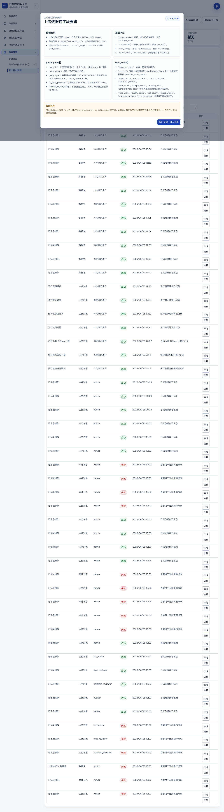

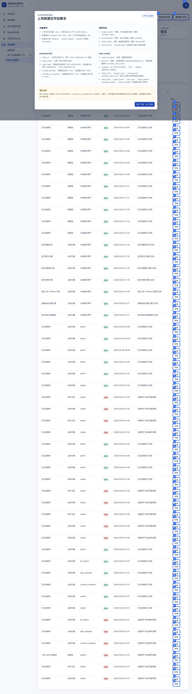

## 十、一键完整计算流程

本章说明软著演示时推荐的快速操作路径。用户可按以下步骤完成一次完整演示：

1. 打开系统并进入系统首页。
2. 点击“选择演示数据”或进入数据接入管理选择示例数据。
3. 进入合同分配规则页面，确认或保存合同比例方案。
4. 返回系统首页，点击“执行完整链路计算”。
5. 系统依次完成数据接入、质量评估、数元计量、贡献度与效用计算、MD-DShap 权重计算和收益分配模拟。
6. 用户进入收益分配模拟页面查看分配结果。
7. 用户进入报告生成与导出页面，导出 Markdown、CSV、JSON 或审计日志。
8. 用户进入审计日志管理页面，查看操作记录和快照信息。

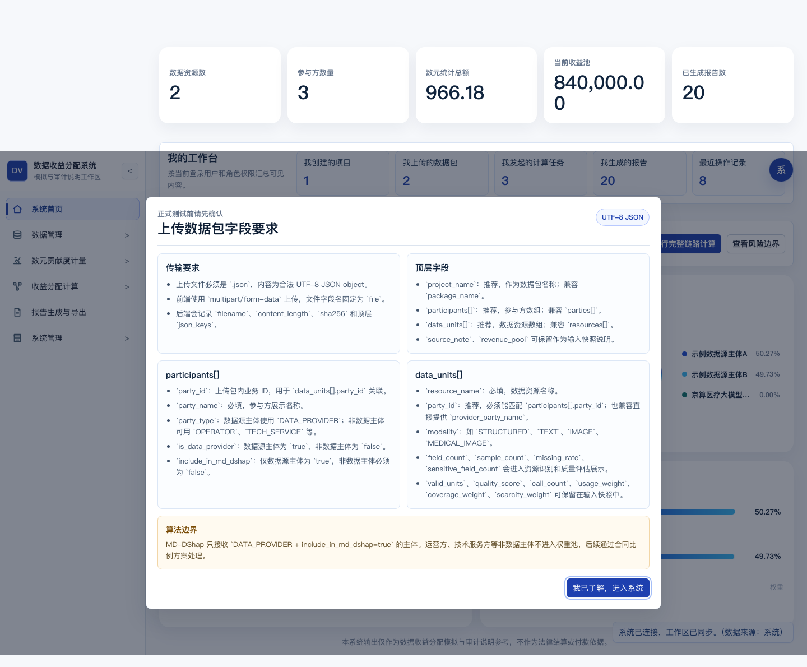

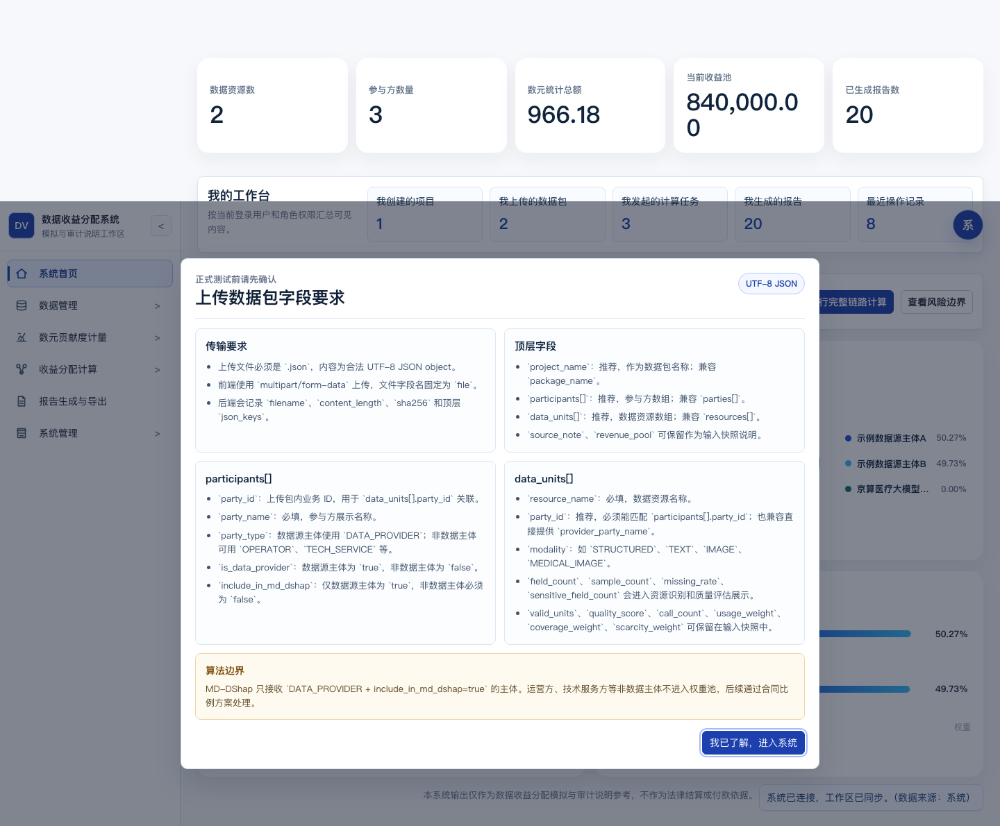

## 十一、常见问题与注意事项

### 11.1 为什么系统结果不是法律结算？

本系统定位为数据收益分配模拟与审计说明系统。系统输出用于演示和参考，不构成法律结算、财务付款、合同履约或主管单位审批依据。

### 11.2 上传文件失败怎么办？

用户可以点击“失败详情”查看字段错误、格式错误或校验失败原因。修正 JSON 文件后，重新上传即可。上传失败时系统不会生成有效数据包。

### 11.3 为什么某些按钮是灰色？

按钮灰色通常表示前置条件未满足、当前用户无权限、后端接口未接入或该能力属于 P1 预留。例如资源摘要导出、纯算法结果导出、收益分配确认书等能力在当前 P0 中不应伪造成已实现。

### 11.4 为什么未完成前置步骤不能执行计算？

质量评估、数元计量、效用计算、MD-DShap 和收益分配模拟之间有顺序依赖。系统需要先获得数据包、资源主体关系、质量结果、计量结果、效用结果和权重结果，才能生成可追溯的收益分配模拟结果。

### 11.5 为什么非数据主体不进入 MD-DShap？

MD-DShap 用于计算数据源主体之间的贡献权重。非数据主体如运营服务方、合同服务方等不进入权重池，当前主流程通过合同比例方案参与收益分配模拟。

### 11.6 为什么报告导出需要先完成收益分配？

报告需要引用项目、数据包、资源、参与方、质量评估、数元计量、效用、MD-DShap 和分配结果等信息。如果收益分配未完成，报告无法形成完整的模拟参考内容。

### 11.7 为什么已锁定或已导出的结果不能直接修改？

已锁定或已导出的结果需要保留历史版本和审计追溯。系统应通过新版本或重新计算方式生成新的结果，而不是静默覆盖历史记录。

### 11.8 当前 P0 与 P1 功能有什么区别？

P0 重点支持本地演示、JSON 上传、数据资源管理、质量评估、数元计量、贡献效用、MD-DShap、合同比例、收益分配模拟、Markdown/CSV/JSON/JSONL 导出和审计追溯。P1 可扩展登录与 RBAC、PDF、CSV/XLSX 模板导入、异步任务、历史报告管理和更完整的权限控制。

## 十二、附录

### 12.1 页面截图清单

| 序号 | 页面 | 截图文件 | 说明 |
| --- | --- | --- | --- |
| 1 | 登录页 | 00_login_page.png | 登录入口截图。 |
| 2 | 系统首页 | 01_dashboard_page.png | 系统首页页面全图。 |
| 3 | 数据接入管理 | 02_data_ingestion_page.png | 数据接入页面全图。 |
| 4 | 数据资源管理 | 03_data_resources_page.png | 数据资源页面全图。 |
| 5 | 参与方管理 | 04_data_parties_page.png | 参与方页面全图。 |
| 6 | 质量评估管理 | 05_quality_page.png | 质量评估页面全图。 |
| 7 | 数元计量管理 | 06_shuyuan_page.png | 数元计量页面全图。 |
| 8 | 贡献度与效用计算 | 07_utility_page.png | 效用计算页面全图。 |
| 9 | MD-DShap 计算管理 | 08_md_dshap_page.png | 权重计算页面全图。 |
| 10 | 合同分配规则 | 09_contract_rules_page.png | 合同比例配置页面全图。 |
| 11 | 收益分配模拟 | 10_allocation_simulation_page.png | 分配模拟页面全图。 |
| 12 | 报告生成与导出 | 11_reports_page.png | 报告页面全图。 |
| 13 | 参数配置 | 12_parameters_page.png | 参数配置页面全图。 |
| 14 | 用户与权限管理（P1） | 13_users_page.png | P1 用户权限页面全图。 |
| 15 | 审计日志管理 | 14_audit_page.png | 审计日志页面全图。 |

### 12.2 按钮清单

| 页面 | 按钮名称 | 功能说明 | 是否 P0 可用 |
| --- | --- | --- | --- |
| 系统首页 | 选择演示数据 | 初始化演示项目和数据包。 | 是 |
| 系统首页 | 执行完整链路计算 | 执行质量、计量、效用、权重和分配模拟。 | 是 |
| 系统首页 | 查看风险边界 | 查看模拟参考和非法律结算提示。 | 是 |
| 数据接入管理 | 使用示例数据、上传 JSON、预览、失败详情、删除 | 完成数据包接入、校验和管理。 | 是 |
| 数据接入管理 | CSV/XLSX 模板下载和导入 | 模板导入扩展能力。 | P1/本地扩展 |
| 数据资源管理 | 详情、关联主体 | 查看资源详情并维护数据源主体关系。 | 是 |
| 数据资源管理 | 导出资源摘要 | 当前后端未提供 P0 接口。 | 否，后端缺口 |
| 参与方管理 | 新增、编辑、停用、查看主体状态 | 管理参与方基础信息和主体状态；贡献、效用和权重结果在对应计算页面或报告中查看。 | 是 |
| 质量评估管理 | 查看证据、重新评估、查看评分 | 查看或生成质量评估结果。 | 是 |
| 数元计量管理 | 查看明细、执行数元计量 | 查看和生成数元计量结果。 | 是 |
| 贡献度与效用计算 | 查看计算说明、重新计算、查看详情、查看依据 | 查看和生成贡献效用结果。 | 是 |
| MD-DShap 计算管理 | 启动计算、查看边际贡献、查看审计、查看详情 | 生成并展示权重结果。 | 是 |
| 合同分配规则 | 编辑数据源池比例、新增非数据主体比例、保存合同比例方案 | 维护合同比例方案。 | 是 |
| 收益分配模拟 | 执行分配模拟、锁定方案、导出报告 | 生成和管理收益分配模拟结果。 | 是 |
| 报告生成与导出 | 预览、导出 Markdown、导出 CSV、导出 JSON、导出算法审计说明 | 生成报告和导出文件。 | 是 |
| 报告生成与导出 | 生成 PDF、查看历史报告、归档 | 报告扩展能力。 | P1/本地扩展 |
| 报告生成与导出 | 导出收益分配确认书 | 当前后端未提供确认书专用导出接口。 | 否，后端缺口 |
| 参数配置 | 查看参数、查看版本、保存参数版本 | 查看或维护系统参数。 | 部分 P0，保存类按权限 |
| 用户与权限管理（P1） | 刷新用户、新增用户、重置密码、禁用、权限矩阵 | 管理用户、角色和权限。 | P1 |
| 审计日志管理 | 查询审计日志、详情、快照、导出审计日志 | 查看和导出审计追溯信息。 | 是 |

### 12.3 版本说明

| 项目 | 说明 |
| --- | --- |
| 当前版本 | V1.0 |
| 交付用途 | 软著提交、本地演示、功能闭环验证 |
| P0 能力 | 本地演示、JSON 上传、质量评估、数元计量、贡献效用、MD-DShap、合同比例、收益分配模拟、Markdown/CSV/JSON/JSONL 导出、审计追溯。 |
| 非 P0 能力 | 登录/RBAC、PDF、异步任务、多租户、真实财务付款、银行结算、税务处理、电子签章、外部系统集成等不作为当前 P0 必选能力。 |
