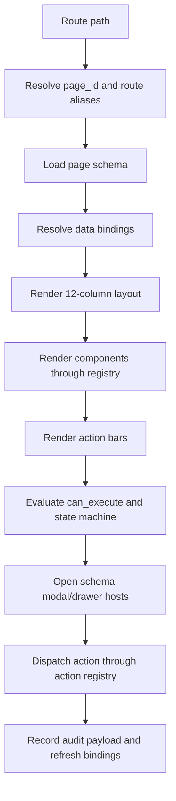

# UI Renderer Design Freeze

This document freezes the future renderer architecture. It is docs-only and does
not create implementation files in this phase.

## 1. Goal

The renderer must make UI changes schema-driven:

```tsx
<SchemaApp schema={systemUiSchema} />
```

or:

```tsx
<SchemaPage pageId="MDS_CALCULATION" />
```

Page files may remain only as route shells. They must not contain business
layout, hardcoded buttons, hardcoded modal/drawer content, direct state
transitions, or direct business API calls.

## 2. Runtime Layers

Future target files:

```text
src/ui-renderer/SchemaApp.tsx
src/ui-renderer/SchemaPage.tsx
src/ui-renderer/SchemaLayout.tsx
src/ui-renderer/SchemaComponentRenderer.tsx
src/ui-renderer/SchemaActionBar.tsx
src/ui-renderer/SchemaModalHost.tsx
src/ui-renderer/SchemaDrawerHost.tsx
src/ui-renderer/SchemaTable.tsx
src/ui-renderer/SchemaForm.tsx
src/ui-renderer/SchemaStepper.tsx
src/ui-renderer/SchemaRiskPanel.tsx
src/ui-renderer/SchemaAuditPanel.tsx
src/ui-renderer/SchemaChart.tsx
src/ui-renderer/SchemaUploadZone.tsx
src/ui-renderer/SchemaTimeline.tsx
```

Future schema support files:

```text
src/ui-schema/ui.schema.types.ts
src/ui-schema/component.registry.ts
src/ui-schema/action.registry.ts
src/ui-schema/state.machine.ts
src/ui-schema/data.binding.registry.ts
src/ui-schema/validation.ts
src/routes/schemaRoutes.tsx
src/design-system/tokens.ts
src/design-system/layout.ts
src/design-system/components.ts
```

These paths are future implementation targets only.

## 3. Rendering Flow



## 4. Page Selection

`SchemaApp` responsibilities:

- load the system schema
- normalize current route
- resolve compatibility aliases
- select page schema by `page_id`
- render global shell: sidebar, topbar, risk/disclaimer, project status rail
- provide schema context to components and action dispatchers

Route alias rule:

- `/dashboard` renders `SYS_OVERVIEW`
- The former system-home split paths are废止 and must not be preserved as
  current aliases.
- Audit metadata for home-page actions uses `module_code=SYS` and
  `menu_code=NAV_SYS_HOME`.

## 5. Layout

`SchemaLayout` responsibilities:

- enforce 12-column grid
- accept stable `grid` metadata per component
- prevent dynamic content from resizing fixed-format controls
- provide standard spacing, page section rhythm, and responsive wrapping
- render page-level empty, loading, and error states

Component layout fields:

```text
grid.column_start, grid.column_span, grid.row, min_height,
density, priority, sticky, collapse_behavior
```

## 6. Component Registry

`SchemaComponentRenderer` dispatches only these types:

```text
table, form, modal, drawer, stepper, card, chart, upload_zone,
timeline, risk_panel, audit_panel, action_bar
```

Shared behavior:

- title and optional description
- density
- loading state
- empty state with next action
- error state with field or business-rule location
- disabled state
- action slot
- audit hint
- risk hint
- common footer behavior for modals/drawers

## 7. Table Renderer

`SchemaTable` must support:

- schema-defined columns
- fixed operation column
- pagination
- filtering
- empty state
- field formatting
- money with 2 decimals
- weights with 6 decimals
- scores with 4 or 6 decimals
- detail drawer for wide fields
- audit/source columns when configured

The table renderer must fail validation when:

- a declared operation references an unknown action
- a table has no empty state
- a weight field lacks precision rules
- an exportable table lacks field-scope metadata

## 8. Form Renderer

`SchemaForm` must support:

- schema-defined fields
- required fields
- ranges
- enum options
- numeric precision
- field-level error
- validation rules before save
- save success UI from action schema
- save failure UI from action schema

The form renderer must not hardcode business validation in page components.

## 9. Action Dispatcher

`SchemaActionBar` displays action controls, but `ActionDispatcher` decides
whether they can run.

Decision inputs:

```text
action schema, project state, object state, permission context,
P0/P1 phase, validation result, locked/exported status
```

Decision outputs:

```text
visible, enabled, disabled_reason, confirmation_required,
overlay_component_id, audit_payload, next_state
```

No action may bypass:

- permission/phase gate
- precondition gate
- validation rules
- state-machine guard
- confirmation rule
- audit rule

## 10. Modal And Drawer Hosts

`SchemaModalHost` and `SchemaDrawerHost` open overlays only from schema records.

Overlay requirements:

- title
- size
- content components
- form or detail schema
- confirm/cancel action
- success UI
- failure UI
- audit requirement
- risk/disclaimer display
- focus trap and close behavior

Export overlays must include:

- file type
- field scope
- source snapshot ID
- `report_id` preview or generation rule
- `checksum` preview or generation rule
- no-overwrite rule
- simulation-reference disclaimer

## 11. State Machine Integration

The renderer uses the state machine for:

- status rail
- stepper state
- action enable/disable
- allowed transitions
- rollback policy display
- locked/exported behavior

Invalid state transition behavior:

- block dispatch
- show failure UI with guard details
- write failure audit record when configured
- do not mutate page-local state as a workaround

## 12. Data Binding Integration

Components receive data through binding IDs, not direct imports or page-local
mock objects.

Binding lifecycle:

```text
initialize -> load -> transform -> render -> action dispatch -> refresh
```

Binding error policy:

- page-level failure for root project/context missing
- component-level failure for noncritical table/detail load
- export/action failure for missing snapshot or field-scope data

## 13. Audit And Compliance Injection

Renderer must inject compliance text in:

- page header disclaimer
- risk panels
- upload warning
- MD-DShap panels
- allocation lock confirmation
- export confirmation
- report preview
- generated report body

Audit panels must support:

```text
input_snapshot_id, parameter_snapshot_id, output_snapshot_id,
algorithm_version, calculation_trace, menu_code, module_code,
operator, status, failure_reason, report_id, checksum
```

## 14. Current Prototype Migration Risks

Current hardcoded patterns to remove in a future implementation round:

- manual `window.location.pathname` page selection
- page-specific functions for system home, data ingestion, and resources
- `PageSpecific` module branching
- `ActionOverlay` hardcoded action ID switch
- local `useState` business workflow state inside page components
- repeated modal/drawer markup
- repeated table/form/filter markup
- CSS classes that encode component variants outside tokens/registry

## 15. Renderer Acceptance

A future implementation is not accepted until:

- deleting a page route shell does not delete the schema page definition
- any page can be regenerated from schema
- all page IDs render through `SchemaPage`
- all buttons dispatch through action registry
- all modals/drawers are schema components
- all state transitions are validated
- all export dialogs show field scope, `report_id`, `checksum`, and disclaimer
- `SYS-004` performs full-pipeline semantics or is blocked by explicit guards
- `USER-008` is present as P1 role management
