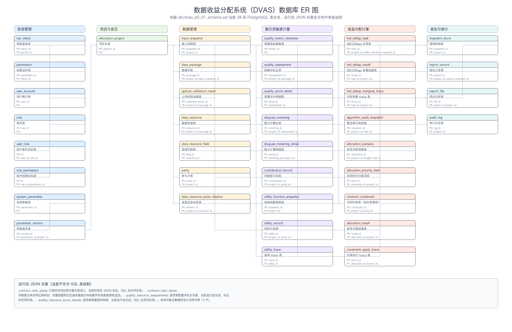

# 数据收益分配系统 数据库设计说明书

> 本文依据当前代码库重新对齐数据库设计与 ER 图。所有收益分配结果均为模拟参考，不构成法律结算、法定结算、付款指令、合同履约结果或主管机关审批结论。

## 文档修订记录

| 版本 | 日期 | 修订说明 | 依据 |
| --- | --- | --- | --- |
| V1.0 | 2026-07-03 | 按当前 SQL DDL、后端、前端、测试重新生成数据库设计说明书和 ER 图。 | `db/dvas_p0_01_schema.sql`、`backend/dvas/*.py`、`ui_prototype/src/**`、`backend/tests/*.py` |

## 目录

- 1. 概述
- 2. 数据库总体设计
- 3. 数据库表清单
- 4. ER 关系图
- 5. 逐表字段设计
- 6. 主外键与逻辑关系设计
- 7. 索引与唯一约束设计
- 8. 枚举与状态字典设计
- 9. 页面-数据表映射
- 10. 后端服务-数据表映射
- 11. 报告导出字段与来源表映射
- 12. 审计、快照与版本策略
- 13. 数据库与真实代码一致性说明
- 14. 附录 A：数据库表清单
- 15. 附录 B：ER 图源码
- 16. 附录 C：DDL 文件路径

## 1. 概述

### 1.1 编写目的

本文用于说明 DVAS（数据收益分配系统 V1.2）当前数据库结构、核心 ER 关系、页面与后端服务对数据库对象的使用方式，以及现有 SQL DDL 与运行态 JSON 状态之间的边界。本文只覆盖数据库设计和 ER 图，不编写《系统详细设计说明书》。

### 1.2 适用范围

- P0：本地操作员模式、演示数据 / JSON 上传、数据接入、资源识别、参与方管理、质量评估、数元计量、贡献度与效用计算、MD-DShap 权重计算、合同比例规则、收益分配模拟、Markdown / CSV / JSON / JSONL 导出、审计日志和快照追溯。
- P1：登录与 RBAC、PDF 导出、CSV/XLSX 模板导入、异步任务进度、历史报告管理和更完整权限控制。P1 对象可以在 DDL 中预留，但不得描述为 P0 已完成能力。
- 数据库输出边界：本文不把模拟分配结果写成真实结算、法律结算、真实财务付款、银行结算、税务处理、电子签章或合同履约指令；多租户、生产级部署和外部系统集成不属于 P0 数据库交付范围。

### 1.3 设计依据与优先级

| 优先级 | 来源 | 用法 |
| --- | --- | --- |
| 1 | `db/dvas_p0_01_schema.sql` | 当前 PostgreSQL 表、字段、主键、外键、索引、CHECK 约束和注释的最高依据。 |
| 2 | `backend/dvas/repository.py`、`services.py`、`app.py`、`persistence_mapping.py` | 识别运行态 JSON 状态、服务读写对象、SQL/运行态枚举映射和 API 边界。 |
| 3 | `ui_prototype/src/app/routes.tsx`、`ui_prototype/src/app/menu.ts`、`ui_prototype/src/domain/api/**` | 校验页面、路由、按钮动作、前端字段和后端 API 消费关系。 |
| 4 | `backend/tests/*.py` | 校验完整链路、合同分配规则、质量逐资源结果、P1 接口外观和导出契约。 |
| 5 | 旧版数据库文档和需求文档 | 只作为历史参考；与代码冲突时以以上来源为准。 |

## 2. 数据库总体设计

### 2.1 数据库与 Schema

| 项目 | 当前设计 |
| --- | --- |
| 数据库类型 | PostgreSQL 13+ |
| 数据库名 | `dvas_p0` |
| Schema | `dvas` |
| DDL 主文件 | `db/dvas_p0_01_schema.sql` |
| 建库脚本 | `db/dvas_p0_00_create_database.sql` |
| 种子数据 | `db/dvas_p0_02_seed.sql` |
| 演示数据 | `db/dvas_p0_03_demo_data.sql` |
| 校验脚本 | `db/dvas_p0_04_validation.sql` |
| 当前 SQL 表数量 | 38 张 |

### 2.2 设计分层

| 层级 | 说明 | 典型对象 |
| --- | --- | --- |
| 导航、权限与本地用户 | 支撑菜单、动作、P0 本地操作员和 P1 RBAC 预留。 | `nav_menu`、`permission`、`user_account`、`role` |
| 项目与快照 | 作为完整链路根对象并保存可追溯输入、参数、结果和报告快照。 | `allocation_project`、`snapshot_store`、`input_snapshot` |
| 数据接入与资源主体 | 管理数据包、资源、字段、参与方和资源主体关系。 | `data_package`、`data_resource`、`party`、`data_resource_party_relation` |
| 数元贡献度计量 | 维护质量评估、数元计量、贡献度和效用函数。 | `quality_assessment`、`shuyuan_metering`、`contribution_record`、`utility_record` |
| MD-DShap 与收益分配 | 计算权重、形成收益分配场景、应用合同/优先分配和尾差处理。 | `md_dshap_task`、`md_dshap_result`、`allocation_scenario`、`allocation_result` |
| 报告、审计与参数 | 记录报告、导出文件、审计日志、参数和版本。 | `report_record`、`export_file`、`audit_log`、`system_parameter` |

### 2.3 SQL 表与运行态 JSON 状态边界

当前后端默认仓储是 JSON 状态文件，PostgreSQL DDL 是 P0 标准关系数据库包，并有只读 PostgreSQL API 视图。以下对象是当前业务完整链路真实使用的运行态对象，但不是当前 SQL DDL 中的同名表：

| 运行态对象 | 后端服务 | 前端页面 | 当前说明 |
| --- | --- | --- | --- |
| `contract_ratio_plans` | ContractRatioService | /allocation/constraints | 已保存合同比例方案主表语义，当前存放在 JSON 状态；SQL 尚无同名表。 |
| `contract_ratio_items` | ContractRatioService | /allocation/constraints | 非数据主体合同比例条目；完整链路用它扣减非数据主体金额并形成数据源收益池。 |
| `quality_resource_assessments` | QualityService | /metering/quality | 逐资源质量评估主对象，当前运行态生成；SQL 尚无同名表。 |
| `quality_resource_score_details` | QualityService | /metering/quality | 逐资源质量指标明细，当前运行态生成；SQL 尚无同名表。 |
| `report_manifests` | ReportService | /reports | 报告清单与下载状态，当前运行态维护。 |
| `sessions` | AuthService | P1 登录/会话 | P1 本地会话对象，当前运行态维护。 |
| `async_jobs` | JobService / ReportService | P1 异步任务 | 本地异步任务外观，当前运行态维护。 |
| `business_drafts` | DraftService / ContractRatioService | 合同比例、流程草稿 | 页面草稿和未应用配置，当前运行态维护。 |

因此，本文件的 ER 图只绘制当前 SQL DDL 中真实存在的表；运行态对象在一致性说明和页面/服务映射中单独披露，避免把尚未落入 DDL 的对象误写成数据库表。

## 3. 数据库表清单

| 序号 | 模块 | 表名 | 中文名 | DDL 注释 | 代码使用状态 | 前端/接口入口 | 备注 |
| --- | --- | --- | --- | --- | --- | --- | --- |
| 1 | 系统管理 | `nav_menu` | 导航菜单表 | 导航菜单表，固化六大一级导航与二级页面。 | NavigationService / seed | /dashboard, all menus | SQL 种子固化导航；前端另有静态菜单配置用于页面展示。 |
| 2 | 系统管理 | `permission` | 权限动作表 | 按钮/动作权限表，P0 用于按钮可用性说明，P1 接入 RBAC。 | AuthService / UserAccessService | 系统管理/用户与权限管理（P1） | P0 用于按钮动作说明；P1 本地权限接口读取运行态权限集合。 |
| 3 | 系统管理 | `user_account` | 用户账户表 | 用户表；P0 仅初始化 local_operator，P1 启用登录。 | AuthService / UserAccessService | /system/users（P1） | SQL P0 仅 local_operator；运行态 P1 用户字段比当前 DDL 更丰富。 |
| 4 | 系统管理 | `role` | 角色表 | 角色表，支撑 P1 RBAC，P0 保留本地操作员角色。 | UserAccessService | /system/users（P1） | P0 保留本地操作员角色，P1 扩展 RBAC。 |
| 5 | 系统管理 | `user_role` | 用户角色关系表 | 用户角色关系表。 | UserAccessService | /system/users（P1） | 用户到角色的多对多关系。 |
| 6 | 系统管理 | `role_permission` | 角色权限关系表 | 角色权限关系表。 | UserAccessService | /system/users（P1） | 角色到权限的多对多关系。 |
| 7 | 项目与首页 | `allocation_project` | 项目主表 | 项目主表，所有业务链路的根对象。 | ProjectService / DashboardService / PostgresReadService | /dashboard | 完整链路根对象；当前项目状态和收益总额入口。 |
| 8 | 报告与审计 | `snapshot_store` | 通用快照表 | 通用快照表，统一保存输入、参数、结果、报告与算法快照。 | SnapshotRepository / ReportService | 审计日志、报告导出 | 统一保存输入、参数、结果、报告与算法快照。 |
| 9 | 数据管理 | `input_snapshot` | 输入快照表 | 输入快照表，上传或演示数据初始化时生成。 | DataPackageService | /data/ingestion | 演示数据或 JSON 上传后生成输入快照。 |
| 10 | 数据管理 | `data_package` | 数据包表 | 数据包表，数据接入管理主表。 | DataPackageService / PostgresReadService | /data/ingestion | 数据接入管理主表。 |
| 11 | 数据管理 | `upload_validation_result` | 上传校验结果表 | 上传校验结果表，失败详情页面读取。 | DataPackageService | /data/ingestion | 上传失败详情和校验日志。 |
| 12 | 数据管理 | `data_resource` | 数据资源表 | 数据资源表，保存资源摘要、模态、样本和计算标记。 | DataResourceService | /data/resources | 资源摘要、模态、样本数和是否纳入计算。 |
| 13 | 数据管理 | `data_resource_field` | 资源字段表 | 资源字段表，支持字段统计与脱敏预览。 | DataResourceService | /data/resources | 字段统计、敏感标记和预览。 |
| 14 | 数据管理 | `party` | 参与方表 | 参与方表，项目内参与方名称唯一。 | PartyService / ContractRatioService | /data/parties, /allocation/constraints | 区分数据源主体和非数据贡献主体。 |
| 15 | 数据管理 | `data_resource_party_relation` | 资源主体关系表 | 资源主体关系表，资源进入算法前必须关联数据源主体。 | DataResourceService / PartyService | /data/resources, /data/parties | SQL 独立关系表；当前运行态也在 data_resources 中保留关联摘要。 |
| 16 | 数元贡献度计量 | `quality_metric_template` | 质量指标模板表 | 质量指标模板表。 | QualityService | /metering/quality | 质量指标、权重和评分规则模板。 |
| 17 | 数元贡献度计量 | `quality_assessment` | 质量评估主表 | 质量评估表，保存质量总分、等级、维度分和证据。 | QualityService | /metering/quality | 包级质量总分、等级、维度分和证据。 |
| 18 | 数元贡献度计量 | `quality_score_detail` | 质量评分明细表 | 质量得分明细表，保存一级/二级指标得分。 | QualityService | /metering/quality | 指标级质量得分明细。 |
| 19 | 数元贡献度计量 | `shuyuan_metering` | 数元计量主表 | 数元计量主表。 | ShuyuanService | /metering/shuyuan | 数元计量版本、系数和总量。 |
| 20 | 数元贡献度计量 | `shuyuan_metering_detail` | 数元计量明细表 | 数元计量明细表，支持资源级与参与方级计量。 | ShuyuanService | /metering/shuyuan | 资源级、参与方级计量明细。 |
| 21 | 数元贡献度计量 | `contribution_record` | 贡献度记录表 | 贡献度记录表，按参与方保存贡献信号。 | ContributionService | /metering/utility | 参与方贡献信号和归一化贡献度。 |
| 22 | 数元贡献度计量 | `utility_function_snapshot` | 效用函数快照表 | 效用函数快照表，用于报告披露效用函数来源。 | UtilityService | /metering/utility | 效用函数公式、参数和校验和。 |
| 23 | 数元贡献度计量 | `utility_record` | 效用记录表 | 效用记录表，是 MD-DShap 的 v(S,t) 来源。 | UtilityService / MDDShapService | /metering/utility | MD-DShap 的 v(S,t) 输入来源。 |
| 24 | 数元贡献度计量 | `utility_trace` | 效用 trace 表 | 效用 trace 表，保存公式、输入值与输出值。 | UtilityService | /metering/utility | 效用公式输入输出追溯。 |
| 25 | 收益分配计算 | `md_dshap_task` | MD-DShap 任务表 | MD-DShap 任务表，默认 algorithm_mode=MD_DSHAP。 | MDDShapService | /allocation/md-dshap | 默认算法任务；每次重算生成新 task_id。 |
| 26 | 收益分配计算 | `md_dshap_result` | MD-DShap 权重结果表 | MD-DShap 权重结果表，参与方权重进入收益分配。 | MDDShapService / AllocationService | /allocation/md-dshap, /allocation/simulation | 参与方权重结果；展示按 6 位小数。 |
| 27 | 收益分配计算 | `md_dshap_marginal_trace` | 边际贡献 trace 表 | 边际贡献明细表，用于算法审计和复杂度说明。 | MDDShapService | /allocation/md-dshap | 边际贡献采样审计明细。 |
| 28 | 收益分配计算 | `algorithm_audit_snapshot` | 算法审计快照表 | 算法审计快照表，导出 md_dshap_audit_report.md 的依据。 | MDDShapService / ReportService | /allocation/md-dshap, /reports | 算法输入、参数、输出和假设快照。 |
| 29 | 收益分配计算 | `allocation_scenario` | 收益分配场景表 | 收益分配场景表，保存总收益、合同优先与数据源收益池。 | AllocationService | /allocation/simulation | 总收益、合同优先扣除和数据源收益池。 |
| 30 | 收益分配计算 | `allocation_priority_item` | 合同优先分配项表 | 合同优先分配项表，先于数据源收益池扣除。 | AllocationService | /allocation/simulation | SQL 中的优先分配项；当前保存合同比例主链由运行态 contract_ratio_items 承载。 |
| 31 | 收益分配计算 | `contract_constraint` | 合同约束表（旧约束兼容） | 合同约束表，支持最小、最大、封顶、保底、固定比例和优先分配。 | AllocationService | /allocation/constraints | 保留旧约束模型；当前完整链路主要读取已保存合同比例方案。 |
| 32 | 收益分配计算 | `allocation_result` | 收益分配结果表 | 收益分配结果表，保存约束前后金额。 | AllocationService / ReportService | /allocation/simulation, /reports | 约束前后金额和尾差调整结果。 |
| 33 | 收益分配计算 | `constraint_apply_trace` | 约束执行 trace 表 | 约束执行 trace 表，支持约束调整前后对比。 | AllocationService | /allocation/simulation | 约束调整步骤、原因和金额变化。 |
| 34 | 报告与审计 | `report_record` | 报告记录表 | 报告记录表，每次导出生成 report_id 和 checksum，不覆盖历史文件。 | ReportService / PostgresReadService | /reports | 每次导出生成 report_id 和 checksum，不覆盖历史。 |
| 35 | 报告与审计 | `export_file` | 导出文件表 | 导出文件明细表，一次报告导出可包含多个文件。 | ReportService | /reports | 报告导出的具体文件明细。 |
| 36 | 报告与审计 | `audit_log` | 审计日志表 | 审计日志表，记录新增、编辑、删除、计算、导出等关键操作。 | AuditService / PostgresReadService | /system/audit | 关键操作、快照、状态、失败原因和校验和。 |
| 37 | 系统管理 | `system_parameter` | 系统参数表 | 系统参数表，保存质量、算法、报告、风险文案与精度规则。 | ParameterService | /system/parameters | 质量、算法、报告、风险文案和精度规则。 |
| 38 | 系统管理 | `parameter_version` | 参数版本表 | 参数版本表，参数修改只影响新计算，不回改历史结果。 | ParameterService | /system/parameters | 参数修改生成版本，不回改历史结果。 |

## 4. ER 关系图

图 4-1 数据收益分配系统数据库 ER 关系图：

| 文件 | 用途 |
| --- | --- |
| `docs/diagrams/dvas_er_diagram.mmd` | Mermaid ER 源文件，按当前 SQL 表和外键生成。 |
| `docs/diagrams/dvas_er_diagram.svg` | 可缩放矢量图，便于审阅和转入文档。 |
| `docs/diagrams/dvas_er_diagram.png` | 位图预览，便于 DOCX 或截图式交付。 |

ER 图说明：

- `allocation_project` 是完整链路根对象，数据包、资源、参与方、质量评估、数元计量、效用、MD-DShap、收益分配、报告和审计均通过 `project_id` 回溯。
- `party.include_in_md_dshap` 区分进入 MD-DShap 池的数据源主体；非数据贡献主体通过合同比例或优先分配链路处理，不默认进入 MD-DShap 权重池。
- `snapshot_store`、`algorithm_audit_snapshot`、`audit_log`、`report_record` 和 `export_file` 构成报告与审计追溯闭环。
- `contract_ratio_plans` 和 `contract_ratio_items` 当前为运行态 JSON 对象，不在 ER 图中绘制为 SQL 表。

## 5. 逐表字段设计

### 5.1 `nav_menu`：导航菜单表

- 模块：系统管理
- DDL 注释：导航菜单表，固化六大一级导航与二级页面。
- 当前代码入口：NavigationService / seed
- 主要页面/API：/dashboard, all menus

| 字段 | 类型 | 必填 | 键 | 默认值 | 枚举/约束摘要 | 说明 |
| --- | --- | --- | --- | --- | --- | --- |
| `menu_id` | `varchar(64)` | 是 | PK | - | - | 菜单标识 |
| `parent_id` | `varchar(64)` | 否 | FK -> `nav_menu.menu_id` | - | - | parent 标识 |
| `menu_code` | `varchar(64)` | 是 |  | - | - | 菜单编码 |
| `menu_name` | `varchar(100)` | 是 |  | - | - | 菜单名称 |
| `module_code` | `varchar(32)` | 是 |  | - | - | 模块编码 |
| `route_path` | `varchar(200)` | 是 |  | - | - | 前端路由 |
| `menu_level` | `smallint` | 是 |  | - | 1, 2 | 业务字段 |
| `sort_no` | `int` | 是 |  | - | - | 序号或版本号 |
| `p0_required` | `boolean` | 是 |  | true | - | 业务字段 |
| `p1_only` | `boolean` | 是 |  | false | - | 业务字段 |
| `status` | `varchar(16)` | 是 |  | 'ENABLED' | ENABLED, DISABLED | 业务状态 |
| `created_at` | `timestamp` | 是 |  | now() | - | 创建时间 |
| `updated_at` | `timestamp` | 是 |  | now() | - | 更新时间 |

### 5.2 `permission`：权限动作表

- 模块：系统管理
- DDL 注释：按钮/动作权限表，P0 用于按钮可用性说明，P1 接入 RBAC。
- 当前代码入口：AuthService / UserAccessService
- 主要页面/API：系统管理/用户与权限管理（P1）

| 字段 | 类型 | 必填 | 键 | 默认值 | 枚举/约束摘要 | 说明 |
| --- | --- | --- | --- | --- | --- | --- |
| `permission_id` | `varchar(64)` | 是 | PK | - | - | 权限标识 |
| `menu_id` | `varchar(64)` | 是 | FK -> `nav_menu.menu_id` | - | - | 菜单标识 |
| `permission_code` | `varchar(100)` | 是 |  | - | - | 权限编码 |
| `permission_name` | `varchar(120)` | 是 |  | - | - | 权限名称 |
| `action_type` | `varchar(32)` | 是 |  | - | VIEW, CREATE, UPDATE, DELETE_DISABLE, CALCULATE, EXPORT, CONFIRM | 动作类型 |
| `button_code` | `varchar(100)` | 否 |  | - | - | 按钮编码 |
| `p0_required` | `boolean` | 是 |  | true | - | 业务字段 |
| `p1_only` | `boolean` | 是 |  | false | - | 业务字段 |
| `status` | `varchar(16)` | 是 |  | 'ENABLED' | ENABLED, DISABLED | 业务状态 |
| `created_at` | `timestamp` | 是 |  | now() | - | 创建时间 |
| `updated_at` | `timestamp` | 是 |  | now() | - | 更新时间 |

### 5.3 `user_account`：用户账户表

- 模块：系统管理
- DDL 注释：用户表；P0 仅初始化 local_operator，P1 启用登录。
- 当前代码入口：AuthService / UserAccessService
- 主要页面/API：/system/users（P1）

| 字段 | 类型 | 必填 | 键 | 默认值 | 枚举/约束摘要 | 说明 |
| --- | --- | --- | --- | --- | --- | --- |
| `user_id` | `varchar(64)` | 是 | PK | - | - | 用户标识 |
| `username` | `varchar(80)` | 是 |  | - | - | 用户名 |
| `display_name` | `varchar(100)` | 是 |  | - | - | 显示名称 |
| `operator_code` | `varchar(80)` | 是 |  | - | - | 操作员编码 |
| `password_hash` | `varchar(255)` | 否 |  | - | - | 密码哈希（P1） |
| `status` | `varchar(16)` | 是 |  | 'ACTIVE' | ACTIVE, DISABLED | 业务状态 |
| `created_at` | `timestamp` | 是 |  | now() | - | 创建时间 |
| `updated_at` | `timestamp` | 是 |  | now() | - | 更新时间 |

### 5.4 `role`：角色表

- 模块：系统管理
- DDL 注释：角色表，支撑 P1 RBAC，P0 保留本地操作员角色。
- 当前代码入口：UserAccessService
- 主要页面/API：/system/users（P1）

| 字段 | 类型 | 必填 | 键 | 默认值 | 枚举/约束摘要 | 说明 |
| --- | --- | --- | --- | --- | --- | --- |
| `role_id` | `varchar(64)` | 是 | PK | - | - | 角色标识 |
| `role_code` | `varchar(64)` | 是 |  | - | - | 角色编码 |
| `role_name` | `varchar(100)` | 是 |  | - | - | 角色名称 |
| `description` | `text` | 否 |  | - | - | 说明 |
| `status` | `varchar(16)` | 是 |  | 'ACTIVE' | ACTIVE, DISABLED | 业务状态 |
| `created_at` | `timestamp` | 是 |  | now() | - | 创建时间 |
| `updated_at` | `timestamp` | 是 |  | now() | - | 更新时间 |

### 5.5 `user_role`：用户角色关系表

- 模块：系统管理
- DDL 注释：用户角色关系表。
- 当前代码入口：UserAccessService
- 主要页面/API：/system/users（P1）

| 字段 | 类型 | 必填 | 键 | 默认值 | 枚举/约束摘要 | 说明 |
| --- | --- | --- | --- | --- | --- | --- |
| `id` | `varchar(64)` | 是 | PK | - | - | 内部标识 |
| `user_id` | `varchar(64)` | 是 | FK -> `user_account.user_id` | - | - | 用户标识 |
| `role_id` | `varchar(64)` | 是 | FK -> `role.role_id` | - | - | 角色标识 |
| `created_at` | `timestamp` | 是 |  | now() | - | 创建时间 |

表级约束：
- `UNIQUE (user_id, role_id)`

### 5.6 `role_permission`：角色权限关系表

- 模块：系统管理
- DDL 注释：角色权限关系表。
- 当前代码入口：UserAccessService
- 主要页面/API：/system/users（P1）

| 字段 | 类型 | 必填 | 键 | 默认值 | 枚举/约束摘要 | 说明 |
| --- | --- | --- | --- | --- | --- | --- |
| `id` | `varchar(64)` | 是 | PK | - | - | 内部标识 |
| `role_id` | `varchar(64)` | 是 | FK -> `role.role_id` | - | - | 角色标识 |
| `permission_id` | `varchar(64)` | 是 | FK -> `permission.permission_id` | - | - | 权限标识 |
| `created_at` | `timestamp` | 是 |  | now() | - | 创建时间 |

表级约束：
- `UNIQUE (role_id, permission_id)`

### 5.7 `allocation_project`：项目主表

- 模块：项目与首页
- DDL 注释：项目主表，所有业务链路的根对象。
- 当前代码入口：ProjectService / DashboardService / PostgresReadService
- 主要页面/API：/dashboard

| 字段 | 类型 | 必填 | 键 | 默认值 | 枚举/约束摘要 | 说明 |
| --- | --- | --- | --- | --- | --- | --- |
| `project_id` | `varchar(64)` | 是 | PK | - | - | 所属项目标识 |
| `project_name` | `varchar(200)` | 是 |  | - | - | 项目名称 |
| `scenario_name` | `varchar(200)` | 否 |  | - | - | 场景名称 |
| `status` | `varchar(32)` | 是 |  | 'DRAFT' | DRAFT, INGESTED, ASSESSED, METERED, UTILITY_CALCULATED, WEIGHT_CALCULATED, ALLOCATED, CONFIRMED, EXPORTED, DISABLED | 业务状态 |
| `current_package_id` | `varchar(64)` | 否 |  | - | - | current_package 标识 |
| `current_algorithm_task_id` | `varchar(64)` | 否 |  | - | - | current_algorithm_task 标识 |
| `current_allocation_id` | `varchar(64)` | 否 |  | - | - | current_allocation 标识 |
| `total_revenue_amount` | `numeric(18,2)` | 否 |  | - | CHECK (total_revenue_amount IS NULL OR total_revenue_amount >= 0) | 项目总收益金额 |
| `version_no` | `int` | 是 |  | 1 | CHECK (version_no >= 1) | 版本号 |
| `created_by` | `varchar(64)` | 是 |  | 'local_operator' | - | 创建人 |
| `created_at` | `timestamp` | 是 |  | now() | - | 创建时间 |
| `updated_at` | `timestamp` | 是 |  | now() | - | 更新时间 |

### 5.8 `snapshot_store`：通用快照表

- 模块：报告与审计
- DDL 注释：通用快照表，统一保存输入、参数、结果、报告与算法快照。
- 当前代码入口：SnapshotRepository / ReportService
- 主要页面/API：审计日志、报告导出

| 字段 | 类型 | 必填 | 键 | 默认值 | 枚举/约束摘要 | 说明 |
| --- | --- | --- | --- | --- | --- | --- |
| `snapshot_id` | `varchar(64)` | 是 | PK | - | - | 快照标识 |
| `project_id` | `varchar(64)` | 否 | FK -> `allocation_project.project_id` | - | - | 所属项目标识 |
| `snapshot_type` | `varchar(40)` | 是 |  | - | INPUT, PARAMETER, RESULT, REPORT, ALGORITHM, ALLOCATION, ASSUMPTION, OTHER | 类型字段 |
| `object_type` | `varchar(80)` | 否 |  | - | - | 类型字段 |
| `object_id` | `varchar(64)` | 否 |  | - | - | object 标识 |
| `content_json` | `jsonb` | 是 |  | - | - | 快照内容 JSON |
| `checksum` | `varchar(128)` | 是 |  | - | - | 内容校验和 |
| `created_by` | `varchar(64)` | 是 |  | 'local_operator' | - | 创建人 |
| `created_at` | `timestamp` | 是 |  | now() | - | 创建时间 |

### 5.9 `input_snapshot`：输入快照表

- 模块：数据管理
- DDL 注释：输入快照表，上传或演示数据初始化时生成。
- 当前代码入口：DataPackageService
- 主要页面/API：/data/ingestion

| 字段 | 类型 | 必填 | 键 | 默认值 | 枚举/约束摘要 | 说明 |
| --- | --- | --- | --- | --- | --- | --- |
| `snapshot_id` | `varchar(64)` | 是 | PK | - | - | 快照标识 |
| `project_id` | `varchar(64)` | 是 | FK -> `allocation_project.project_id` | - | - | 所属项目标识 |
| `source_type` | `varchar(32)` | 是 |  | - | DEMO, UPLOAD_JSON | 类型字段 |
| `source_name` | `varchar(200)` | 否 |  | - | - | 名称字段 |
| `content_json` | `jsonb` | 是 |  | - | - | 快照内容 JSON |
| `checksum` | `varchar(128)` | 是 |  | - | - | 内容校验和 |
| `created_by` | `varchar(64)` | 是 |  | 'local_operator' | - | 创建人 |
| `created_at` | `timestamp` | 是 |  | now() | - | 创建时间 |

### 5.10 `data_package`：数据包表

- 模块：数据管理
- DDL 注释：数据包表，数据接入管理主表。
- 当前代码入口：DataPackageService / PostgresReadService
- 主要页面/API：/data/ingestion

| 字段 | 类型 | 必填 | 键 | 默认值 | 枚举/约束摘要 | 说明 |
| --- | --- | --- | --- | --- | --- | --- |
| `package_id` | `varchar(64)` | 是 | PK | - | - | 数据包标识 |
| `project_id` | `varchar(64)` | 是 | FK -> `allocation_project.project_id` | - | - | 所属项目标识 |
| `input_snapshot_id` | `varchar(64)` | 否 | FK -> `input_snapshot.snapshot_id` | - | - | 输入快照标识 |
| `package_name` | `varchar(200)` | 是 |  | - | - | 名称字段 |
| `source_type` | `varchar(32)` | 是 |  | - | DEMO, UPLOAD_JSON | 类型字段 |
| `file_name` | `varchar(255)` | 否 |  | - | - | 文件名 |
| `checksum` | `varchar(128)` | 是 |  | - | - | 内容校验和 |
| `status` | `varchar(32)` | 是 |  | 'VALID' | DRAFT, VALID, INVALID, DISABLED | 业务状态 |
| `version_no` | `int` | 是 |  | 1 | CHECK (version_no >= 1) | 版本号 |
| `created_by` | `varchar(64)` | 是 |  | 'local_operator' | - | 创建人 |
| `created_at` | `timestamp` | 是 |  | now() | - | 创建时间 |
| `updated_at` | `timestamp` | 是 |  | now() | - | 更新时间 |

### 5.11 `upload_validation_result`：上传校验结果表

- 模块：数据管理
- DDL 注释：上传校验结果表，失败详情页面读取。
- 当前代码入口：DataPackageService
- 主要页面/API：/data/ingestion

| 字段 | 类型 | 必填 | 键 | 默认值 | 枚举/约束摘要 | 说明 |
| --- | --- | --- | --- | --- | --- | --- |
| `validation_result_id` | `varchar(64)` | 是 | PK | - | - | validation_result 标识 |
| `project_id` | `varchar(64)` | 是 | FK -> `allocation_project.project_id` | - | - | 所属项目标识 |
| `package_id` | `varchar(64)` | 否 | FK -> `data_package.package_id` | - | - | 数据包标识 |
| `is_valid` | `boolean` | 是 |  | - | - | 业务字段 |
| `error_field` | `varchar(200)` | 否 |  | - | - | 业务字段 |
| `error_type` | `varchar(80)` | 否 |  | - | - | 类型字段 |
| `error_message` | `text` | 否 |  | - | - | 业务字段 |
| `detail_json` | `jsonb` | 是 |  | '{}'::jsonb | - | 详情 JSON |
| `created_at` | `timestamp` | 是 |  | now() | - | 创建时间 |

### 5.12 `data_resource`：数据资源表

- 模块：数据管理
- DDL 注释：数据资源表，保存资源摘要、模态、样本和计算标记。
- 当前代码入口：DataResourceService
- 主要页面/API：/data/resources

| 字段 | 类型 | 必填 | 键 | 默认值 | 枚举/约束摘要 | 说明 |
| --- | --- | --- | --- | --- | --- | --- |
| `resource_id` | `varchar(64)` | 是 | PK | - | - | 数据资源标识 |
| `project_id` | `varchar(64)` | 是 | FK -> `allocation_project.project_id` | - | - | 所属项目标识 |
| `package_id` | `varchar(64)` | 是 | FK -> `data_package.package_id` | - | - | 数据包标识 |
| `resource_name` | `varchar(200)` | 是 |  | - | - | 数据资源名称 |
| `modality` | `varchar(40)` | 是 |  | 'TABLE' | - | 业务字段 |
| `field_count` | `int` | 是 |  | 0 | CHECK (field_count >= 0) | 计数值 |
| `sample_count` | `bigint` | 是 |  | 0 | CHECK (sample_count >= 0) | 计数值 |
| `missing_rate` | `numeric(8,6)` | 是 |  | 0 | CHECK (missing_rate >= 0 AND missing_rate <= 1) | 业务字段 |
| `include_in_calculation` | `boolean` | 是 |  | true | - | 业务字段 |
| `resource_summary_json` | `jsonb` | 是 |  | '{}'::jsonb | - | 结构化 JSON 数据 |
| `status` | `varchar(16)` | 是 |  | 'ACTIVE' | ACTIVE, DISABLED | 业务状态 |
| `created_at` | `timestamp` | 是 |  | now() | - | 创建时间 |
| `updated_at` | `timestamp` | 是 |  | now() | - | 更新时间 |

### 5.13 `data_resource_field`：资源字段表

- 模块：数据管理
- DDL 注释：资源字段表，支持字段统计与脱敏预览。
- 当前代码入口：DataResourceService
- 主要页面/API：/data/resources

| 字段 | 类型 | 必填 | 键 | 默认值 | 枚举/约束摘要 | 说明 |
| --- | --- | --- | --- | --- | --- | --- |
| `field_id` | `varchar(64)` | 是 | PK | - | - | 字段标识 |
| `resource_id` | `varchar(64)` | 是 | FK -> `data_resource.resource_id` | - | - | 数据资源标识 |
| `field_name` | `varchar(160)` | 是 |  | - | - | 字段名称 |
| `field_type` | `varchar(80)` | 否 |  | - | - | 类型字段 |
| `is_sensitive` | `boolean` | 是 |  | false | - | 业务字段 |
| `missing_rate` | `numeric(8,6)` | 是 |  | 0 | CHECK (missing_rate >= 0 AND missing_rate <= 1) | 业务字段 |
| `distinct_count` | `bigint` | 否 |  | - | CHECK (distinct_count IS NULL OR distinct_count >= 0) | 计数值 |
| `stats_json` | `jsonb` | 是 |  | '{}'::jsonb | - | 结构化 JSON 数据 |
| `sample_preview_json` | `jsonb` | 是 |  | '[]'::jsonb | - | 结构化 JSON 数据 |
| `created_at` | `timestamp` | 是 |  | now() | - | 创建时间 |

表级约束：
- `UNIQUE (resource_id, field_name)`

### 5.14 `party`：参与方表

- 模块：数据管理
- DDL 注释：参与方表，项目内参与方名称唯一。
- 当前代码入口：PartyService / ContractRatioService
- 主要页面/API：/data/parties, /allocation/constraints

| 字段 | 类型 | 必填 | 键 | 默认值 | 枚举/约束摘要 | 说明 |
| --- | --- | --- | --- | --- | --- | --- |
| `party_id` | `varchar(64)` | 是 | PK | - | - | 参与方标识 |
| `project_id` | `varchar(64)` | 是 | FK -> `allocation_project.project_id` | - | - | 所属项目标识 |
| `party_name` | `varchar(200)` | 是 |  | - | - | 参与方名称 |
| `party_type` | `varchar(40)` | 是 |  | - | DATA_PROVIDER, OPERATOR, PILOT_BASE, TECH_SERVICE, EXPERT, CONTRACT_OTHER | 参与方类型 |
| `include_in_md_dshap` | `boolean` | 是 |  | false | - | 业务字段 |
| `credit_code` | `varchar(100)` | 否 |  | - | - | 编码字段 |
| `contact_name` | `varchar(100)` | 否 |  | - | - | 名称字段 |
| `description` | `text` | 否 |  | - | - | 说明 |
| `status` | `varchar(16)` | 是 |  | 'ACTIVE' | ACTIVE, DISABLED | 业务状态 |
| `created_at` | `timestamp` | 是 |  | now() | - | 创建时间 |
| `updated_at` | `timestamp` | 是 |  | now() | - | 更新时间 |

表级约束：
- `UNIQUE (project_id, party_name)`

### 5.15 `data_resource_party_relation`：资源主体关系表

- 模块：数据管理
- DDL 注释：资源主体关系表，资源进入算法前必须关联数据源主体。
- 当前代码入口：DataResourceService / PartyService
- 主要页面/API：/data/resources, /data/parties

| 字段 | 类型 | 必填 | 键 | 默认值 | 枚举/约束摘要 | 说明 |
| --- | --- | --- | --- | --- | --- | --- |
| `relation_id` | `varchar(64)` | 是 | PK | - | - | relation 标识 |
| `project_id` | `varchar(64)` | 是 | FK -> `allocation_project.project_id` | - | - | 所属项目标识 |
| `resource_id` | `varchar(64)` | 是 | FK -> `data_resource.resource_id` | - | - | 数据资源标识 |
| `party_id` | `varchar(64)` | 是 | FK -> `party.party_id` | - | - | 参与方标识 |
| `split_ratio` | `numeric(18,6)` | 是 |  | 1 | CHECK (split_ratio >= 0 AND split_ratio <= 1) | 比例值 |
| `is_primary_provider` | `boolean` | 是 |  | false | - | 业务字段 |
| `include_in_md_dshap` | `boolean` | 是 |  | true | - | 业务字段 |
| `status` | `varchar(16)` | 是 |  | 'ACTIVE' | ACTIVE, DISABLED | 业务状态 |
| `created_at` | `timestamp` | 是 |  | now() | - | 创建时间 |
| `updated_at` | `timestamp` | 是 |  | now() | - | 更新时间 |

表级约束：
- `UNIQUE (resource_id, party_id)`

### 5.16 `quality_metric_template`：质量指标模板表

- 模块：数元贡献度计量
- DDL 注释：质量指标模板表。
- 当前代码入口：QualityService
- 主要页面/API：/metering/quality

| 字段 | 类型 | 必填 | 键 | 默认值 | 枚举/约束摘要 | 说明 |
| --- | --- | --- | --- | --- | --- | --- |
| `metric_id` | `varchar(64)` | 是 | PK | - | - | metric 标识 |
| `metric_code` | `varchar(80)` | 是 |  | - | - | 指标编码 |
| `parent_metric_code` | `varchar(80)` | 否 |  | - | - | 编码字段 |
| `metric_name` | `varchar(160)` | 是 |  | - | - | 指标名称 |
| `metric_level` | `smallint` | 是 |  | - | 1, 2 | 业务字段 |
| `default_weight` | `numeric(18,6)` | 是 |  | - | CHECK (default_weight >= 0 AND default_weight <= 1) | 权重值 |
| `score_rule_json` | `jsonb` | 是 |  | '{}'::jsonb | - | 结构化 JSON 数据 |
| `status` | `varchar(16)` | 是 |  | 'ACTIVE' | ACTIVE, DISABLED | 业务状态 |
| `created_at` | `timestamp` | 是 |  | now() | - | 创建时间 |
| `updated_at` | `timestamp` | 是 |  | now() | - | 更新时间 |

### 5.17 `quality_assessment`：质量评估主表

- 模块：数元贡献度计量
- DDL 注释：质量评估表，保存质量总分、等级、维度分和证据。
- 当前代码入口：QualityService
- 主要页面/API：/metering/quality

| 字段 | 类型 | 必填 | 键 | 默认值 | 枚举/约束摘要 | 说明 |
| --- | --- | --- | --- | --- | --- | --- |
| `assessment_id` | `varchar(64)` | 是 | PK | - | - | 质量评估标识 |
| `project_id` | `varchar(64)` | 是 | FK -> `allocation_project.project_id` | - | - | 所属项目标识 |
| `package_id` | `varchar(64)` | 是 | FK -> `data_package.package_id` | - | - | 数据包标识 |
| `assessment_version_no` | `int` | 是 |  | 1 | CHECK (assessment_version_no >= 1) | 序号或版本号 |
| `quality_score` | `numeric(8,4)` | 是 |  | - | CHECK (quality_score >= 0 AND quality_score <= 100) | 评分值 |
| `quality_level` | `varchar(20)` | 是 |  | - | - | 业务字段 |
| `quality_factor` | `numeric(12,6)` | 是 |  | - | CHECK (quality_factor >= 0) | 业务字段 |
| `dimension_scores` | `jsonb` | 是 |  | '{}'::jsonb | - | 业务字段 |
| `evidence_summary` | `text` | 否 |  | - | - | 业务字段 |
| `parameter_snapshot_id` | `varchar(64)` | 否 |  | - | - | 参数快照标识 |
| `status` | `varchar(16)` | 是 |  | 'SUCCESS' | SUCCESS, FAILED, DISABLED | 业务状态 |
| `generated_at` | `timestamp` | 是 |  | now() | - | 时间戳 |

### 5.18 `quality_score_detail`：质量评分明细表

- 模块：数元贡献度计量
- DDL 注释：质量得分明细表，保存一级/二级指标得分。
- 当前代码入口：QualityService
- 主要页面/API：/metering/quality

| 字段 | 类型 | 必填 | 键 | 默认值 | 枚举/约束摘要 | 说明 |
| --- | --- | --- | --- | --- | --- | --- |
| `detail_id` | `varchar(64)` | 是 | PK | - | - | detail 标识 |
| `assessment_id` | `varchar(64)` | 是 | FK -> `quality_assessment.assessment_id` | - | - | 质量评估标识 |
| `metric_code` | `varchar(80)` | 是 |  | - | - | 指标编码 |
| `dimension_code` | `varchar(80)` | 是 |  | - | - | 编码字段 |
| `metric_name` | `varchar(160)` | 是 |  | - | - | 指标名称 |
| `weight` | `numeric(18,6)` | 是 |  | - | CHECK (weight >= 0 AND weight <= 1) | 业务字段 |
| `score` | `numeric(8,4)` | 是 |  | - | CHECK (score >= 0 AND score <= 100) | 业务字段 |
| `weighted_score` | `numeric(12,6)` | 是 |  | - | CHECK (weighted_score >= 0) | 评分值 |
| `evidence_json` | `jsonb` | 是 |  | '{}'::jsonb | - | 结构化 JSON 数据 |
| `created_at` | `timestamp` | 是 |  | now() | - | 创建时间 |

### 5.19 `shuyuan_metering`：数元计量主表

- 模块：数元贡献度计量
- DDL 注释：数元计量主表。
- 当前代码入口：ShuyuanService
- 主要页面/API：/metering/shuyuan

| 字段 | 类型 | 必填 | 键 | 默认值 | 枚举/约束摘要 | 说明 |
| --- | --- | --- | --- | --- | --- | --- |
| `metering_id` | `varchar(64)` | 是 | PK | - | - | 数元计量标识 |
| `project_id` | `varchar(64)` | 是 | FK -> `allocation_project.project_id` | - | - | 所属项目标识 |
| `assessment_id` | `varchar(64)` | 是 | FK -> `quality_assessment.assessment_id` | - | - | 质量评估标识 |
| `metering_version_no` | `int` | 是 |  | 1 | CHECK (metering_version_no >= 1) | 序号或版本号 |
| `base_shuyuan_price` | `numeric(18,2)` | 是 |  | - | CHECK (base_shuyuan_price > 0) | 业务字段 |
| `scenario_coefficient` | `numeric(12,6)` | 是 |  | 1 | CHECK (scenario_coefficient > 0) | 业务字段 |
| `quality_coefficient` | `numeric(12,6)` | 是 |  | 1 | CHECK (quality_coefficient > 0) | 业务字段 |
| `technology_coefficient` | `numeric(12,6)` | 是 |  | 1 | CHECK (technology_coefficient > 0) | 业务字段 |
| `expert_coefficient` | `numeric(12,6)` | 是 |  | 1 | CHECK (expert_coefficient > 0) | 业务字段 |
| `development_coefficient` | `numeric(12,6)` | 是 |  | 1 | CHECK (development_coefficient > 0) | 业务字段 |
| `call_count_total` | `bigint` | 是 |  | 0 | CHECK (call_count_total >= 0) | 计数值 |
| `total_amount` | `numeric(18,2)` | 是 |  | - | CHECK (total_amount >= 0) | 金额值 |
| `parameter_snapshot_id` | `varchar(64)` | 否 |  | - | - | 参数快照标识 |
| `status` | `varchar(16)` | 是 |  | 'SUCCESS' | SUCCESS, FAILED, DISABLED | 业务状态 |
| `generated_at` | `timestamp` | 是 |  | now() | - | 时间戳 |

### 5.20 `shuyuan_metering_detail`：数元计量明细表

- 模块：数元贡献度计量
- DDL 注释：数元计量明细表，支持资源级与参与方级计量。
- 当前代码入口：ShuyuanService
- 主要页面/API：/metering/shuyuan

| 字段 | 类型 | 必填 | 键 | 默认值 | 枚举/约束摘要 | 说明 |
| --- | --- | --- | --- | --- | --- | --- |
| `detail_id` | `varchar(64)` | 是 | PK | - | - | detail 标识 |
| `metering_id` | `varchar(64)` | 是 | FK -> `shuyuan_metering.metering_id` | - | - | 数元计量标识 |
| `project_id` | `varchar(64)` | 是 | FK -> `allocation_project.project_id` | - | - | 所属项目标识 |
| `resource_id` | `varchar(64)` | 是 | FK -> `data_resource.resource_id` | - | - | 数据资源标识 |
| `party_id` | `varchar(64)` | 是 | FK -> `party.party_id` | - | - | 参与方标识 |
| `call_count` | `bigint` | 是 |  | 0 | CHECK (call_count >= 0) | 计数值 |
| `effective_units` | `numeric(18,6)` | 是 |  | 0 | CHECK (effective_units >= 0) | 业务字段 |
| `metering_amount` | `numeric(18,2)` | 是 |  | - | CHECK (metering_amount >= 0) | 金额值 |
| `formula_json` | `jsonb` | 是 |  | '{}'::jsonb | - | 结构化 JSON 数据 |
| `created_at` | `timestamp` | 是 |  | now() | - | 创建时间 |

### 5.21 `contribution_record`：贡献度记录表

- 模块：数元贡献度计量
- DDL 注释：贡献度记录表，按参与方保存贡献信号。
- 当前代码入口：ContributionService
- 主要页面/API：/metering/utility

| 字段 | 类型 | 必填 | 键 | 默认值 | 枚举/约束摘要 | 说明 |
| --- | --- | --- | --- | --- | --- | --- |
| `contribution_id` | `varchar(64)` | 是 | PK | - | - | 贡献度记录标识 |
| `project_id` | `varchar(64)` | 是 | FK -> `allocation_project.project_id` | - | - | 所属项目标识 |
| `party_id` | `varchar(64)` | 是 | FK -> `party.party_id` | - | - | 参与方标识 |
| `metering_id` | `varchar(64)` | 否 | FK -> `shuyuan_metering.metering_id` | - | - | 数元计量标识 |
| `valid_units` | `numeric(18,6)` | 是 |  | 0 | CHECK (valid_units >= 0) | 业务字段 |
| `usage_weight` | `numeric(18,6)` | 是 |  | 0 | CHECK (usage_weight >= 0) | 权重值 |
| `coverage_weight` | `numeric(18,6)` | 是 |  | 0 | CHECK (coverage_weight >= 0) | 权重值 |
| `scarcity_weight` | `numeric(18,6)` | 是 |  | 0 | CHECK (scarcity_weight >= 0) | 权重值 |
| `contribution_score` | `numeric(18,6)` | 是 |  | 0 | CHECK (contribution_score >= 0) | 评分值 |
| `normalized_contribution` | `numeric(18,6)` | 是 |  | 0 | CHECK (normalized_contribution >= 0 AND normalized_contribution <= 1) | 业务字段 |
| `version_no` | `int` | 是 |  | 1 | CHECK (version_no >= 1) | 版本号 |
| `created_at` | `timestamp` | 是 |  | now() | - | 创建时间 |

### 5.22 `utility_function_snapshot`：效用函数快照表

- 模块：数元贡献度计量
- DDL 注释：效用函数快照表，用于报告披露效用函数来源。
- 当前代码入口：UtilityService
- 主要页面/API：/metering/utility

| 字段 | 类型 | 必填 | 键 | 默认值 | 枚举/约束摘要 | 说明 |
| --- | --- | --- | --- | --- | --- | --- |
| `snapshot_id` | `varchar(64)` | 是 | PK | - | - | 快照标识 |
| `project_id` | `varchar(64)` | 是 | FK -> `allocation_project.project_id` | - | - | 所属项目标识 |
| `utility_source` | `varchar(80)` | 是 |  | 'DEFAULT_FORMULA' | - | 业务字段 |
| `formula_text` | `text` | 是 |  | - | - | 公式文本 |
| `parameter_json` | `jsonb` | 是 |  | '{}'::jsonb | - | 参数 JSON |
| `checksum` | `varchar(128)` | 是 |  | - | - | 内容校验和 |
| `version_no` | `int` | 是 |  | 1 | CHECK (version_no >= 1) | 版本号 |
| `created_by` | `varchar(64)` | 是 |  | 'local_operator' | - | 创建人 |
| `created_at` | `timestamp` | 是 |  | now() | - | 创建时间 |

### 5.23 `utility_record`：效用记录表

- 模块：数元贡献度计量
- DDL 注释：效用记录表，是 MD-DShap 的 v(S,t) 来源。
- 当前代码入口：UtilityService / MDDShapService
- 主要页面/API：/metering/utility

| 字段 | 类型 | 必填 | 键 | 默认值 | 枚举/约束摘要 | 说明 |
| --- | --- | --- | --- | --- | --- | --- |
| `utility_id` | `varchar(64)` | 是 | PK | - | - | 效用记录标识 |
| `project_id` | `varchar(64)` | 是 | FK -> `allocation_project.project_id` | - | - | 所属项目标识 |
| `party_id` | `varchar(64)` | 是 | FK -> `party.party_id` | - | - | 参与方标识 |
| `contribution_id` | `varchar(64)` | 否 | FK -> `contribution_record.contribution_id` | - | - | 贡献度记录标识 |
| `utility_function_snapshot_id` | `varchar(64)` | 是 | FK -> `utility_function_snapshot.snapshot_id` | - | - | utility_function_snapshot 标识 |
| `task_key` | `varchar(80)` | 是 |  | 'DEFAULT_TASK' | - | 业务字段 |
| `normalized_contribution` | `numeric(18,6)` | 是 |  | 0 | CHECK (normalized_contribution >= 0) | 业务字段 |
| `quality_factor` | `numeric(12,6)` | 是 |  | 1 | CHECK (quality_factor > 0) | 业务字段 |
| `usage_factor` | `numeric(12,6)` | 是 |  | 1 | CHECK (usage_factor > 0) | 业务字段 |
| `scenario_factor` | `numeric(12,6)` | 是 |  | 1 | CHECK (scenario_factor > 0) | 业务字段 |
| `utility_value` | `numeric(18,6)` | 是 |  | 0 | CHECK (utility_value >= 0) | 业务字段 |
| `version_no` | `int` | 是 |  | 1 | CHECK (version_no >= 1) | 版本号 |
| `created_at` | `timestamp` | 是 |  | now() | - | 创建时间 |

### 5.24 `utility_trace`：效用 trace 表

- 模块：数元贡献度计量
- DDL 注释：效用 trace 表，保存公式、输入值与输出值。
- 当前代码入口：UtilityService
- 主要页面/API：/metering/utility

| 字段 | 类型 | 必填 | 键 | 默认值 | 枚举/约束摘要 | 说明 |
| --- | --- | --- | --- | --- | --- | --- |
| `trace_id` | `varchar(64)` | 是 | PK | - | - | trace 标识 |
| `utility_id` | `varchar(64)` | 是 | FK -> `utility_record.utility_id` | - | - | 效用记录标识 |
| `formula_text` | `text` | 是 |  | - | - | 公式文本 |
| `input_json` | `jsonb` | 是 |  | - | - | 输入 JSON |
| `output_json` | `jsonb` | 是 |  | - | - | 输出 JSON |
| `parameter_snapshot_id` | `varchar(64)` | 否 |  | - | - | 参数快照标识 |
| `created_at` | `timestamp` | 是 |  | now() | - | 创建时间 |

### 5.25 `md_dshap_task`：MD-DShap 任务表

- 模块：收益分配计算
- DDL 注释：MD-DShap 任务表，默认 algorithm_mode=MD_DSHAP。
- 当前代码入口：MDDShapService
- 主要页面/API：/allocation/md-dshap

| 字段 | 类型 | 必填 | 键 | 默认值 | 枚举/约束摘要 | 说明 |
| --- | --- | --- | --- | --- | --- | --- |
| `task_id` | `varchar(64)` | 是 | PK | - | - | MD-DShap 任务标识 |
| `project_id` | `varchar(64)` | 是 | FK -> `allocation_project.project_id` | - | - | 所属项目标识 |
| `utility_function_snapshot_id` | `varchar(64)` | 否 | FK -> `utility_function_snapshot.snapshot_id` | - | - | utility_function_snapshot 标识 |
| `algorithm_mode` | `varchar(32)` | 是 |  | 'MD_DSHAP' | MD_DSHAP, BASIC_SHAPLEY | 业务字段 |
| `participant_set_json` | `jsonb` | 是 |  | '[]'::jsonb | - | 结构化 JSON 数据 |
| `task_set_json` | `jsonb` | 是 |  | '[]'::jsonb | - | 结构化 JSON 数据 |
| `seed` | `bigint` | 否 |  | - | - | 业务字段 |
| `sample_rounds` | `int` | 是 |  | 200 | CHECK (sample_rounds > 0) | 业务字段 |
| `epsilon` | `numeric(18,8)` | 是 |  | 0.000001 | CHECK (epsilon >= 0) | 业务字段 |
| `status` | `varchar(16)` | 是 |  | 'PENDING' | PENDING, RUNNING, SUCCESS, FAILED, CANCELLED | 业务状态 |
| `algorithm_version` | `varchar(40)` | 是 |  | 'p0-md-dshap-1.0' | - | 业务字段 |
| `baseline_enabled` | `boolean` | 是 |  | false | - | 业务字段 |
| `parameter_snapshot_id` | `varchar(64)` | 否 |  | - | - | 参数快照标识 |
| `failure_reason` | `text` | 否 |  | - | - | 失败原因 |
| `started_at` | `timestamp` | 否 |  | - | - | 时间戳 |
| `finished_at` | `timestamp` | 否 |  | - | - | 时间戳 |
| `created_by` | `varchar(64)` | 是 |  | 'local_operator' | - | 创建人 |
| `created_at` | `timestamp` | 是 |  | now() | - | 创建时间 |

### 5.26 `md_dshap_result`：MD-DShap 权重结果表

- 模块：收益分配计算
- DDL 注释：MD-DShap 权重结果表，参与方权重进入收益分配。
- 当前代码入口：MDDShapService / AllocationService
- 主要页面/API：/allocation/md-dshap, /allocation/simulation

| 字段 | 类型 | 必填 | 键 | 默认值 | 枚举/约束摘要 | 说明 |
| --- | --- | --- | --- | --- | --- | --- |
| `result_id` | `varchar(64)` | 是 | PK | - | - | 结果标识 |
| `task_id` | `varchar(64)` | 是 | FK -> `md_dshap_task.task_id` | - | - | MD-DShap 任务标识 |
| `project_id` | `varchar(64)` | 是 | FK -> `allocation_project.project_id` | - | - | 所属项目标识 |
| `party_id` | `varchar(64)` | 是 | FK -> `party.party_id` | - | - | 参与方标识 |
| `participant_weight` | `numeric(18,6)` | 是 |  | - | CHECK (participant_weight >= 0 AND participant_weight <= 1) | 权重值 |
| `normalized_weight` | `numeric(18,6)` | 是 |  | - | CHECK (normalized_weight >= 0 AND normalized_weight <= 1) | 权重值 |
| `baseline_weight` | `numeric(18,6)` | 否 |  | - | CHECK (baseline_weight IS NULL OR baseline_weight >= 0) | 权重值 |
| `weight_diff` | `numeric(18,6)` | 否 |  | - | - | 业务字段 |
| `task_level_weight_json` | `jsonb` | 是 |  | '{}'::jsonb | - | 结构化 JSON 数据 |
| `approximation_note` | `text` | 否 |  | - | - | 业务字段 |
| `result_version` | `int` | 是 |  | 1 | CHECK (result_version >= 1) | 业务字段 |
| `created_at` | `timestamp` | 是 |  | now() | - | 创建时间 |

表级约束：
- `UNIQUE (task_id, party_id)`

### 5.27 `md_dshap_marginal_trace`：边际贡献 trace 表

- 模块：收益分配计算
- DDL 注释：边际贡献明细表，用于算法审计和复杂度说明。
- 当前代码入口：MDDShapService
- 主要页面/API：/allocation/md-dshap

| 字段 | 类型 | 必填 | 键 | 默认值 | 枚举/约束摘要 | 说明 |
| --- | --- | --- | --- | --- | --- | --- |
| `trace_id` | `varchar(64)` | 是 | PK | - | - | trace 标识 |
| `task_id` | `varchar(64)` | 是 | FK -> `md_dshap_task.task_id` | - | - | MD-DShap 任务标识 |
| `project_id` | `varchar(64)` | 是 | FK -> `allocation_project.project_id` | - | - | 所属项目标识 |
| `party_id` | `varchar(64)` | 是 | FK -> `party.party_id` | - | - | 参与方标识 |
| `task_key` | `varchar(80)` | 是 |  | 'DEFAULT_TASK' | - | 业务字段 |
| `iteration_no` | `int` | 是 |  | - | CHECK (iteration_no >= 0) | 序号或版本号 |
| `coalition_before` | `jsonb` | 是 |  | '[]'::jsonb | - | 业务字段 |
| `participant_added` | `varchar(64)` | 是 |  | - | - | 业务字段 |
| `v_before` | `numeric(18,6)` | 是 |  | 0 | - | 业务字段 |
| `v_after` | `numeric(18,6)` | 是 |  | 0 | - | 业务字段 |
| `marginal_contribution` | `numeric(18,6)` | 是 |  | 0 | - | 业务字段 |
| `random_seed` | `bigint` | 否 |  | - | - | 业务字段 |
| `created_at` | `timestamp` | 是 |  | now() | - | 创建时间 |

### 5.28 `algorithm_audit_snapshot`：算法审计快照表

- 模块：收益分配计算
- DDL 注释：算法审计快照表，导出 md_dshap_audit_report.md 的依据。
- 当前代码入口：MDDShapService / ReportService
- 主要页面/API：/allocation/md-dshap, /reports

| 字段 | 类型 | 必填 | 键 | 默认值 | 枚举/约束摘要 | 说明 |
| --- | --- | --- | --- | --- | --- | --- |
| `snapshot_id` | `varchar(64)` | 是 | PK | - | - | 快照标识 |
| `project_id` | `varchar(64)` | 是 | FK -> `allocation_project.project_id` | - | - | 所属项目标识 |
| `task_id` | `varchar(64)` | 是 | FK -> `md_dshap_task.task_id` | - | - | MD-DShap 任务标识 |
| `input_snapshot_json` | `jsonb` | 是 |  | - | - | 结构化 JSON 数据 |
| `parameter_snapshot_json` | `jsonb` | 是 |  | - | - | 结构化 JSON 数据 |
| `output_snapshot_json` | `jsonb` | 是 |  | - | - | 结构化 JSON 数据 |
| `assumption_text` | `text` | 是 |  | - | - | 业务字段 |
| `checksum` | `varchar(128)` | 是 |  | - | - | 内容校验和 |
| `created_at` | `timestamp` | 是 |  | now() | - | 创建时间 |

### 5.29 `allocation_scenario`：收益分配场景表

- 模块：收益分配计算
- DDL 注释：收益分配场景表，保存总收益、合同优先与数据源收益池。
- 当前代码入口：AllocationService
- 主要页面/API：/allocation/simulation

| 字段 | 类型 | 必填 | 键 | 默认值 | 枚举/约束摘要 | 说明 |
| --- | --- | --- | --- | --- | --- | --- |
| `allocation_id` | `varchar(64)` | 是 | PK | - | - | 收益分配场景标识 |
| `project_id` | `varchar(64)` | 是 | FK -> `allocation_project.project_id` | - | - | 所属项目标识 |
| `weight_task_id` | `varchar(64)` | 否 | FK -> `md_dshap_task.task_id` | - | - | weight_task 标识 |
| `scenario_name` | `varchar(200)` | 是 |  | - | - | 场景名称 |
| `total_revenue` | `numeric(18,2)` | 是 |  | - | CHECK (total_revenue >= 0) | 总收益金额 |
| `priority_allocation_amount` | `numeric(18,2)` | 是 |  | 0 | CHECK (priority_allocation_amount >= 0) | 金额值 |
| `data_provider_revenue_pool` | `numeric(18,2)` | 是 |  | 0 | CHECK (data_provider_revenue_pool >= 0) | 业务字段 |
| `allocation_mode` | `varchar(40)` | 是 |  | 'MD_DSHAP_WEIGHT' | MD_DSHAP_WEIGHT, CONTRIBUTION, UTILITY, MANUAL | 业务字段 |
| `status` | `varchar(20)` | 是 |  | 'DRAFT' | DRAFT, ALLOCATED, CONFIRMED, LOCKED, FAILED | 业务状态 |
| `version_no` | `int` | 是 |  | 1 | CHECK (version_no >= 1) | 版本号 |
| `locked_by` | `varchar(64)` | 否 |  | - | - | 业务字段 |
| `locked_at` | `timestamp` | 否 |  | - | - | 时间戳 |
| `created_by` | `varchar(64)` | 是 |  | 'local_operator' | - | 创建人 |
| `created_at` | `timestamp` | 是 |  | now() | - | 创建时间 |
| `updated_at` | `timestamp` | 是 |  | now() | - | 更新时间 |

表级约束：
- `CHECK (priority_allocation_amount <= total_revenue)`
- `CHECK (data_provider_revenue_pool <= total_revenue)`

### 5.30 `allocation_priority_item`：合同优先分配项表

- 模块：收益分配计算
- DDL 注释：合同优先分配项表，先于数据源收益池扣除。
- 当前代码入口：AllocationService
- 主要页面/API：/allocation/simulation

| 字段 | 类型 | 必填 | 键 | 默认值 | 枚举/约束摘要 | 说明 |
| --- | --- | --- | --- | --- | --- | --- |
| `item_id` | `varchar(64)` | 是 | PK | - | - | item 标识 |
| `allocation_id` | `varchar(64)` | 是 | FK -> `allocation_scenario.allocation_id` | - | - | 收益分配场景标识 |
| `project_id` | `varchar(64)` | 是 | FK -> `allocation_project.project_id` | - | - | 所属项目标识 |
| `party_id` | `varchar(64)` | 是 | FK -> `party.party_id` | - | - | 参与方标识 |
| `priority_amount` | `numeric(18,2)` | 是 |  | 0 | CHECK (priority_amount >= 0) | 金额值 |
| `priority_ratio` | `numeric(18,6)` | 否 |  | - | CHECK (priority_ratio IS NULL OR (priority_ratio >= 0 AND priority_ratio <= 1)) | 比例值 |
| `basis_text` | `text` | 是 |  | - | - | 依据说明 |
| `priority_order` | `int` | 是 |  | 1 | - | 业务字段 |
| `status` | `varchar(16)` | 是 |  | 'ACTIVE' | ACTIVE, DISABLED | 业务状态 |
| `created_at` | `timestamp` | 是 |  | now() | - | 创建时间 |

### 5.31 `contract_constraint`：合同约束表（旧约束兼容）

- 模块：收益分配计算
- DDL 注释：合同约束表，支持最小、最大、封顶、保底、固定比例和优先分配。
- 当前代码入口：AllocationService
- 主要页面/API：/allocation/constraints

| 字段 | 类型 | 必填 | 键 | 默认值 | 枚举/约束摘要 | 说明 |
| --- | --- | --- | --- | --- | --- | --- |
| `constraint_id` | `varchar(64)` | 是 | PK | - | - | constraint 标识 |
| `project_id` | `varchar(64)` | 是 | FK -> `allocation_project.project_id` | - | - | 所属项目标识 |
| `party_id` | `varchar(64)` | 是 | FK -> `party.party_id` | - | - | 参与方标识 |
| `constraint_type` | `varchar(40)` | 是 |  | - | MIN_AMOUNT, MAX_AMOUNT, CAP_AMOUNT, FLOOR_AMOUNT, FIXED_RATIO, PRIORITY_AMOUNT | 类型字段 |
| `constraint_value` | `numeric(18,6)` | 是 |  | - | CHECK (constraint_value >= 0) | 业务字段 |
| `priority` | `int` | 是 |  | 1 | CHECK (priority >= 1) | 业务字段 |
| `basis_text` | `text` | 否 |  | - | - | 依据说明 |
| `status` | `varchar(16)` | 是 |  | 'ACTIVE' | ACTIVE, DISABLED | 业务状态 |
| `created_by` | `varchar(64)` | 是 |  | 'local_operator' | - | 创建人 |
| `created_at` | `timestamp` | 是 |  | now() | - | 创建时间 |
| `updated_at` | `timestamp` | 是 |  | now() | - | 更新时间 |

### 5.32 `allocation_result`：收益分配结果表

- 模块：收益分配计算
- DDL 注释：收益分配结果表，保存约束前后金额。
- 当前代码入口：AllocationService / ReportService
- 主要页面/API：/allocation/simulation, /reports

| 字段 | 类型 | 必填 | 键 | 默认值 | 枚举/约束摘要 | 说明 |
| --- | --- | --- | --- | --- | --- | --- |
| `result_id` | `varchar(64)` | 是 | PK | - | - | 结果标识 |
| `allocation_id` | `varchar(64)` | 是 | FK -> `allocation_scenario.allocation_id` | - | - | 收益分配场景标识 |
| `project_id` | `varchar(64)` | 是 | FK -> `allocation_project.project_id` | - | - | 所属项目标识 |
| `party_id` | `varchar(64)` | 是 | FK -> `party.party_id` | - | - | 参与方标识 |
| `raw_weight` | `numeric(18,6)` | 是 |  | 0 | CHECK (raw_weight >= 0) | 权重值 |
| `normalized_weight` | `numeric(18,6)` | 是 |  | 0 | CHECK (normalized_weight >= 0 AND normalized_weight <= 1) | 权重值 |
| `pre_constraint_amount` | `numeric(18,2)` | 是 |  | 0 | CHECK (pre_constraint_amount >= 0) | 金额值 |
| `post_constraint_amount` | `numeric(18,2)` | 是 |  | 0 | CHECK (post_constraint_amount >= 0) | 金额值 |
| `adjustment_amount` | `numeric(18,2)` | 是 |  | 0 | - | 金额值 |
| `constraint_adjustment_reason` | `text` | 否 |  | - | - | 业务字段 |
| `result_version` | `int` | 是 |  | 1 | CHECK (result_version >= 1) | 业务字段 |
| `created_at` | `timestamp` | 是 |  | now() | - | 创建时间 |

表级约束：
- `UNIQUE (allocation_id, party_id)`

### 5.33 `constraint_apply_trace`：约束执行 trace 表

- 模块：收益分配计算
- DDL 注释：约束执行 trace 表，支持约束调整前后对比。
- 当前代码入口：AllocationService
- 主要页面/API：/allocation/simulation

| 字段 | 类型 | 必填 | 键 | 默认值 | 枚举/约束摘要 | 说明 |
| --- | --- | --- | --- | --- | --- | --- |
| `trace_id` | `varchar(64)` | 是 | PK | - | - | trace 标识 |
| `allocation_id` | `varchar(64)` | 是 | FK -> `allocation_scenario.allocation_id` | - | - | 收益分配场景标识 |
| `project_id` | `varchar(64)` | 是 | FK -> `allocation_project.project_id` | - | - | 所属项目标识 |
| `constraint_id` | `varchar(64)` | 否 | FK -> `contract_constraint.constraint_id` | - | - | constraint 标识 |
| `party_id` | `varchar(64)` | 是 | FK -> `party.party_id` | - | - | 参与方标识 |
| `before_amount` | `numeric(18,2)` | 是 |  | - | CHECK (before_amount >= 0) | 金额值 |
| `after_amount` | `numeric(18,2)` | 是 |  | - | CHECK (after_amount >= 0) | 金额值 |
| `adjustment_amount` | `numeric(18,2)` | 是 |  | - | - | 金额值 |
| `reason` | `text` | 是 |  | - | - | 业务字段 |
| `step_no` | `int` | 是 |  | - | CHECK (step_no >= 1) | 序号或版本号 |
| `created_at` | `timestamp` | 是 |  | now() | - | 创建时间 |

### 5.34 `report_record`：报告记录表

- 模块：报告与审计
- DDL 注释：报告记录表，每次导出生成 report_id 和 checksum，不覆盖历史文件。
- 当前代码入口：ReportService / PostgresReadService
- 主要页面/API：/reports

| 字段 | 类型 | 必填 | 键 | 默认值 | 枚举/约束摘要 | 说明 |
| --- | --- | --- | --- | --- | --- | --- |
| `report_id` | `varchar(64)` | 是 | PK | - | - | 报告标识 |
| `project_id` | `varchar(64)` | 是 | FK -> `allocation_project.project_id` | - | - | 所属项目标识 |
| `source_snapshot_id` | `varchar(64)` | 否 | FK -> `snapshot_store.snapshot_id` | - | - | 来源快照标识 |
| `report_type` | `varchar(60)` | 是 |  | - | - | 类型字段 |
| `report_version_no` | `int` | 是 |  | 1 | CHECK (report_version_no >= 1) | 序号或版本号 |
| `file_name` | `varchar(255)` | 是 |  | - | - | 文件名 |
| `file_format` | `varchar(16)` | 是 |  | - | MD, CSV, JSON, JSONL, ZIP, PDF | 文件格式 |
| `file_path` | `varchar(500)` | 是 |  | - | - | 文件路径 |
| `checksum` | `varchar(128)` | 是 |  | - | - | 内容校验和 |
| `status` | `varchar(16)` | 是 |  | 'GENERATED' | GENERATED, FAILED, DISABLED | 业务状态 |
| `created_by` | `varchar(64)` | 是 |  | 'local_operator' | - | 创建人 |
| `created_at` | `timestamp` | 是 |  | now() | - | 创建时间 |

### 5.35 `export_file`：导出文件表

- 模块：报告与审计
- DDL 注释：导出文件明细表，一次报告导出可包含多个文件。
- 当前代码入口：ReportService
- 主要页面/API：/reports

| 字段 | 类型 | 必填 | 键 | 默认值 | 枚举/约束摘要 | 说明 |
| --- | --- | --- | --- | --- | --- | --- |
| `file_id` | `varchar(64)` | 是 | PK | - | - | file 标识 |
| `report_id` | `varchar(64)` | 是 | FK -> `report_record.report_id` | - | - | 报告标识 |
| `project_id` | `varchar(64)` | 是 | FK -> `allocation_project.project_id` | - | - | 所属项目标识 |
| `file_name` | `varchar(255)` | 是 |  | - | - | 文件名 |
| `file_type` | `varchar(60)` | 是 |  | - | - | 文件类型 |
| `file_format` | `varchar(16)` | 是 |  | - | MD, CSV, JSON, JSONL, ZIP, PDF | 文件格式 |
| `file_path` | `varchar(500)` | 是 |  | - | - | 文件路径 |
| `field_scope_json` | `jsonb` | 是 |  | '[]'::jsonb | - | 结构化 JSON 数据 |
| `checksum` | `varchar(128)` | 是 |  | - | - | 内容校验和 |
| `created_by` | `varchar(64)` | 是 |  | 'local_operator' | - | 创建人 |
| `created_at` | `timestamp` | 是 |  | now() | - | 创建时间 |

### 5.36 `audit_log`：审计日志表

- 模块：报告与审计
- DDL 注释：审计日志表，记录新增、编辑、删除、计算、导出等关键操作。
- 当前代码入口：AuditService / PostgresReadService
- 主要页面/API：/system/audit

| 字段 | 类型 | 必填 | 键 | 默认值 | 枚举/约束摘要 | 说明 |
| --- | --- | --- | --- | --- | --- | --- |
| `log_id` | `varchar(64)` | 是 | PK | - | - | 审计日志标识 |
| `project_id` | `varchar(64)` | 否 | FK -> `allocation_project.project_id` | - | - | 所属项目标识 |
| `module_code` | `varchar(32)` | 是 |  | - | - | 模块编码 |
| `menu_code` | `varchar(64)` | 是 |  | - | - | 菜单编码 |
| `operation_type` | `varchar(40)` | 是 |  | - | VIEW, CREATE, UPDATE, DELETE_DISABLE, CALCULATE, EXPORT, CONFIRM, SYSTEM | 类型字段 |
| `object_type` | `varchar(80)` | 是 |  | - | - | 类型字段 |
| `object_id` | `varchar(64)` | 否 |  | - | - | object 标识 |
| `operator_id` | `varchar(64)` | 是 |  | 'local_operator' | - | 操作员标识 |
| `role_code` | `varchar(64)` | 是 |  | 'LOCAL_OPERATOR' | - | 角色编码 |
| `before_value_json` | `jsonb` | 否 |  | - | - | 结构化 JSON 数据 |
| `after_value_json` | `jsonb` | 否 |  | - | - | 结构化 JSON 数据 |
| `input_snapshot_id` | `varchar(64)` | 否 |  | - | - | 输入快照标识 |
| `parameter_snapshot_id` | `varchar(64)` | 否 |  | - | - | 参数快照标识 |
| `result_snapshot_id` | `varchar(64)` | 否 |  | - | - | 结果快照标识 |
| `status` | `varchar(16)` | 是 |  | 'SUCCESS' | SUCCESS, FAILED | 业务状态 |
| `failure_reason` | `text` | 否 |  | - | - | 失败原因 |
| `checksum` | `varchar(128)` | 否 |  | - | - | 内容校验和 |
| `created_at` | `timestamp` | 是 |  | now() | - | 创建时间 |

### 5.37 `system_parameter`：系统参数表

- 模块：系统管理
- DDL 注释：系统参数表，保存质量、算法、报告、风险文案与精度规则。
- 当前代码入口：ParameterService
- 主要页面/API：/system/parameters

| 字段 | 类型 | 必填 | 键 | 默认值 | 枚举/约束摘要 | 说明 |
| --- | --- | --- | --- | --- | --- | --- |
| `parameter_id` | `varchar(64)` | 是 | PK | - | - | parameter 标识 |
| `parameter_code` | `varchar(100)` | 是 |  | - | - | 编码字段 |
| `parameter_name` | `varchar(160)` | 是 |  | - | - | 名称字段 |
| `parameter_type` | `varchar(40)` | 是 |  | - | TEXT, NUMBER, BOOLEAN, JSON, ENUM | 类型字段 |
| `default_value_json` | `jsonb` | 是 |  | - | - | 结构化 JSON 数据 |
| `current_value_json` | `jsonb` | 是 |  | - | - | 结构化 JSON 数据 |
| `scope` | `varchar(40)` | 是 |  | 'GLOBAL' | GLOBAL, PROJECT, QUALITY, METERING, ALGORITHM, REPORT, RISK | 业务字段 |
| `is_editable` | `boolean` | 是 |  | true | - | 业务字段 |
| `version_no` | `int` | 是 |  | 1 | CHECK (version_no >= 1) | 版本号 |
| `status` | `varchar(16)` | 是 |  | 'ACTIVE' | ACTIVE, DISABLED | 业务状态 |
| `updated_by` | `varchar(64)` | 是 |  | 'local_operator' | - | 更新人 |
| `updated_at` | `timestamp` | 是 |  | now() | - | 更新时间 |
| `created_at` | `timestamp` | 是 |  | now() | - | 创建时间 |

### 5.38 `parameter_version`：参数版本表

- 模块：系统管理
- DDL 注释：参数版本表，参数修改只影响新计算，不回改历史结果。
- 当前代码入口：ParameterService
- 主要页面/API：/system/parameters

| 字段 | 类型 | 必填 | 键 | 默认值 | 枚举/约束摘要 | 说明 |
| --- | --- | --- | --- | --- | --- | --- |
| `version_id` | `varchar(64)` | 是 | PK | - | - | version 标识 |
| `parameter_id` | `varchar(64)` | 是 | FK -> `system_parameter.parameter_id` | - | - | parameter 标识 |
| `project_id` | `varchar(64)` | 否 | FK -> `allocation_project.project_id` | - | - | 所属项目标识 |
| `version_no` | `int` | 是 |  | - | CHECK (version_no >= 1) | 版本号 |
| `value_json` | `jsonb` | 是 |  | - | - | 结构化 JSON 数据 |
| `checksum` | `varchar(128)` | 是 |  | - | - | 内容校验和 |
| `created_by` | `varchar(64)` | 是 |  | 'local_operator' | - | 创建人 |
| `created_at` | `timestamp` | 是 |  | now() | - | 创建时间 |

表级约束：
- `UNIQUE (parameter_id, project_id, version_no)`

## 6. 主外键与逻辑关系设计

### 6.1 物理外键关系

| 子表 | 子字段 | 父表 | 父字段 | 删除策略/约束摘要 |
| --- | --- | --- | --- | --- |
| `nav_menu` | `parent_id` | `nav_menu` | `menu_id` | CASCADE |
| `permission` | `menu_id` | `nav_menu` | `menu_id` | CASCADE |
| `user_role` | `user_id` | `user_account` | `user_id` | CASCADE |
| `user_role` | `role_id` | `role` | `role_id` | CASCADE |
| `role_permission` | `role_id` | `role` | `role_id` | CASCADE |
| `role_permission` | `permission_id` | `permission` | `permission_id` | CASCADE |
| `snapshot_store` | `project_id` | `allocation_project` | `project_id` | CASCADE |
| `input_snapshot` | `project_id` | `allocation_project` | `project_id` | CASCADE |
| `data_package` | `project_id` | `allocation_project` | `project_id` | CASCADE |
| `data_package` | `input_snapshot_id` | `input_snapshot` | `snapshot_id` | SET NULL |
| `upload_validation_result` | `project_id` | `allocation_project` | `project_id` | CASCADE |
| `upload_validation_result` | `package_id` | `data_package` | `package_id` | CASCADE |
| `data_resource` | `project_id` | `allocation_project` | `project_id` | CASCADE |
| `data_resource` | `package_id` | `data_package` | `package_id` | CASCADE |
| `data_resource_field` | `resource_id` | `data_resource` | `resource_id` | CASCADE |
| `party` | `project_id` | `allocation_project` | `project_id` | CASCADE |
| `data_resource_party_relation` | `project_id` | `allocation_project` | `project_id` | CASCADE |
| `data_resource_party_relation` | `resource_id` | `data_resource` | `resource_id` | CASCADE |
| `data_resource_party_relation` | `party_id` | `party` | `party_id` | CASCADE |
| `quality_assessment` | `project_id` | `allocation_project` | `project_id` | CASCADE |
| `quality_assessment` | `package_id` | `data_package` | `package_id` | CASCADE |
| `quality_score_detail` | `assessment_id` | `quality_assessment` | `assessment_id` | CASCADE |
| `shuyuan_metering` | `project_id` | `allocation_project` | `project_id` | CASCADE |
| `shuyuan_metering` | `assessment_id` | `quality_assessment` | `assessment_id` | RESTRICT |
| `shuyuan_metering_detail` | `metering_id` | `shuyuan_metering` | `metering_id` | CASCADE |
| `shuyuan_metering_detail` | `project_id` | `allocation_project` | `project_id` | CASCADE |
| `shuyuan_metering_detail` | `resource_id` | `data_resource` | `resource_id` | RESTRICT |
| `shuyuan_metering_detail` | `party_id` | `party` | `party_id` | RESTRICT |
| `contribution_record` | `project_id` | `allocation_project` | `project_id` | CASCADE |
| `contribution_record` | `party_id` | `party` | `party_id` | RESTRICT |
| `contribution_record` | `metering_id` | `shuyuan_metering` | `metering_id` | SET NULL |
| `utility_function_snapshot` | `project_id` | `allocation_project` | `project_id` | CASCADE |
| `utility_record` | `project_id` | `allocation_project` | `project_id` | CASCADE |
| `utility_record` | `party_id` | `party` | `party_id` | RESTRICT |
| `utility_record` | `contribution_id` | `contribution_record` | `contribution_id` | SET NULL |
| `utility_record` | `utility_function_snapshot_id` | `utility_function_snapshot` | `snapshot_id` | RESTRICT |
| `utility_trace` | `utility_id` | `utility_record` | `utility_id` | CASCADE |
| `md_dshap_task` | `project_id` | `allocation_project` | `project_id` | CASCADE |
| `md_dshap_task` | `utility_function_snapshot_id` | `utility_function_snapshot` | `snapshot_id` | SET NULL |
| `md_dshap_result` | `task_id` | `md_dshap_task` | `task_id` | CASCADE |
| `md_dshap_result` | `project_id` | `allocation_project` | `project_id` | CASCADE |
| `md_dshap_result` | `party_id` | `party` | `party_id` | RESTRICT |
| `md_dshap_marginal_trace` | `task_id` | `md_dshap_task` | `task_id` | CASCADE |
| `md_dshap_marginal_trace` | `project_id` | `allocation_project` | `project_id` | CASCADE |
| `md_dshap_marginal_trace` | `party_id` | `party` | `party_id` | RESTRICT |
| `algorithm_audit_snapshot` | `project_id` | `allocation_project` | `project_id` | CASCADE |
| `algorithm_audit_snapshot` | `task_id` | `md_dshap_task` | `task_id` | CASCADE |
| `allocation_scenario` | `project_id` | `allocation_project` | `project_id` | CASCADE |
| `allocation_scenario` | `weight_task_id` | `md_dshap_task` | `task_id` | SET NULL |
| `allocation_priority_item` | `allocation_id` | `allocation_scenario` | `allocation_id` | CASCADE |
| `allocation_priority_item` | `project_id` | `allocation_project` | `project_id` | CASCADE |
| `allocation_priority_item` | `party_id` | `party` | `party_id` | RESTRICT |
| `contract_constraint` | `project_id` | `allocation_project` | `project_id` | CASCADE |
| `contract_constraint` | `party_id` | `party` | `party_id` | RESTRICT |
| `allocation_result` | `allocation_id` | `allocation_scenario` | `allocation_id` | CASCADE |
| `allocation_result` | `project_id` | `allocation_project` | `project_id` | CASCADE |
| `allocation_result` | `party_id` | `party` | `party_id` | RESTRICT |
| `constraint_apply_trace` | `allocation_id` | `allocation_scenario` | `allocation_id` | CASCADE |
| `constraint_apply_trace` | `project_id` | `allocation_project` | `project_id` | CASCADE |
| `constraint_apply_trace` | `constraint_id` | `contract_constraint` | `constraint_id` | SET NULL |
| `constraint_apply_trace` | `party_id` | `party` | `party_id` | RESTRICT |
| `report_record` | `project_id` | `allocation_project` | `project_id` | CASCADE |
| `report_record` | `source_snapshot_id` | `snapshot_store` | `snapshot_id` | SET NULL |
| `export_file` | `report_id` | `report_record` | `report_id` | CASCADE |
| `export_file` | `project_id` | `allocation_project` | `project_id` | CASCADE |
| `audit_log` | `project_id` | `allocation_project` | `project_id` | CASCADE |
| `parameter_version` | `parameter_id` | `system_parameter` | `parameter_id` | CASCADE |
| `parameter_version` | `project_id` | `allocation_project` | `project_id` | CASCADE |

### 6.2 逻辑关系与非外键字段

| 逻辑关系 | 当前设计 | 原因 |
| --- | --- | --- |
| `allocation_project.current_package_id/current_algorithm_task_id/current_allocation_id` | 保留为当前指针字段，DDL 未加物理外键。 | 这些字段是页面快速定位当前包、当前算法任务和当前分配场景的缓存指针，历史对象仍通过各业务表保存。 |
| `quality_assessment.parameter_snapshot_id`、`shuyuan_metering.parameter_snapshot_id`、`utility_trace.parameter_snapshot_id`、`audit_log.*_snapshot_id` | 多数为逻辑快照引用，未全部设置外键。 | 快照可跨对象类型复用，保留追溯弹性。 |
| `data_resource_party_relation` 与运行态 `data_resources.party_relations` | SQL 使用独立关系表；运行态 JSON 同时保留资源关联摘要。 | 当前前端需要在资源页快速展示主体名称、主贡献方和纳入计算状态。 |
| `contract_ratio_plans/items` 与 SQL `allocation_priority_item/contract_constraint` | 当前完整链路以运行态合同比例方案为准；SQL 保留旧优先/约束模型。 | 避免把尚未进入 DDL 的合同比例方案误画为 SQL 表，同时保留向后兼容说明。 |
| `quality_resource_assessments/details` 与 SQL `quality_assessment/quality_score_detail` | 当前逐资源质量结果为运行态对象，SQL 只有包级质量评估和质量明细表。 | 后端已新增逐资源质量评估能力，DDL 尚未补同名表。 |

## 7. 索引与唯一约束设计

### 7.1 索引清单

| 索引名 | 表 | 字段 | 设计目的 |
| --- | --- | --- | --- |
| `idx_nav_menu_parent_sort` | `nav_menu` | `parent_id, sort_no` | 按业务查询条件加速列表、详情或追溯。 |
| `idx_nav_menu_module` | `nav_menu` | `module_code` | 按业务查询条件加速列表、详情或追溯。 |
| `idx_permission_menu_action` | `permission` | `menu_id, action_type` | 按业务查询条件加速列表、详情或追溯。 |
| `idx_project_status_created` | `allocation_project` | `status, created_at` | 按业务查询条件加速列表、详情或追溯。 |
| `idx_snapshot_project_type` | `snapshot_store` | `project_id, snapshot_type, created_at` | 按业务查询条件加速列表、详情或追溯。 |
| `idx_data_package_project_status` | `data_package` | `project_id, status, checksum` | 支撑数据管理页按项目、状态、类型或计算标记检索。 |
| `idx_data_resource_package_modality` | `data_resource` | `package_id, modality, include_in_calculation` | 支撑数据管理页按项目、状态、类型或计算标记检索。 |
| `idx_party_project_type_dshap` | `party` | `project_id, party_type, include_in_md_dshap` | 支撑数据管理页按项目、状态、类型或计算标记检索。 |
| `idx_relation_project_party` | `data_resource_party_relation` | `project_id, party_id` | 按业务查询条件加速列表、详情或追溯。 |
| `idx_quality_project_package_version` | `quality_assessment` | `project_id, package_id, assessment_version_no` | 按业务查询条件加速列表、详情或追溯。 |
| `idx_metering_project_assessment_version` | `shuyuan_metering` | `project_id, assessment_id, metering_version_no` | 按业务查询条件加速列表、详情或追溯。 |
| `idx_contribution_project_party` | `contribution_record` | `project_id, party_id` | 按业务查询条件加速列表、详情或追溯。 |
| `idx_utility_project_party_task` | `utility_record` | `project_id, party_id, task_key` | 按业务查询条件加速列表、详情或追溯。 |
| `idx_md_task_project_status_mode` | `md_dshap_task` | `project_id, status, algorithm_mode, created_at` | 支撑算法任务列表、状态筛选和 trace 查询。 |
| `idx_md_result_task_party` | `md_dshap_result` | `task_id, party_id` | 按业务查询条件加速列表、详情或追溯。 |
| `idx_md_trace_task_party_iter` | `md_dshap_marginal_trace` | `task_id, party_id, iteration_no` | 支撑算法任务列表、状态筛选和 trace 查询。 |
| `idx_allocation_project_status` | `allocation_scenario` | `project_id, status, created_at` | 按业务查询条件加速列表、详情或追溯。 |
| `idx_allocation_result_alloc_party` | `allocation_result` | `allocation_id, party_id` | 按业务查询条件加速列表、详情或追溯。 |
| `idx_constraint_project_party_status` | `contract_constraint` | `project_id, party_id, status, priority` | 按业务查询条件加速列表、详情或追溯。 |
| `idx_report_project_type_created` | `report_record` | `project_id, report_type, created_at` | 支撑报告历史和导出文件查询。 |
| `idx_export_report` | `export_file` | `report_id, file_type` | 支撑报告历史和导出文件查询。 |
| `idx_audit_project_module_object` | `audit_log` | `project_id, module_code, operation_type, object_type, object_id, created_at` | 按项目、模块、操作类型、对象和时间查询审计日志。 |
| `idx_system_parameter_scope_status` | `system_parameter` | `scope, status` | 按业务查询条件加速列表、详情或追溯。 |

### 7.2 唯一约束

| 表 | 字段 | 说明 |
| --- | --- | --- |
| `nav_menu` | `menu_code` | 防止同一业务范围内重复记录。 |
| `permission` | `permission_code` | 防止同一业务范围内重复记录。 |
| `user_account` | `username` | 防止同一业务范围内重复记录。 |
| `user_account` | `operator_code` | 防止同一业务范围内重复记录。 |
| `role` | `role_code` | 防止同一业务范围内重复记录。 |
| `user_role` | `user_id, role_id` | 防止同一业务范围内重复记录。 |
| `role_permission` | `role_id, permission_id` | 防止同一业务范围内重复记录。 |
| `data_resource_field` | `resource_id, field_name` | 防止同一业务范围内重复记录。 |
| `party` | `project_id, party_name` | 防止同一业务范围内重复记录。 |
| `data_resource_party_relation` | `resource_id, party_id` | 防止同一业务范围内重复记录。 |
| `quality_metric_template` | `metric_code` | 防止同一业务范围内重复记录。 |
| `md_dshap_result` | `task_id, party_id` | 防止同一业务范围内重复记录。 |
| `allocation_result` | `allocation_id, party_id` | 防止同一业务范围内重复记录。 |
| `system_parameter` | `parameter_code` | 防止同一业务范围内重复记录。 |
| `parameter_version` | `parameter_id, project_id, version_no` | 防止同一业务范围内重复记录。 |

## 8. 枚举与状态字典设计

| 字典 | DDL 值 | 运行态/接口说明 |
| --- | --- | --- |
| `nav_menu.menu_level` | 1, 2 | 按 DDL CHECK 约束执行。 |
| `nav_menu.status` | ENABLED, DISABLED | 按 DDL CHECK 约束执行。 |
| `permission.action_type` | VIEW, CREATE, UPDATE, DELETE_DISABLE, CALCULATE, EXPORT, CONFIRM | 按 DDL CHECK 约束执行。 |
| `permission.status` | ENABLED, DISABLED | 按 DDL CHECK 约束执行。 |
| `user_account.status` | ACTIVE, DISABLED | 按 DDL CHECK 约束执行。 |
| `role.status` | ACTIVE, DISABLED | 按 DDL CHECK 约束执行。 |
| `allocation_project.status` | DRAFT, INGESTED, ASSESSED, METERED, UTILITY_CALCULATED, WEIGHT_CALCULATED, ALLOCATED, CONFIRMED, EXPORTED, DISABLED | 按 DDL CHECK 约束执行。 |
| `snapshot_store.snapshot_type` | INPUT, PARAMETER, RESULT, REPORT, ALGORITHM, ALLOCATION, ASSUMPTION, OTHER | 按 DDL CHECK 约束执行。 |
| `input_snapshot.source_type` | DEMO, UPLOAD_JSON | 按 DDL CHECK 约束执行。 |
| `data_package.source_type` | DEMO, UPLOAD_JSON | 按 DDL CHECK 约束执行。 |
| `data_package.status` | DRAFT, VALID, INVALID, DISABLED | 按 DDL CHECK 约束执行。 |
| `data_resource.status` | ACTIVE, DISABLED | 按 DDL CHECK 约束执行。 |
| `party.party_type` | DATA_PROVIDER, OPERATOR, PILOT_BASE, TECH_SERVICE, EXPERT, CONTRACT_OTHER | 按 DDL CHECK 约束执行。 |
| `party.status` | ACTIVE, DISABLED | 按 DDL CHECK 约束执行。 |
| `data_resource_party_relation.status` | ACTIVE, DISABLED | 按 DDL CHECK 约束执行。 |
| `quality_metric_template.metric_level` | 1, 2 | 按 DDL CHECK 约束执行。 |
| `quality_metric_template.status` | ACTIVE, DISABLED | 按 DDL CHECK 约束执行。 |
| `quality_assessment.status` | SUCCESS, FAILED, DISABLED | 按 DDL CHECK 约束执行。 |
| `shuyuan_metering.status` | SUCCESS, FAILED, DISABLED | 按 DDL CHECK 约束执行。 |
| `md_dshap_task.algorithm_mode` | MD_DSHAP, BASIC_SHAPLEY | 后端运行态 `BASELINE_SHAPLEY` 通过 `persistence_mapping.py` 映射为 SQL `BASIC_SHAPLEY`；MD-DShap 是默认策略。 |
| `md_dshap_task.status` | PENDING, RUNNING, SUCCESS, FAILED, CANCELLED | 按 DDL CHECK 约束执行。 |
| `allocation_scenario.allocation_mode` | MD_DSHAP_WEIGHT, CONTRIBUTION, UTILITY, MANUAL | 后端运行态 `MD_DSHAP_WEIGHT_WITH_CONSTRAINTS` 映射为 SQL `MD_DSHAP_WEIGHT`。 |
| `allocation_scenario.status` | DRAFT, ALLOCATED, CONFIRMED, LOCKED, FAILED | 按 DDL CHECK 约束执行。 |
| `allocation_priority_item.status` | ACTIVE, DISABLED | 按 DDL CHECK 约束执行。 |
| `contract_constraint.constraint_type` | MIN_AMOUNT, MAX_AMOUNT, CAP_AMOUNT, FLOOR_AMOUNT, FIXED_RATIO, PRIORITY_AMOUNT | 后端旧约束枚举 `PRIORITY_ALLOCATION` 映射为 SQL `PRIORITY_AMOUNT`。 |
| `contract_constraint.status` | ACTIVE, DISABLED | 按 DDL CHECK 约束执行。 |
| `report_record.file_format` | MD, CSV, JSON, JSONL, ZIP, PDF | P0 实际导出 Markdown/CSV/JSON/JSONL；SQL 中 `PDF`/`ZIP` 为 P1 或预留，不代表 P0 已实现 PDF。 |
| `report_record.status` | GENERATED, FAILED, DISABLED | 按 DDL CHECK 约束执行。 |
| `export_file.file_format` | MD, CSV, JSON, JSONL, ZIP, PDF | P0 实际导出 Markdown/CSV/JSON/JSONL；SQL 中 `PDF`/`ZIP` 为 P1 或预留，不代表 P0 已实现 PDF。 |
| `audit_log.operation_type` | VIEW, CREATE, UPDATE, DELETE_DISABLE, CALCULATE, EXPORT, CONFIRM, SYSTEM | 按 DDL CHECK 约束执行。 |
| `audit_log.status` | SUCCESS, FAILED | 按 DDL CHECK 约束执行。 |
| `system_parameter.parameter_type` | TEXT, NUMBER, BOOLEAN, JSON, ENUM | 按 DDL CHECK 约束执行。 |
| `system_parameter.scope` | GLOBAL, PROJECT, QUALITY, METERING, ALGORITHM, REPORT, RISK | 按 DDL CHECK 约束执行。 |
| `system_parameter.status` | ACTIVE, DISABLED | 按 DDL CHECK 约束执行。 |

## 9. 页面-数据表映射

| 页面 | 路由 | 主要数据对象 | 当前说明 |
| --- | --- | --- | --- |
| 系统首页 | `/dashboard` | `allocation_project`、`data_package`、`data_resource`、`party`、`quality_assessment`、`md_dshap_task`、`allocation_scenario`、`report_record`、运行态 dashboard summary | 项目总览、流程入口、风险提示和一键计算。 |
| 数据接入管理 | `/data/ingestion` | `input_snapshot`、`data_package`、`upload_validation_result` | 演示数据初始化、JSON 上传和校验结果。 |
| 数据资源管理 | `/data/resources` | `data_resource`、`data_resource_field`、`data_resource_party_relation`、`party` | 资源、字段、资源主体关联和纳入计算状态。 |
| 参与方管理 | `/data/parties` | `party`、`data_resource_party_relation` | 参与方类型、数据源主体标识和资源关联。 |
| 质量评估管理 | `/metering/quality` | `quality_metric_template`、`quality_assessment`、`quality_score_detail`、运行态 `quality_resource_assessments/details` | 包级质量评估和当前代码新增的逐资源质量结果。 |
| 数元计量管理 | `/metering/shuyuan` | `shuyuan_metering`、`shuyuan_metering_detail`、`quality_assessment` | 数元计量主表和明细。 |
| 贡献度与效用计算 | `/metering/utility` | `contribution_record`、`utility_function_snapshot`、`utility_record`、`utility_trace` | 贡献信号、效用函数、效用值和 trace。 |
| MD-DShap 计算管理 | `/allocation/md-dshap` | `md_dshap_task`、`md_dshap_result`、`md_dshap_marginal_trace`、`algorithm_audit_snapshot` | 权重任务、结果、边际贡献和算法审计快照。 |
| 合同分配规则 | `/allocation/constraints` | `party`、运行态 `contract_ratio_plans/items`、兼容 `contract_constraint` | 当前主链路为已保存合同比例方案；SQL 尚无同名表。 |
| 收益分配模拟 | `/allocation/simulation` | `allocation_scenario`、`allocation_priority_item`、`allocation_result`、`constraint_apply_trace`、`md_dshap_result`、运行态 `contract_ratio_plans/items` | 使用 MD-DShap 权重和已保存合同比例方案形成模拟结果。 |
| 报告生成与导出 | `/reports` | `report_record`、`export_file`、`snapshot_store`、`algorithm_audit_snapshot`、运行态 `report_manifests` | Markdown/CSV/JSON/JSONL 导出、report_id、checksum 和历史记录。 |
| 参数配置 | `/system/parameters` | `system_parameter`、`parameter_version` | 质量、算法、报告和风险文案参数。 |
| 用户与权限管理（P1） | `/system/users` | `user_account`、`role`、`permission`、`user_role`、`role_permission`、运行态 `sessions` | P1 登录与 RBAC 管理；不属于 P0 必须能力。 |
| 审计日志管理 | `/system/audit` | `audit_log`、`snapshot_store`、`report_record`、`export_file` | 关键操作、对象、快照、失败原因和校验和追溯。 |

## 10. 后端服务-数据表映射

| 后端服务 | 数据对象 | 当前职责 |
| --- | --- | --- |
| ProjectService / DashboardService | `allocation_project`、业务链路汇总对象 | 创建/选择项目、首页总览、流程状态。 |
| DataPackageService | `input_snapshot`、`data_package`、`upload_validation_result` | 演示数据、上传、校验、输入快照。 |
| DataResourceService | `data_resource`、`data_resource_field`、`data_resource_party_relation` | 资源识别、字段统计、资源主体关联。 |
| PartyService | `party`、`data_resource_party_relation` | 参与方维护，区分数据源主体和非数据贡献主体。 |
| QualityService | `quality_metric_template`、`quality_assessment`、`quality_score_detail`、运行态 `quality_resource_assessments/details` | 包级质量评估和逐资源质量结果。 |
| ShuyuanService | `shuyuan_metering`、`shuyuan_metering_detail` | 数元计量主表和明细。 |
| ContributionService / UtilityService | `contribution_record`、`utility_function_snapshot`、`utility_record`、`utility_trace` | 贡献度、效用函数、效用值和 trace。 |
| MDDShapService | `md_dshap_task`、`md_dshap_result`、`md_dshap_marginal_trace`、`algorithm_audit_snapshot` | MD-DShap 任务、权重结果和审计快照。 |
| ContractRatioService | 运行态 `contract_ratio_plans/items`、`party`、`allocation_project` | 保存合同比例方案，当前完整链路必须读取已保存方案；不生成默认/假方案。 |
| AllocationService | `allocation_scenario`、`allocation_priority_item`、`contract_constraint`、`allocation_result`、`constraint_apply_trace`、运行态 `contract_ratio_plans/items` | 收益分配模拟、尾差处理、锁定和复制版本。 |
| ReportService | `report_record`、`export_file`、`snapshot_store`、`algorithm_audit_snapshot`、运行态 `report_manifests` | 导出报告、生成 checksum 和历史记录。 |
| AuditService | `audit_log`、`snapshot_store` | 关键操作审计、失败原因和快照追溯。 |
| ParameterService | `system_parameter`、`parameter_version` | 系统参数、参数版本和新计算生效策略。 |
| AuthService / UserAccessService | `user_account`、`role`、`permission`、`user_role`、`role_permission`、运行态 `sessions` | P1 本地用户、角色、权限和会话外观。 |
| PostgresReadService | SQL `allocation_project`、`audit_log`、`report_record` 等 | 只读 PostgreSQL 健康、项目、审计和报告接口。 |

## 11. 报告导出字段与来源表映射

| 报告部分 | 来源表/对象 | 字段来源 | 披露要求 |
| --- | --- | --- | --- |
| 项目概览 | `allocation_project` | `project_id`、`project_name`、`scenario_name`、`status`、`total_revenue_amount` | 报告必须说明模拟参考、非法律结算边界。 |
| 数据接入与资源 | `data_package`、`data_resource`、`data_resource_field`、`party`、`data_resource_party_relation` | 数据包、资源、字段、参与方、资源主体关系 | 不得写成真实医疗生产数据；肺癌早筛只可作为样例项目。 |
| 质量评估 | `quality_assessment`、`quality_score_detail`、运行态逐资源质量对象 | 质量总分、等级、维度分、指标明细、逐资源热力图 | SQL 尚无逐资源质量同名表。 |
| 数元计量 | `shuyuan_metering`、`shuyuan_metering_detail` | 计量版本、系数、资源/参与方明细、金额 | 金额为模拟参考。 |
| 贡献度与效用 | `contribution_record`、`utility_function_snapshot`、`utility_record`、`utility_trace` | 贡献信号、效用函数、效用值、trace | 为 MD-DShap 提供 v(S,t) 或效用输入。 |
| MD-DShap 权重 | `md_dshap_task`、`md_dshap_result`、`md_dshap_marginal_trace`、`algorithm_audit_snapshot` | 任务参数、权重、边际贡献、算法快照 | 权重输出按 6 位小数展示；Basic Shapley 仅为小规模 baseline_check。 |
| 合同分配规则 | 运行态 `contract_ratio_plans/items`、兼容 `contract_constraint` | 总收益、非数据主体比例/金额、数据源收益池 | 当前完整链路要求读取已保存方案，不使用默认假方案。 |
| 收益分配结果 | `allocation_scenario`、`allocation_priority_item`、`allocation_result`、`constraint_apply_trace` | 约束前后金额、尾差调整、结果版本、锁定状态 | 不得描述为付款指令。 |
| 导出与审计 | `report_record`、`export_file`、`audit_log`、`snapshot_store` | `report_id`、`checksum`、文件清单、操作日志、快照 ID | 历史报告不得静默覆盖。 |

## 12. 审计、快照与版本策略

- 输入快照：`input_snapshot` 保存演示数据或上传 JSON 的原始内容和 checksum。
- 通用快照：`snapshot_store` 统一保存输入、参数、结果、报告、算法和收益分配快照。
- 参数版本：`system_parameter` 与 `parameter_version` 记录参数变更，参数修改只影响新计算，不回改历史结果。
- 算法版本：`md_dshap_task` 每次重算生成新的 `task_id`，`md_dshap_result` 生成新的 `result_id` 和结果版本，`algorithm_audit_snapshot` 保存输入、参数、输出和假设。
- 收益分配版本：`allocation_scenario.version_no` 和 `allocation_result.result_version` 保留不同方案；锁定参考方案后复制新版本重算，不覆盖历史。
- 报告版本：`report_record.report_version_no`、`export_file.checksum` 和 `report_id` 共同保证历史报告可追溯。
- 审计日志：`audit_log` 记录 `menu_code`、`module_code`、`operation_type`、`object_type`、`object_id`、操作员、状态、失败原因、快照 ID 和 checksum。

## 13. 数据库与真实代码一致性说明

### 13.1 已对齐的当前事实

1. 当前 PostgreSQL DDL 真实存在 38 张表，ER 图和逐表字段均由 `db/dvas_p0_01_schema.sql` 解析生成。
2. 当前后端默认运行仓储为 JSON 状态；PostgreSQL 相关服务是只读健康、项目、状态、审计和报告查询接口。
3. 当前完整链路的合同比例方案由运行态 `contract_ratio_plans` 和 `contract_ratio_items` 承载，SQL 仍保留 `allocation_priority_item` 与 `contract_constraint` 作为优先分配/旧约束模型。
4. 当前逐资源质量评估由运行态 `quality_resource_assessments` 和 `quality_resource_score_details` 承载，SQL 仍只有包级 `quality_assessment` 和 `quality_score_detail`。
5. 前端 `/allocation/constraints` 等页面消费真实后端 API 字段；不得用前端 mock 或默认方案冒充后端已保存状态。
6. `persistence_mapping.py` 负责部分运行态枚举与 SQL DDL 枚举之间的映射，包括 `BASELINE_SHAPLEY`/`BASIC_SHAPLEY`、`MARKDOWN`/`MD`、`PRIORITY_ALLOCATION`/`PRIORITY_AMOUNT`。

### 13.2 与旧文档相比必须修正的漂移

| 漂移点 | 当前真实状态 | 本文处理 |
| --- | --- | --- |
| 把 `contract_ratio_plan` 或 `contract_ratio_item` 写成 SQL 表 | 当前 DDL 无同名表；后端运行态有复数集合 `contract_ratio_plans/items`。 | 在运行态对象表中披露，不进入 SQL ER。 |
| 把逐资源质量结果写成已落库表 | 当前 DDL 无 `quality_resource_assessment` 和 `quality_resource_score_detail`。 | 标注为运行态 JSON 对象，不进入 SQL ER。 |
| 把 P1 登录、PDF、异步任务写成 P0 已完成能力 | P1 接口外观和运行态对象存在，但 P0 不包含登录、PDF、异步队列。 | 明确标为 P1 或运行态外观。 |
| 沿用旧外部身份、通信或单点登录系统模型 | 当前代码和 DDL 无这些业务对象。 | 不纳入本文数据库设计。 |
| 以 Basic Shapley 作为默认分配算法 | 当前默认是 MD-DShap；Basic Shapley 仅为小规模 baseline_check。 | 状态字典和报告字段中明确默认算法。 |
| 使用旧版链路术语作为标准链路表述 | 项目规则要求使用“完整链路”。 | 本文统一使用“完整链路”。 |

### 13.3 后续数据库演进建议

以下不是本次修改范围，仅作为后续 DDL 对齐候选：

- 若合同比例方案继续作为完整链路硬依赖，应新增 `contract_ratio_plan` 和 `contract_ratio_item` SQL 表，或明确将其长期定位为 JSON 状态对象。
- 若逐资源质量评估需要关系库追溯，应新增 `quality_resource_assessment` 和 `quality_resource_score_detail` SQL 表，并与 `quality_assessment`、`data_resource`、`quality_metric_template` 建立外键。
- 若 P1 用户权限进入正式数据库模式，应补齐运行态 `user_accounts` 中的邮箱、禁用人、禁用时间、最近登录时间、强制改密等字段，或修改服务映射以匹配当前 DDL。
- 若异步任务、报告 manifest、业务草稿需要审计追溯，应为 `async_jobs`、`report_manifests`、`business_drafts` 设计正式表。

## 14. 附录 A：数据库表清单

- 系统管理：`nav_menu`、`permission`、`user_account`、`role`、`user_role`、`role_permission`、`system_parameter`、`parameter_version`
- 项目与首页：`allocation_project`
- 数据管理：`input_snapshot`、`data_package`、`upload_validation_result`、`data_resource`、`data_resource_field`、`party`、`data_resource_party_relation`
- 数元贡献度计量：`quality_metric_template`、`quality_assessment`、`quality_score_detail`、`shuyuan_metering`、`shuyuan_metering_detail`、`contribution_record`、`utility_function_snapshot`、`utility_record`、`utility_trace`
- 收益分配计算：`md_dshap_task`、`md_dshap_result`、`md_dshap_marginal_trace`、`algorithm_audit_snapshot`、`allocation_scenario`、`allocation_priority_item`、`contract_constraint`、`allocation_result`、`constraint_apply_trace`
- 报告与审计：`snapshot_store`、`report_record`、`export_file`、`audit_log`

## 15. 附录 B：ER 图源码

完整 Mermaid ER 源文件见 `docs/diagrams/dvas_er_diagram.mmd`。该文件由当前 DDL 的 38 张表和物理外键生成，不包含运行态 JSON 对象。

## 16. 附录 C：DDL 文件路径

- `db/dvas_p0_00_create_database.sql`：SHA256 `e01b4b07c286302a83c8ac91b35c5076f851720949503fb32dc44f68af9f0cbb`
- `db/dvas_p0_01_schema.sql`：SHA256 `8ecb3595390b74c23fa4fd8e4a854da33083293e1f222150f3367a7df5c6f05b`
- `db/dvas_p0_02_seed.sql`：SHA256 `581725d40a1f3ecded449914717261b620eac86f962c36ae1b9137d7028ebfbf`
- `db/dvas_p0_03_demo_data.sql`：SHA256 `00a4e4c15dbdcdbd7876e9f952c4b494ed315dfe2de3a58ee256d6c08ce02ba7`
- `db/dvas_p0_04_validation.sql`：SHA256 `cf24ef7cbfed10184f8794170e1f5d654a2efb99172f8f3b25a2cebe05d9b0d6`
- `db/dvas_p0_er.mmd`：SHA256 `1be382e9e492b8436b042d276e653a08aeb2cbdd91a9a2e87caadefe25c87049`

---

本说明书到此结束。本轮不生成《系统详细设计说明书》。
