# 数据收益分配系统 系统详细设计说明书

**表 0-1 文档控制信息表**

| 文档项 | 内容 |
| --- | --- |
| 系统名称 | 数据收益分配系统 |
| 英文简称 | DVAS, Data Value Allocation System |
| 文档名称 | 系统详细设计说明书 |
| 文档编号 | DVAS-SDD-001 |
| 当前版本 | V1.1 |
| 编制日期 | 2026-07-03 |
| 编制范围 | P0 本地演示版与 P1/P2 扩展边界说明 |
| 输出边界 | 系统结果仅为收益分配模拟参考，非法律结算 / 非法定结算结果，不构成付款指令、合同履行、资产评估报告、正式审计报告或主管机关审批结论。 |

## 文档修订记录

**表 0-2 文档修订记录**

| 版本 | 说明 | 作者/日期 | 审核人/日期 | 批准人/日期 |
| --- | --- | --- | --- | --- |
| V1.0 | 基于已验收的数据库设计说明书、ER 图、DDL、当前后端代码、当前前端代码和测试文件重新生成系统详细设计说明书。参考外部 DOCX 的正式交付文档结构、目录、修订记录、表格颗粒度和附录编排，不复用其业务内容。 | 编制组 / 2026-07-03 | 待确认 | 待确认 |
| V1.1 | 根据外部写作风格审核意见进行交付文档整改：压缩重复模板句式，补充接口样例、计算公式、运行态边界、报告字段和当前实现折中说明。 | 编制组 / 2026-07-03 | 待确认 | 待确认 |

## 目录

- 1. 综述
- 2. 总体框架设计
- 3. 系统详细设计
- 4. 前后端集成设计
- 5. 核心业务流程设计
- 6. 接口详细设计
- 7. 算法与计算详细设计
- 8. 数据库设计
- 9. 报告导出设计
- 10. 审计、快照与版本设计
- 11. 用户与权限设计
- 12. 异常处理设计
- 13. 非功能设计
- 14. 测试与验收设计
- 15. 典型业务场景设计
- 16. 本地初始化与交付方案
- 17. 页面截图清单
- 18. 附录 A：源码模块映射
- 19. 附录 B：数据库字段摘要与 ER 图
- 20. 附录 C：术语表

## 1. 综述
### 1.1 引言
本文用于说明数据收益分配系统当前实现的详细设计，包括总体框架、系统逻辑组成、页面与模块、接口、核心流程、算法、数据库、报告、审计、用户权限、异常处理、非功能设计、验收映射和本地交付方案。本文面向交付审查、开发维护、测试验收、文档归档和后续 P1/P2 扩展设计。

本文不是数据库设计说明书的替代文件。数据库表、ER 关系、字段、枚举和 SQL/运行态边界以 `docs/数据收益分配系统_数据库设计说明书.md` 为第一事实来源，本文只在系统详细设计层面引用和展开。

### 1.2 编写目的

**表 1-1 编写目的**

| 序号 | 目的 | 说明 |
| --- | --- | --- |
| 1 | 指导实现和维护 | 说明前端页面、后端服务、数据库对象和报告导出的设计关系。 |
| 2 | 支撑测试验收 | 明确状态迁移、接口、异常、审计和验收点。 |
| 3 | 支撑交付归档 | 形成可随 DOCX 交付的正式系统详细设计材料。 |
| 4 | 锁定边界 | 持续声明系统结果仅为收益分配模拟参考，非法律结算。 |

### 1.3 项目背景
数据收益分配系统用于在本地演示环境中展示数据接入、数据资源识别、参与方管理、质量评估、数元计量、贡献度与效用计算、MD-DShap 权重计算、合同分配规则配置、收益分配模拟、报告导出和审计追溯的完整链路。系统关注模拟计算与审计说明，不承担真实资金划拨、法定结算、合同履行、税务处理或主管机关审批职责。

### 1.4 阅读前注意事项

**表 1-2 阅读前注意事项**

| 注意项 | 说明 |
| --- | --- |
| 事实来源 | 本文内容必须服从数据库设计说明书、ER 图、DDL、后端、前端和测试文件。旧 V1.x 文档仅可辅助参考。 |
| 输出边界 | 页面、报告、导出和审计均需声明“模拟参考、非法律结算”。 |
| P0/P1 边界 | P0 是当前本地演示主链路；PDF、CSV/XLSX 模板导入、登录与权限扩展、任务队列均标注为 P1 或后续。 |
| 运行态边界 | 合同比例方案、逐资源质量结果、会话和任务等部分对象当前为运行态 JSON，不写成当前 SQL 表。 |
| 截图边界 | 本文已补充当前前端主页面截图；截图仅用于界面说明，不改变系统设计事实来源。 |

### 1.5 术语定义

**表 1-3 术语定义**

| 术语 | 定义 |
| --- | --- |
| DVAS | Data Value Allocation System，数据收益分配系统。 |
| 完整链路 | 从项目创建或演示数据选择开始，到报告导出和审计追溯结束的业务计算链路。 |
| 数据源主体 | 提供数据资源并默认进入 MD-DShap 权重池的参与方。 |
| 非数据贡献主体 | 运营方、试点基地、技术服务方、专家或其他合同主体，不默认进入 MD-DShap 权重池。 |
| 数元计量 | 基于资源、质量、调用次数和场景系数等信息形成的数据单元计量过程。 |
| 效用值 | 提供给 MD-DShap 的 v(S,t) 或效用输入。 |
| MD-DShap | 当前默认的贡献权重计算策略，输出归一化权重，不直接形成付款指令。 |
| 合同比例方案 | 当前运行态保存的合同分配规则，包含总收益、数据源收益池比例和非数据主体比例项。 |
| checksum | 文件、快照或审计记录的内容校验和，用于追溯和防止静默篡改。 |

### 1.6 参考资料和附件清单

**表 1-4 参考资料和附件清单**

| 优先级 | 资料或附件 | 路径 | 用途 |
| --- | --- | --- | --- |
| 1 | 数据库设计说明书 | docs/数据收益分配系统_数据库设计说明书.md | 数据库、ER、页面映射、服务映射、报告字段来源和 SQL/运行态边界的第一事实来源。 |
| 2 | ER 图 | docs/diagrams/dvas_er_diagram.mmd / png / svg | 38 张 SQL 表和 ER 关系图来源。 |
| 3 | DDL | db/dvas_p0_01_schema.sql | PostgreSQL 表、字段、外键、索引、约束和注释依据。 |
| 4 | 后端代码 | backend/dvas/*.py、backend/openapi.yaml | API、服务、状态机、审计、报告和运行态对象依据。 |
| 5 | 前端代码 | ui_prototype/src/** | 导航、页面、按钮、API client 和异常状态依据。 |
| 6 | 测试文件 | backend/tests/*.py | 验收覆盖、异常场景和完整链路行为依据。 |

## 2. 总体框架设计
### 2.1 系统总体架构

**表 2-1 系统总体架构**

| 层级 | 组成 | 主要职责 |
| --- | --- | --- |
| 前端展示层 | React + Vite，ui_prototype/src/** | 展示管理后台、路由导航、页面按钮、数据表、图表、抽屉、弹窗、后端连接状态和异常提示。 |
| API 适配层 | backend/dvas/server.py、backend/dvas/app.py、backend/openapi.yaml | 接收 HTTP 请求、解析 JSON/Multipart、绑定当前用户、执行路由分发、返回标准 JSON 信封。 |
| 业务服务层 | backend/dvas/services.py | 执行数据接入、质量、数元、效用、MD-DShap、合同、收益分配、报告、审计、参数和用户逻辑。 |
| 状态与仓储层 | backend/dvas/repository.py、backend/runtime/dvas_state.json | 保存当前 P0/P1 本地运行态对象、快照、审计、报告、导出文件索引。 |
| 标准关系库层 | db/dvas_p0_01_schema.sql | 定义 PostgreSQL 13+ 标准表结构、外键、索引和约束。 |
| 报告文件层 | 后端导出目录 | 存储 Markdown、CSV、JSON、JSONL 等导出文件和 checksum。 |
| 审计追溯层 | AuditService、snapshot_store、运行态 snapshots | 记录操作、失败、输入快照、参数快照、结果快照、报告快照和 checksum。 |

**图 2-1 系统运行组成示意**

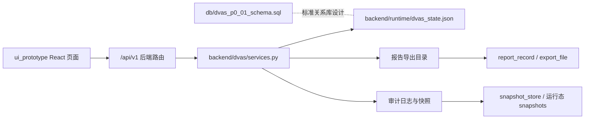

说明：当前 P0 演示链路以本地后端和运行态 JSON 状态文件执行，PostgreSQL DDL 是验收用标准数据库设计包。生产数据库切换、集群部署和外部系统集成不属于当前 P0 已实现范围。

### 2.2 系统逻辑组成

**表 2-2 系统逻辑组成**

| 逻辑组成 | 职责 | 主要对象 |
| --- | --- | --- |
| 项目与首页 | 项目状态、流程入口、风险提示、一键完整计算。 | allocation_project、dashboard summary、preconditions |
| 数据管理 | 数据接入、资源识别、参与方和资源关系。 | input_snapshot、data_package、data_resource、party |
| 数元贡献度计量 | 质量、数元、贡献和效用。 | quality_assessment、shuyuan_metering、contribution_record、utility_record |
| 收益分配计算 | MD-DShap、合同比例和收益分配模拟。 | md_dshap_task、contract_ratio_plans/items、allocation_result |
| 报告与审计 | 报告导出、文件校验、审计日志和快照。 | report_record、export_file、audit_log、snapshot_store |
| 系统管理 | 参数、P1 本地用户和权限、审计查询。 | system_parameter、parameter_version、user_account、role、permission |

### 2.3 模块组成

**表 2-3 模块组成**

| 一级导航 | 二级页面 | 路由 | 阶段 | menu_code |
| --- | --- | --- | --- | --- |
| 系统首页 | 系统首页 | /dashboard | P0 | NAV_SYS_HOME |
| 数据管理 | 数据接入管理 | /data/ingestion | P0 | NAV_DATA_PACKAGE |
| 数据管理 | 数据资源管理 | /data/resources | P0 | NAV_DATA_RESOURCE |
| 数据管理 | 参与方管理 | /data/parties | P0 | NAV_DATA_PARTY |
| 数元贡献度计量 | 质量评估管理 | /metering/quality | P0 | NAV_MEASURE_QUALITY |
| 数元贡献度计量 | 数元计量管理 | /metering/shuyuan | P0 | NAV_MEASURE_SHUYUAN |
| 数元贡献度计量 | 贡献度与效用计算 | /metering/utility | P0 | NAV_MEASURE_UTILITY |
| 收益分配计算 | MD-DShap 计算管理 | /allocation/md-dshap | P0 | NAV_ALLOC_MDS |
| 收益分配计算 | 合同分配规则 | /allocation/constraints | P0 | NAV_ALLOC_CONSTRAINT |
| 收益分配计算 | 收益分配模拟 | /allocation/simulation | P0 | NAV_ALLOC_SIMULATION |
| 报告生成与导出 | 报告生成与导出 | /reports | P0/P1 | NAV_REPORT_EXPORT |
| 系统管理 | 参数配置 | /system/parameters | P0 | NAV_SYSTEM_PARAMETER |
| 系统管理 | 用户与权限管理 | /system/users | P1 | NAV_SYSTEM_USER |
| 系统管理 | 审计日志管理 | /system/audit | P0 | NAV_SYSTEM_AUDIT |

### 2.4 模块间关系

**表 2-4 模块间关系**

| 关系序号 | 上游模块 | 下游模块 | 数据或状态传递 |
| --- | --- | --- | --- |
| 1 | 数据接入管理 | 数据资源管理 | 有效数据包生成资源与字段。 |
| 2 | 数据资源管理 | 参与方管理 | 资源需关联数据源主体。 |
| 3 | 参与方管理 | 质量评估管理 | 质量前置需明确参与方和数据源主体边界。 |
| 4 | 质量评估管理 | 数元计量管理 | 质量因子参与数元计量。 |
| 5 | 数元计量管理 | 贡献度与效用计算 | 数元结果进入贡献和效用计算。 |
| 6 | 贡献度与效用计算 | MD-DShap 计算管理 | 效用值提供 v(S,t) 输入。 |
| 7 | MD-DShap 计算管理 | 收益分配模拟 | 归一化权重进入数据源收益池分配。 |
| 8 | 合同分配规则 | 收益分配模拟 | 合同比例方案决定非数据主体金额和数据源收益池。 |
| 9 | 收益分配模拟 | 报告生成与导出 | 分配结果进入 Markdown/CSV/JSON/JSONL 导出。 |
| 10 | 全模块 | 审计日志管理 | 关键写操作、失败和导出均进入审计与快照。 |

### 2.5 功能权限分配

**表 2-5 功能权限分配**

| 权限类别 | P0/P1 | 说明 |
| --- | --- | --- |
| 查看类 | P0 | 本地操作员可查看 P0 主链路页面。 |
| 计算类 | P0 | 质量评估、数元计量、效用计算、MD-DShap、收益分配模拟需满足前置条件。 |
| 导出类 | P0 | Markdown、CSV、JSON、JSONL 导出需写 report_id、checksum 和审计。 |
| 用户与角色类 | P1 | 本地用户、角色和权限扩展，不作为 P0 必须能力。 |
| 密码动作 | P1 | 管理员分配初始密码、重置密码；用户可修改本人密码；不返回明文密码。 |

### 2.6 物理/运行环境设计

**表 2-6 P0 本地运行环境设计**

| 环境项 | 当前设计 | 边界说明 |
| --- | --- | --- |
| 前端运行 | ui_prototype 本地 Vite/静态构建 | 本地演示环境，不声明生产部署能力。 |
| 后端运行 | backend/dvas/server.py 提供 /api/v1 | 本地同步执行为主。 |
| 关系数据库设计目标 | PostgreSQL 13+，Schema dvas | DDL 为标准数据库包；默认仓储仍可为 JSON 运行态。 |
| 运行态状态 | backend/runtime/dvas_state.json | 承载当前 P0/P1 本地对象、报告索引、审计和部分草稿。 |
| 报告文件 | 后端导出目录 | 每次导出生成新文件和 checksum，不覆盖历史。 |
| 生产部署、集群、高可用、多租户、银行结算、税务处理、电子签章 | P1/P2 后续扩展或非本系统范围 | 本文不写成当前已实现能力。 |

### 2.7 界面 UI 设计

**表 2-7 界面 UI 设计原则**

| 设计项 | 说明 |
| --- | --- |
| 导航基线 | 左侧导航使用系统首页、数据管理、数元贡献度计量、收益分配计算、报告生成与导出、系统管理。 |
| 首页边界 | 系统首页为一级页面，不设置二级窗口；内部集成总览、流程入口、风险提示和一键计算。 |
| 异常状态 | 后端不可用时明确提示，不用前端 mock 伪造成后端成功。 |
| 截图策略 | 当前已补充 14 张主页面截图，后续如页面发生调整需重新截取并替换对应图号文件。 |

## 3. 系统详细设计
### 3.1 系统首页
系统首页是 P0 本地演示的工作台，不是营销页。页面入口为 `/dashboard`，前端由 `OverviewPage` 读取当前项目、资源数、参与方数、计量金额、收益池和最近报告，并把用户引导到后续计算页面。

**表 3-1 系统首页设计要点**

| 项目 | 当前设计 |
| --- | --- |
| 入口和按钮 | `/dashboard`；选择演示数据、上传 JSON、一键完整计算、报告预览。 |
| 读取对象 | `allocation_project`、`data_package`、`data_resource`、`party`、`quality_assessment`、`md_dshap_task`、`allocation_scenario`、`report_record`。 |
| 接口 | `GET /dashboard`、`GET /dashboard/preconditions`、`POST /dashboard/actions/quick-run`，项目级兼容入口为 `POST /projects/{project_id}/pipeline/run`。 |
| 状态处理 | 首页查询不改状态；一键完整计算按现有服务顺序推进，前置不满足时返回阻断原因。 |

当前实现没有在前端伪造完整链路成功态。缺少有效数据包、质量评估、效用、MD-DShap 权重或合同比例方案时，页面展示后端返回的阻断信息；一键完整计算失败写 `SYS-004` 相关审计，成功时由各阶段服务分别写自己的审计记录。

【图 3-1 系统首页页面截图】
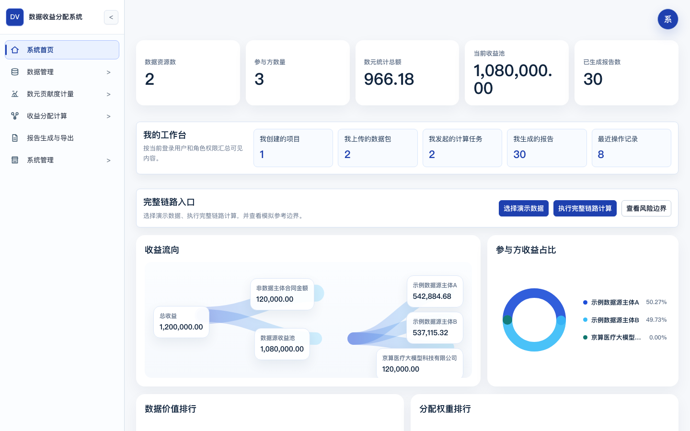
- 页面路径：/dashboard
- 需要展示内容：项目总览、流程入口、风险提示、一键完整计算和最近报告摘要。
- 截图文件：dvas-sdd-03-01-dashboard.png

### 3.2 数据接入管理
数据接入页负责把演示数据或用户上传的 UTF-8 JSON 转成 P0 运行对象。主接口以 OpenAPI 和后端路由的 `/data-packages/*` 为准；前端仍保留 `/data/packages/*` 兼容别名，用于旧页面动作。

**表 3-2 数据接入落库与校验**

| 步骤 | 处理内容 | 写入或更新对象 | 失败处理 |
| --- | --- | --- | --- |
| 选择演示数据 | 调用 `POST /demo-cases/{demo_case_id}/select` 初始化本地样例。 | `input_snapshot`、`data_package`、`data_resource`、`party`。 | `DVAS_NOT_FOUND` 或初始化失败审计。 |
| 上传 JSON | `POST /data-packages/upload` 接收 JSON body 或 multipart 文件，文件入口只接受 JSON。 | 有效包写 `data_package`，原始内容写输入快照并计算 checksum。 | `DVAS_UPLOAD_VALIDATION_FAILED`，返回字段级错误并保留校验结果。 |
| 查看结果 | `GET /data-packages`、`GET /data-packages/{package_id}`、`GET /data-packages/{package_id}/validation-result`。 | 只读。 | 包不存在返回 `DVAS_NOT_FOUND`。 |

上传 payload 至少应包含 `package_name`、`file_name`、`resources`、`parties`。资源侧关注 `resource_name`、`modality`、`field_count`、`sample_count` 和 `provider_party_name`；参与方侧关注 `party_name`、`party_type`、`include_in_md_dshap`。金额、比例、重复主体和资源主体关系在接入阶段先做基础校验，后续页面仍按各模块规则二次校验。

【图 3-2 数据接入管理页面截图】
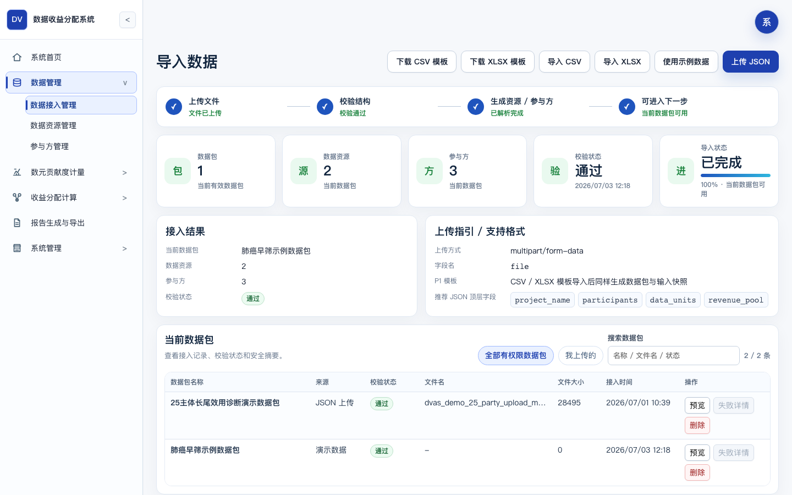
- 页面路径：/data/ingestion
- 需要展示内容：演示数据初始化、JSON 上传、校验结果和字段要求入口。
- 截图文件：dvas-sdd-03-02-data-ingestion.png

### 3.3 数据资源管理
资源管理页展示当前数据包识别出的数据资源、字段统计和主体绑定结果。资源进入后续计算前必须处于 `ACTIVE`，且未被设置为不参与计算。

**表 3-3 数据资源管理接口与规则**

| 设计点 | 说明 |
| --- | --- |
| 页面入口 | `/data/resources`。 |
| 主要接口 | `GET /data-resources`、`GET /data-resources/{resource_id}`、`PUT /data-resources/{resource_id}/party-relations`。 |
| 关键字段 | `resource_id`、`resource_name`、`modality`、`field_count`、`sample_count`、`party_id`、`include_in_calculation`、`status`。 |
| 资源主体关系 | 保存时提交 `party_id`、`split_ratio`、`is_primary_provider`；前端会先根据主体名称解析后端 `party_id`。 |

当前 P0 主要按一个资源绑定一个主数据源主体处理；数据库设计保留 `data_resource_party_relation` 支持多主体拆分。若资源未绑定数据源主体，该资源不会进入 MD-DShap 参与方池，页面应提示“未关联当前数据包有效数据资源”。

【图 3-3 数据资源管理页面截图】
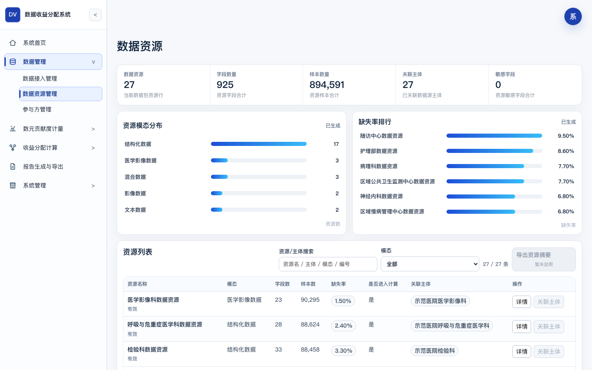
- 页面路径：/data/resources
- 需要展示内容：数据资源清单、字段统计、资源摘要和资源-数据源主体关联。
- 截图文件：dvas-sdd-03-03-data-resources.png

### 3.4 参与方管理
参与方管理不只维护名称列表，还决定主体进入哪条计算路径：数据源主体可以进入 MD-DShap 权重池；运营方、试点基地、技术服务方、专家等非数据主体默认走合同比例方案。

**表 3-4 参与方类型与后续影响**

| 配置项 | 后续影响 |
| --- | --- |
| `party_type=DATA_PROVIDER` | 可作为数据资源提供方，满足资源绑定和启用条件时进入权重池。 |
| `include_in_md_dshap=true` | 仅对数据源主体有效；非数据主体即使误设也会在参与方池中被排除。 |
| `status=ACTIVE/ENABLED` | 参与后续质量、数元、效用和权重计算。 |
| `status=DISABLED/INACTIVE` | 不进入权重池；如导致无可用数据源主体，权重计算被阻断。 |

接口为 `GET /data/parties`、`POST /data/parties`、`PATCH /data/parties/{party_id}` 和 `PATCH /data/parties/{party_id}/status`。新增、更新、禁用均写审计；重名、非法类型、禁用后无可用数据源主体等情况返回字段级错误。

【图 3-4 参与方管理页面截图】
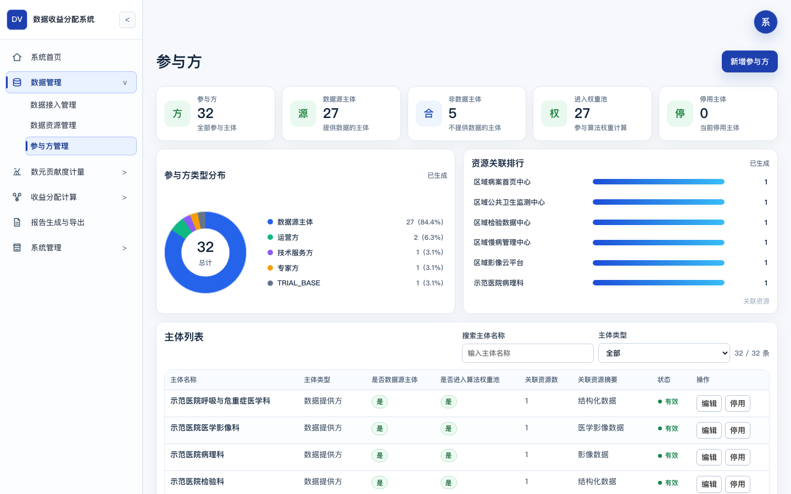
- 页面路径：/data/parties
- 需要展示内容：数据源主体、非数据贡献主体、启停状态和是否纳入权重池。
- 截图文件：dvas-sdd-03-04-parties.png

### 3.5 质量评估管理
质量评估使用当前后端 `DVAS_QUALITY_7P17S_V1`。包级结果写入 `quality_assessment` 和 `quality_score_detail`；逐资源质量结果当前保存在运行态 `quality_resource_assessments`、`quality_resource_score_details`，不是 38 张 SQL 表中的同名表。

评估入口为 `POST /metering/quality/evaluate`，兼容入口为 `POST /quality-assessments/run`。服务先检查当前数据包是否 `VALIDATED`，再读取数据资源和质量权重，计算包级 `quality_score`、`quality_level`、`quality_factor=quality_score/100`、一级维度分和二级指标明细。逐资源评估按字段数、样本量、缺失率、资源状态和主体关系产生 `total_score`、`lowest_dimension_code`、`quality_factor` 和证据摘要。

**表 3-5 质量评估页面处理**

| 页面动作 | 后端处理 | 写入对象 |
| --- | --- | --- |
| 参数配置 | `GET/PUT /metering/quality/weights` 读取或保存质量指标权重。 | `system_parameter`、`parameter_version`。 |
| 重新评估 | 校验数据包和资源，重新计算包级和逐资源质量。 | `quality_assessment`、`quality_score_detail`、运行态逐资源结果、结果快照。 |
| 查看证据 | 查询包级明细、逐资源评分和热力图数据。 | 只读。 |

低分资源阈值取系统参数 `LOW_QUALITY_RESOURCE_THRESHOLD`，默认按 70 分识别。质量结果只影响后续数元和效用，不直接形成收益分配金额。

【图 3-5 质量评估管理页面截图】
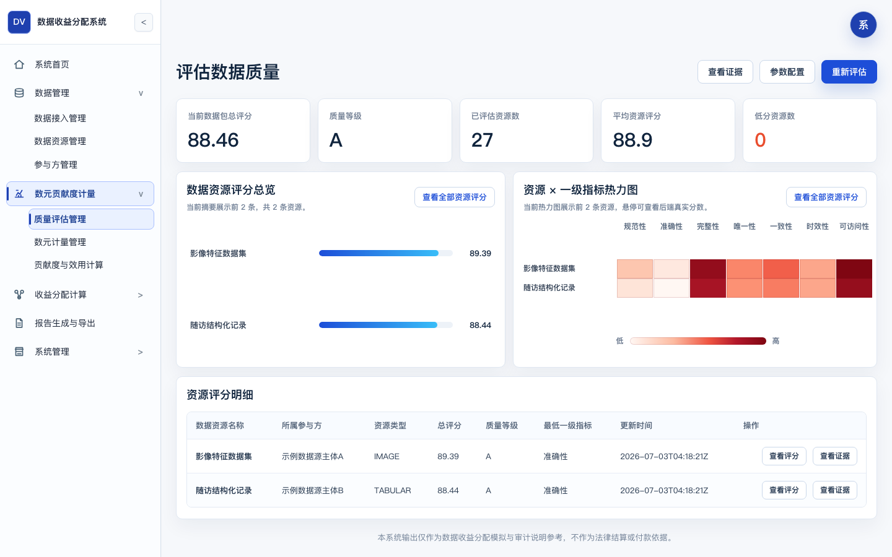
- 页面路径：/metering/quality
- 需要展示内容：包级质量总分、质量等级、逐资源评分、指标权重和证据抽屉。
- 截图文件：dvas-sdd-03-05-quality.png

### 3.6 数元计量管理
数元计量从最近一次质量评估开始，读取有效资源、调用量和参数。当前算法版本为 `DVAS_SHUYUAN_METERING_RESOURCE_QUALITY_V1`。

计量公式写在参数快照中：

```text
metering_amount = base_price × scenario_coefficient × quality_coefficient × technology_coefficient × expert_coefficient × development_coefficient × call_count
```

当前实现优先使用逐资源质量因子；缺少逐资源质量结果时回退到包级 `quality_factor`。调用量可由页面草稿 `SHUYUAN_CALL_COUNTS` 提供，也可由请求中的 `call_counts` 提供；仅提供总 `call_count` 时按资源 `sample_count` 分摊，样本量为 0 时均分。

**表 3-6 数元计量关键字段**

| 字段 | 来源 | 用途 |
| --- | --- | --- |
| `base_shuyuan_price` | `DEFAULT_SHUYUAN_BASE_PRICE` 或请求参数 | 基础单价。 |
| `scenario_coefficient` | `DEFAULT_SCENARIO_COEFFICIENT` 或请求参数 | 场景系数。 |
| `quality_coefficient` | 逐资源质量因子或包级质量因子 | 质量修正。 |
| `call_count` / `valid_units` | 调用量草稿、请求或资源样本数 | 计量数量。 |
| `metering_amount` | 公式计算结果 | 后续贡献度输入。 |

【图 3-6 数元计量管理页面截图】
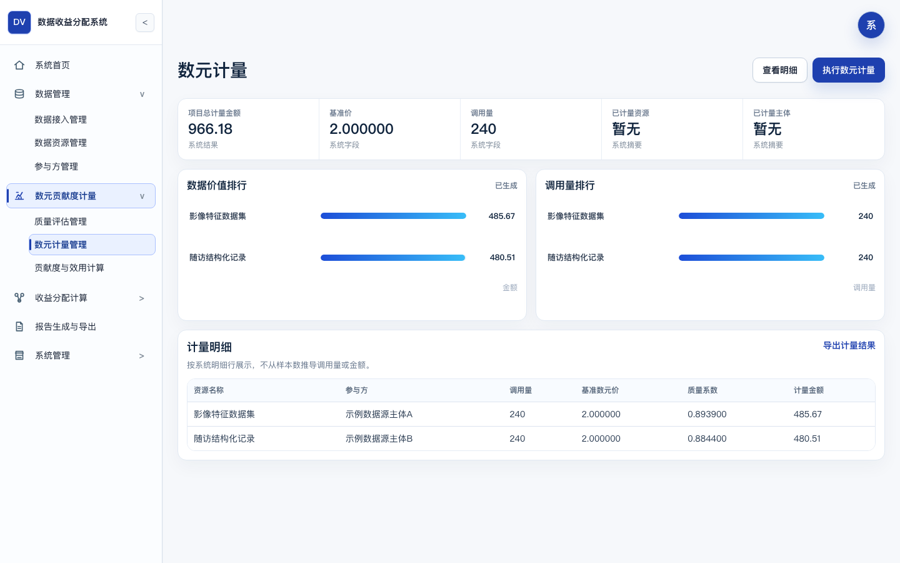
- 页面路径：/metering/shuyuan
- 需要展示内容：计量参数、调用量、资源级明细和项目计量金额。
- 截图文件：dvas-sdd-03-06-shuyuan.png

### 3.7 贡献度与效用计算
贡献度和效用页把数元计量转成 MD-DShap 可用的 `v(S,t)` 输入。当前后端分两步处理：先按参与方聚合资源调用量形成 `contribution_record`，再结合质量和场景参数形成 `utility_record` 与 `utility_trace`。

贡献度公式：

```text
contribution_score = valid_units × usage_weight × coverage_weight × scarcity_weight
normalized_contribution = contribution_score / sum(contribution_score)
```

效用公式：

```text
utility_value = normalized_contribution × quality_factor × usage_factor × scenario_factor
```

**表 3-7 贡献度与效用写入对象**

| 阶段 | 接口 | 写入对象 | 当前说明 |
| --- | --- | --- | --- |
| 保存贡献因子 | `PUT /metering/utility/contribution-factors` | `system_parameter`、`parameter_version` | 参数变更不回改历史结果。 |
| 计算贡献度 | `POST /metering/utility/contribution/calculate` | `contribution_record`、参数快照、结果快照 | 按参与方聚合有效调用量。 |
| 保存效用函数 | `PUT /metering/utility/function` | 运行态 `business_drafts` | 当前为运行态草稿，不是 SQL 表。 |
| 计算效用 | `POST /metering/utility/calculate` | `utility_record`、`utility_trace`、快照 | 更新项目状态为 `UTILITY_CALCULATED`。 |

效用 trace 保留每个参与方的贡献、质量因子来源、使用因子、场景因子和公式文本。质量因子优先取参与方资源加权平均，缺失时回退包级质量因子。

【图 3-7 贡献度与效用计算页面截图】
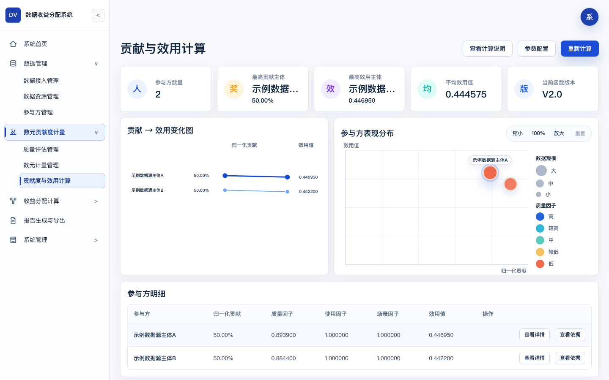
- 页面路径：/metering/utility
- 需要展示内容：贡献因子、效用函数、效用值和 trace。
- 截图文件：dvas-sdd-03-07-utility.png

### 3.8 MD-DShap 计算管理
MD-DShap 页只负责数据源主体权重层，不处理非数据主体金额。当前算法版本为 `DVAS_MD_DSHAP_P0_DETERMINISTIC_V0`，任务集合为 `P0_DETERMINISTIC_UTILITY`。

参与方池由后端按四个条件过滤：主体类型为数据源主体、状态启用、`include_in_md_dshap=true`、已关联当前数据包有效资源。未满足条件的主体进入 `excluded_parties`，并带有排除原因。单数据源主体场景不运行完整权重分解，直接写 `normalized_weight=1.000000` 并保留简化说明。

多数据源主体权重按当前效用值归一化：

```text
raw_weight_i = utility_value_i / total_utility
normalized_weight_i = round(raw_weight_i, 6)
```

四舍五入后的差额写回原始权重最大的主体，保证权重合计为 `1.000000`。`BASELINE_SHAPLEY` 只能作为小规模 `baseline_check`，不能保存为最终权重任务模式；配置错误返回 `DVAS_FACTOR_INVALID`。

**表 3-8 MD-DShap 任务对象**

| 对象 | 关键字段 |
| --- | --- |
| `md_dshap_task` | `task_id`、`algorithm_mode`、`seed`、`sample_rounds`、`epsilon`、`algorithm_party_count`、`contract_party_count`、`parameter_snapshot_id`、`algorithm_audit_snapshot_id`。 |
| `md_dshap_result` | `party_id`、`participant_weight`、`normalized_weight`、`baseline_weight`、`weight_diff`。 |
| `md_dshap_marginal_trace` | `coalition_before`、`v_before`、`v_after`、`marginal_contribution`、`seed`。 |

【图 3-8 MD-DShap 计算管理页面截图】
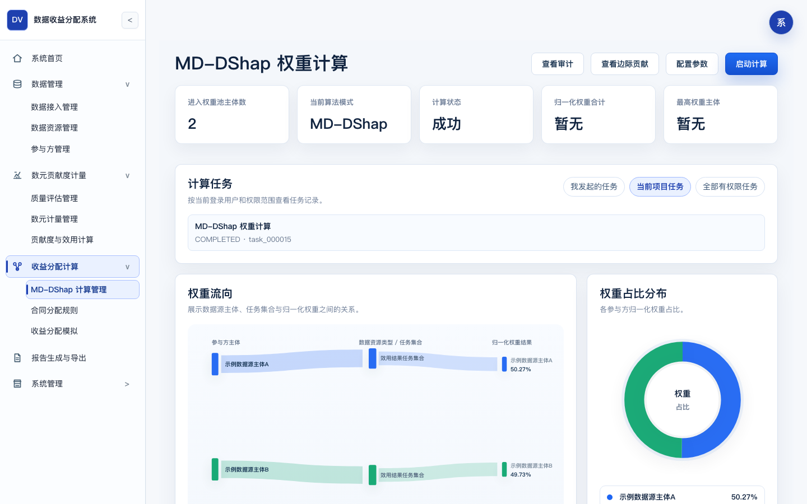
- 页面路径：/allocation/md-dshap
- 需要展示内容：参与方池、排除原因、权重结果、边际贡献 trace 和算法审计导出入口。
- 截图文件：dvas-sdd-03-08-md-dshap.png

### 3.9 合同分配规则
合同分配规则页维护当前项目已保存的合同比例方案。它是当前前端主链路，不是旧 `contract_constraint` 的普通约束路径。方案数据当前放在运行态 `contract_ratio_plans/items`；SQL 设计中的 `allocation_priority_item` 和 `contract_constraint` 作为兼容对象保留。

**表 3-9 合同比例方案规则**

| 规则 | 当前实现 |
| --- | --- |
| 总收益 | `total_revenue` 必填，金额按 0.01 量化。 |
| 数据源收益池比例 | `data_provider_pool_ratio` 必须大于 0 且小于等于 1。 |
| 非数据主体条目 | `items[].bucket_type` 只能为 `NON_DATA_PARTY`；`party_id` 必须存在且不能是数据源主体。 |
| 比例闭合 | 数据源收益池比例加所有非数据主体比例必须等于 `1.000000`。 |
| 方案状态 | 保存后默认 `SAVED`，允许 `DRAFT/SAVED/LOCKED`。 |

保存接口为 `PUT /projects/{project_id}/allocation/contract-ratio`，读取和删除分别为同路径的 `GET`、`DELETE`。保存成功写 `SAVE_CONTRACT_RATIO_PLAN` 审计；删除成功写 `DELETE_CONTRACT_RATIO_PLAN` 审计。没有保存有效方案时，收益分配模拟返回 `DVAS_CONTRACT_RATIO_REQUIRED`。

【图 3-9 合同分配规则页面截图】
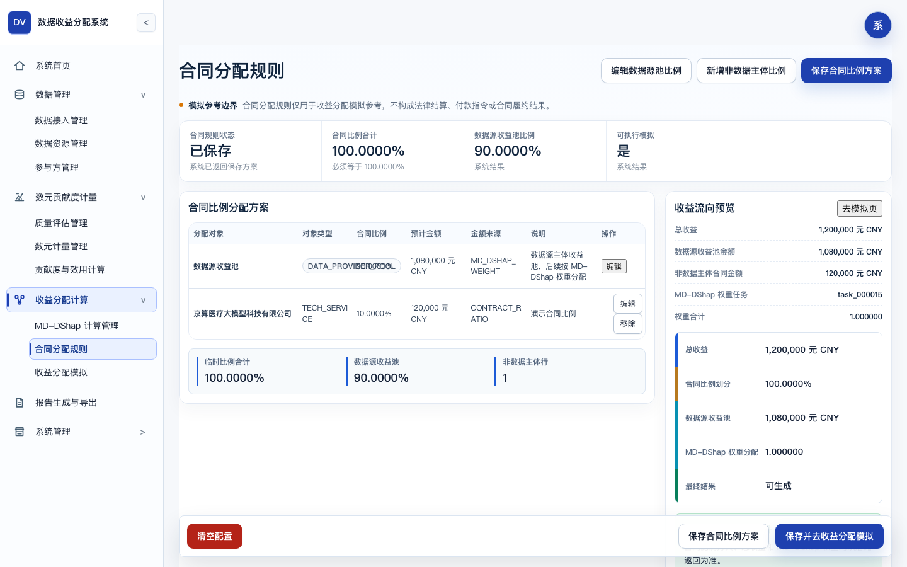
- 页面路径：/allocation/constraints
- 需要展示内容：总收益、数据源收益池比例、非数据主体比例项和保存状态。
- 截图文件：dvas-sdd-03-09-contract-ratio.png

### 3.10 收益分配模拟
收益分配模拟以已保存合同比例方案和最近成功的 MD-DShap 权重任务为输入。当前主接口为 `POST /projects/{project_id}/allocation/simulate`；旧的 `/allocation/simulation/run` 仍用于兼容草稿式分配路径。

计算顺序固定为：

1. 读取 `contract_ratio_plan`，校验状态为 `SAVED` 或 `LOCKED`，且 `ratio_sum=1.000000`。
2. 读取最近成功的 `md_dshap_result`，确认归一化权重可用。
3. 非数据主体金额按 `total_revenue × ratio` 进入 `amount_source=CONTRACT_RATIO`。
4. 数据源主体收益池取 `data_provider_revenue_pool`，按 `normalized_weight` 分配，写 `amount_source=MD_DSHAP_WEIGHT`。
5. 金额保留 0.01 元；尾差写入最大权重数据源主体的 `rounding_delta`。

**表 3-10 收益分配输出字段**

| 输出对象 | 字段 |
| --- | --- |
| `allocation_scenario` | `allocation_id`、`total_revenue`、`non_data_contract_amount`、`data_provider_revenue_pool`、`contract_ratio_plan_id`、`weight_task_id`、`result_snapshot_id`。 |
| `allocation_result` | `party_id`、`subject_track`、`amount_source`、`contract_ratio`、`normalized_weight`、`final_amount`、`rounding_delta`、`simulation_disclaimer`。 |
| 结果快照 | `allocation`、`contract_ratio_plan`、`contract_ratio_items`、`results`、`data_provider_allocations`。 |

锁定方案通过当前前端 `POST /allocation/simulation/{allocation_id}/lock` 执行；旧文档中的其他确认路径不作为当前主路径。

【图 3-10 收益分配模拟页面截图】
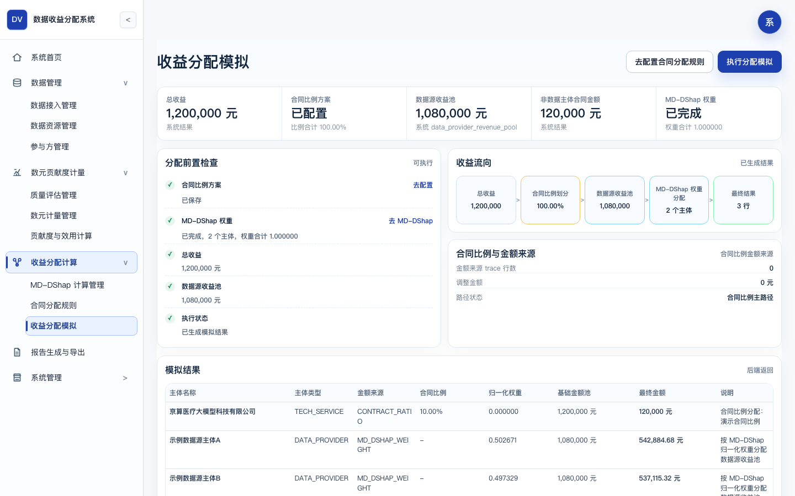
- 页面路径：/allocation/simulation
- 需要展示内容：合同比例方案、数据源收益池、非数据主体金额、数据源主体分配结果和尾差。
- 截图文件：dvas-sdd-03-10-simulation.png

### 3.11 报告生成与导出
报告页预览和导出当前 P0 支持的文件。当前真实 P0 格式为 Markdown、CSV、JSON、JSONL；MD-DShap 审计说明同时输出 Markdown 和 JSON。PDF 代码路径存在，但产品边界仍标为 P1。

**表 3-11 报告页按钮与产物**

| 按钮 | 接口 | 产物 |
| --- | --- | --- |
| 报告预览 | `GET /reports/preview` | 只读预览，不写报告记录。 |
| 导出 Markdown | `POST /reports/markdown` | `allocation_summary.md`。 |
| 导出 CSV | `POST /reports/csv` | `source_level_allocation.csv`、`allocation_result.csv`，并按可用上下文追加质量、数元、权重、约束明细 CSV。 |
| 导出 JSON | `POST /reports/json` | `allocation_result.json`。 |
| 导出审计日志 | `POST /reports/audit-log` | `audit_log.jsonl`。 |
| 导出算法审计 | `POST /reports/md-dshap-audit` 或任务级 `POST /allocation/md-dshap/tasks/{task_id}/audit-export` | `md_dshap_audit_report.md`、`md_dshap_audit_report.json`。 |
| 下载 | `GET /reports/{report_id}/download?file_id={export_file_id}` | 返回 base64 文件内容并校验 checksum。 |

每次导出创建新的 `report_id` 和 `export_file_id`，写 `report_record`、`export_file`、报告快照和成功审计。下载时重新计算文件 SHA-256，并返回 `checksum_verified`。

【图 3-11 报告生成与导出页面截图】
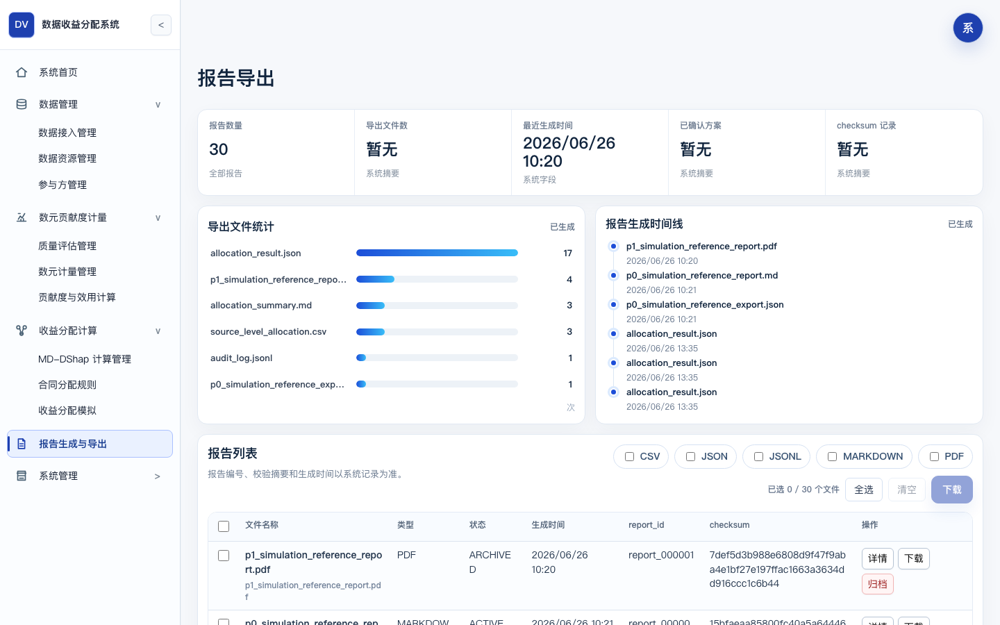
- 页面路径：/reports
- 需要展示内容：报告预览、导出按钮、历史报告、checksum 和下载状态。
- 截图文件：dvas-sdd-03-11-reports.png

### 3.12 参数配置
参数配置页维护运行参数，不修改历史结果。系统参数写 `system_parameter`，每次变更写 `parameter_version`；部分页面草稿，例如数元调用量和效用函数，当前在运行态 `business_drafts` 中维护。

**表 3-12 参数配置范围**

| 参数组 | 典型参数 | 影响范围 |
| --- | --- | --- |
| 质量权重 | 一级/二级指标权重、低分资源阈值 | 新质量评估任务。 |
| 数元参数 | 基础单价、场景系数、技术系数、专家系数、开发系数 | 新数元计量任务。 |
| 贡献与效用 | 使用权重、覆盖权重、稀缺权重、使用因子、场景因子 | 新贡献和效用计算。 |
| MD-DShap | `seed`、`sample_rounds`、`epsilon`、是否保存边际 trace | 新权重任务。 |
| 报告声明和精度 | 模拟参考说明、金额精度、权重展示精度 | 新报告和新页面展示。 |

参数恢复默认和保存都需要权限；失败时返回字段级原因，例如类型非法、范围不合法或参数不存在。

【图 3-12 参数配置页面截图】
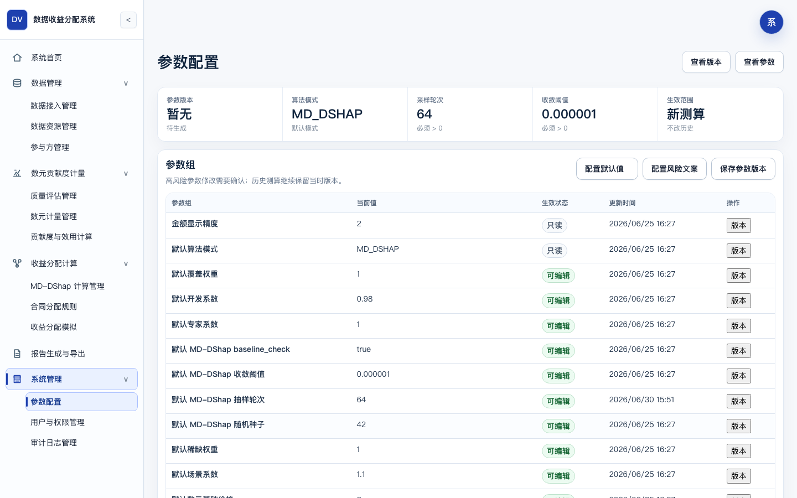
- 页面路径：/system/parameters
- 需要展示内容：质量权重、数元参数、算法参数、报告声明和精度规则。
- 截图文件：dvas-sdd-03-12-parameters.png

### 3.13 用户与权限管理
用户与权限管理是 P1 本地扩展。P0 可在无登录的本地操作员模式下运行；一旦通过 HTTP token 登录，后端按按钮权限检查写操作。

当前实现规则如下：

- 只有具备 `SYSTEM_ADMIN` 角色或对应用户管理权限的用户可以创建、编辑、禁用、重置密码和配置角色权限。
- 管理员创建用户时可以提供初始密码；未提供时后端生成一次性临时密码。返回字段为 `one_time_initial_password`，不会返回密码哈希。
- 管理员重置密码返回 `one_time_temporary_password`，同时撤销目标用户既有会话。
- 用户可通过 `PUT /users/me/password` 修改本人密码；需校验当前密码、新旧密码不同、两次新密码一致、密码至少 8 位且包含字母和数字。
- 禁用用户时拒绝禁用自己，也拒绝禁用最后一个启用的系统管理员。

密码存储使用带本地前缀的 SHA-256 哈希字段 `password_hash`。该实现满足本地演示和权限动作说明，不声明为生产级身份与权限体系。

【图 3-13 用户与权限管理页面截图】
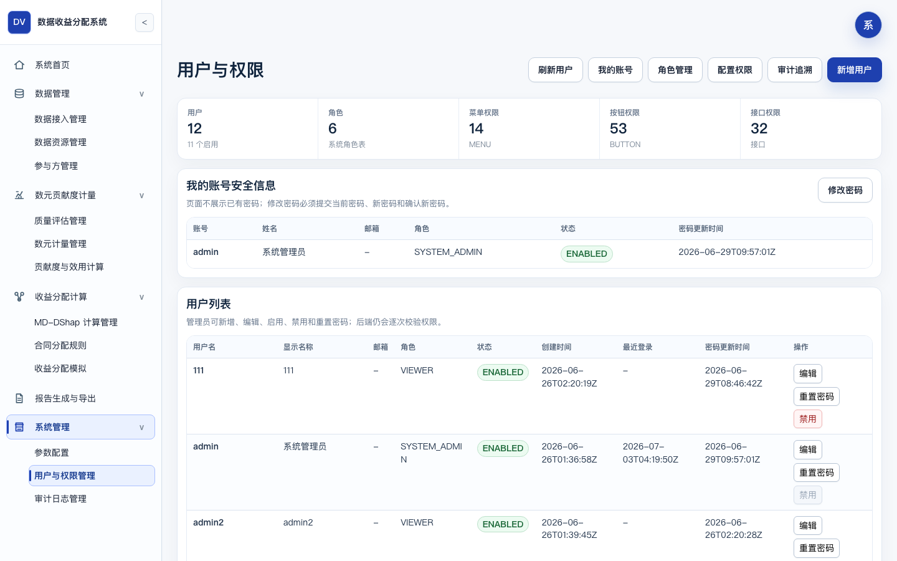
- 页面路径：/system/users
- 需要展示内容：用户列表、角色、权限、禁用、重置密码和本人改密入口。
- 截图文件：dvas-sdd-03-13-users.png

### 3.14 审计日志管理
审计日志页用于查询操作记录、查看快照引用和导出审计日志。当前接口包括 `GET /system/audit/logs`、`GET /audit-logs/{log_id}`、`GET /audit/snapshots/{snapshot_id}` 和 `POST /audit/export`；报告页也可通过 `POST /reports/audit-log` 导出同类 JSONL 文件。

**表 3-14 审计日志设计**

| 设计项 | 当前实现 |
| --- | --- |
| 记录内容 | `module_code`、`menu_code`、`operation_type`、`object_type`、`object_id`、操作人、状态、失败原因、输入快照、参数快照、结果快照、前后值摘要。 |
| 失败审计 | 关键写操作失败时由 `DvasApplication._record_failure_audit` 根据路由补充模块、菜单和对象类型。 |
| 快照读取 | `snapshot_store` 或运行态快照按 `snapshot_id` 读取，不修改业务数据。 |
| 审计导出 | `audit_log.jsonl` 逐行写审计记录，并附带报告记录和导出文件记录。 |

审计查询是只读动作；导出动作会写报告记录和导出文件记录。若文件缺失或快照不存在，接口返回 `DVAS_NOT_FOUND`，页面展示失败原因。

【图 3-14 审计日志管理页面截图】
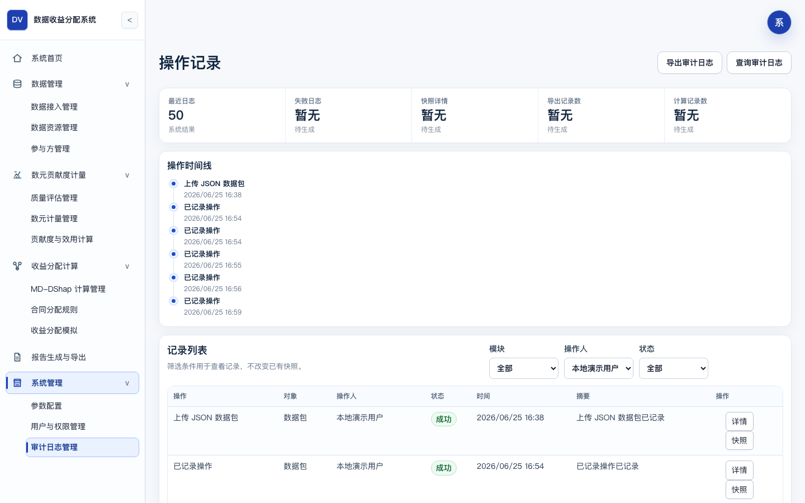
- 页面路径：/system/audit
- 需要展示内容：审计日志列表、详情、快照引用和审计导出。
- 截图文件：dvas-sdd-03-14-audit.png

## 4. 前后端集成设计
### 4.1 集成边界

**表 4-1 前后端集成边界**

| 项目 | 当前设计 |
| --- | --- |
| API 前缀 | 后端接口集中在 /api/v1 下，前端通过 API client 调用。 |
| 连接状态 | 前端在系统未连接时显示不可用状态，不伪造业务成功。 |
| 登录状态 | P0 可使用本地操作员外观；P1 有 token 时绑定当前用户和权限。 |
| 错误信封 | 接口返回 success、data、code、message、trace_id、field_errors 等字段组。 |
| DTO 映射 | 前端 DTO mapper 将后端字段转换为页面数据结构。 |

### 4.2 页面-接口-数据对象映射

**表 4-2 页面-接口-数据对象映射**

| 页面 | 路由 | 主要接口 | 主要数据对象 |
| --- | --- | --- | --- |
| 系统首页 | /dashboard | GET /dashboard；GET /dashboard/preconditions；POST /dashboard/actions/quick-run | allocation_project、data_package、data_resource、party、quality_assessment、md_dshap_task、allocation_scenario、report_record |
| 数据接入管理 | /data/ingestion | POST /demo-cases/{demo_case_id}/select；POST /data-packages/upload（兼容 /data/packages/upload）；GET /data-packages（兼容 /data/packages） | input_snapshot、data_package、upload_validation_result、data_resource、party |
| 数据资源管理 | /data/resources | GET /data-resources（兼容 /data/resources）；PUT /data-resources/{resource_id}/party-relations | data_resource、data_resource_field、data_resource_party_relation、party |
| 参与方管理 | /data/parties | GET /data/parties；POST /data/parties；PATCH /data/parties/{party_id}/status | party、data_resource_party_relation |
| 质量评估管理 | /metering/quality | GET /metering/quality/weights；POST /metering/quality/evaluate；GET /quality-assessments/latest；GET /quality-assessments/{assessment_id}/details | quality_metric_template、quality_assessment、quality_score_detail、运行态 quality_resource_assessments |
| 数元计量管理 | /metering/shuyuan | GET /metering/shuyuan/parameters；PUT /metering/shuyuan/parameters；POST /metering/shuyuan/calculate | shuyuan_metering、shuyuan_metering_detail、system_parameter、parameter_version |
| 贡献度与效用计算 | /metering/utility | PUT /metering/utility/contribution-factors；POST /metering/utility/contribution/calculate；POST /metering/utility/calculate | contribution_record、utility_function_snapshot、utility_record、utility_trace |
| MD-DShap 计算管理 | /allocation/md-dshap | GET /allocation/md-dshap/config；PUT /allocation/md-dshap/config；POST /allocation/md-dshap/tasks；GET /allocation/md-dshap/tasks/{task_id}/results | md_dshap_task、md_dshap_result、md_dshap_marginal_trace、algorithm_audit_snapshot |
| 合同分配规则 | /allocation/constraints | GET /projects/{project_id}/allocation/contract-ratio；PUT /projects/{project_id}/allocation/contract-ratio；DELETE /projects/{project_id}/allocation/contract-ratio；GET/POST /allocation/constraints | 运行态 contract_ratio_plans/items、contract_constraint、allocation_priority_item |
| 收益分配模拟 | /allocation/simulation | POST /projects/{project_id}/allocation/simulate；POST /allocation/simulation/{allocation_id}/lock | allocation_scenario、allocation_result、constraint_apply_trace、md_dshap_result、运行态合同比例方案 |
| 报告生成与导出 | /reports | POST /reports/markdown；POST /reports/csv；POST /reports/json；POST /reports/audit-log；GET /reports/{report_id}/download | report_record、export_file、snapshot_store、algorithm_audit_snapshot、audit_log |
| 参数配置 | /system/parameters | GET /system/parameters；PUT /system/parameters/{parameter_code} | system_parameter、parameter_version |
| 用户与权限管理 | /system/users | GET /system/users；POST /system/users；POST /system/users/{user_id}/disable；POST /system/users/{user_id}/reset-password；PUT /users/me/password | user_account、role、permission、user_role、role_permission、运行态 sessions |
| 审计日志管理 | /system/audit | GET /system/audit/logs；GET /audit/snapshots/{snapshot_id}；POST /audit/export | audit_log、snapshot_store、report_record、export_file |

### 4.3 前端 API client 设计

**表 4-3 前端 API client 设计**

| 文件 | 职责 |
| --- | --- |
| ui_prototype/src/domain/api/config.ts | 维护 API base URL、后端连接开关和 token 读取。 |
| ui_prototype/src/domain/api/endpoints.ts | 维护当前前端可调用或预留的 API 路径。 |
| ui_prototype/src/domain/api/index.ts | 封装 HTTP 调用、错误处理和登录 token。 |
| ui_prototype/src/domain/api/dtoMappers.ts | 转换后端 DTO 到页面模型。 |
| ui_prototype/src/domain/services/** | 将页面 actionId 转换为实际 API 调用或明确不可用状态。 |

### 4.4 后端 API dispatch 设计

**表 4-4 后端 API dispatch 设计**

| 项目 | 说明 |
| --- | --- |
| 路由入口 | DvasApplication 负责 /api/v1 路由分发。 |
| 权限按钮 | 有登录 token 时执行按钮权限检查；P0 本地模式不等同生产权限体系。 |
| 错误审计 | 关键写操作失败时写失败审计，保留 trace_id 或失败原因。 |
| 服务调用 | API 层调用 services.py 中对应服务，不在前端制造业务结果。 |

## 5. 核心业务流程设计
### 5.1 完整链路总览
```text
创建项目或选择演示数据
-> 上传或初始化数据包并生成输入快照
-> 识别数据资源、字段、模态和基础统计
-> 维护参与方，区分数据源主体和非数据贡献主体
-> 数据资源关联数据源主体
-> 质量评估
-> 数元计量
-> 贡献度计算与效用计算
-> MD-DShap 权重计算
-> 配置总收益和合同比例方案，形成非数据主体合同金额和数据源主体收益池
-> 收益分配模拟，使用 MD-DShap 归一化权重分配数据源主体收益池
-> 应用尾差处理
-> 锁定参考方案或复制新版本重算
-> 报告生成与导出
-> 审计追溯
```

### 5.2 流程详细设计
**表 5-1 核心业务流程详细设计**

| 序号 | 流程 | 输入 | 前置条件 | 处理逻辑 | 输出 | 状态变化 | 读写表 / 对象 | 审计日志 |
| --- | --- | --- | --- | --- | --- | --- | --- | --- |
| 1 | 项目创建 / 演示数据初始化 | 演示 case、项目默认配置 | 无或当前项目可重置 | 生成输入快照、数据包、资源、参与方和初始关系 | 当前项目、输入快照、数据包 | DRAFT -> INGESTED | input_snapshot、data_package、data_resource、party | 记录初始化操作 |
| 2 | 数据接入 | JSON 文件、文件名、业务字段 | 文件为 JSON 且结构有效 | 校验字段、主体、金额和资源；通过时生成快照和资源 | 有效数据包或校验失败详情 | 成功进入 INGESTED；失败不推进 | input_snapshot、data_package、upload_validation_result | 成功/失败均记录 |
| 3 | 数据资源识别 | 数据包内容、字段统计 | 数据包有效 | 识别资源、字段、模态、缺失率和样本数 | 资源列表、字段明细 | 保持 INGESTED | data_resource、data_resource_field | 记录资源初始化 |
| 4 | 参与方管理 | 参与方名称、类型、是否纳入权重池 | 项目存在 | 新增、编辑、禁用参与方 | 参与方列表 | 不直接推进状态 | party、运行态参与方 | 写操作审计 |
| 5 | 资源-主体关联 | 资源、数据源主体、分配比例 | 资源与主体存在 | 维护资源和数据源主体关系 | 关联关系 | 可作为质量前置条件 | data_resource_party_relation | 记录关系更新 |
| 6 | 质量评估 | 资源统计、质量权重 | 存在有效资源 | 按 7+17 指标评分，生成包级和逐资源质量 | 质量总分、等级、明细 | INGESTED -> ASSESSED | quality_assessment、quality_score_detail、运行态逐资源对象 | 记录评估 |
| 7 | 数元计量 | 质量结果、参数、调用量 | 质量已评估 | 计算资源级和参与方级数元 | 计量主表和明细 | ASSESSED -> METERED | shuyuan_metering、shuyuan_metering_detail | 记录计量 |
| 8 | 贡献度计算 | 计量结果、贡献因子 | 数元计量完成 | 计算参与方贡献信号和归一化贡献 | 贡献记录 | 保持 METERED 或进入后续效用 | contribution_record | 记录贡献计算 |
| 9 | 效用值计算 | 贡献记录、效用函数 | 贡献记录存在 | 保存效用函数快照并生成效用值和 trace | 效用记录、trace | METERED -> UTILITY_CALCULATED | utility_function_snapshot、utility_record、utility_trace | 记录参数和结果 |
| 10 | MD-DShap 权重计算 | 效用记录、数据源主体池、算法参数 | 效用已计算 | 排除非数据主体；单数据源权重为 1；多数据源计算归一化权重 | 权重任务、权重结果 | UTILITY_CALCULATED -> WEIGHT_CALCULATED | md_dshap_task、md_dshap_result、md_dshap_marginal_trace、algorithm_audit_snapshot | 记录算法快照 |
| 11 | 合同比例应用 | 总收益、数据源收益池比例、非数据主体比例项 | 已保存有效合同比例方案 | 计算非数据主体合同金额和数据源收益池 | 合同摘要 | 保持 WEIGHT_CALCULATED | 运行态 contract_ratio_plans/items | 记录方案保存或读取 |
| 12 | 收益分配模拟 | 合同比例方案、MD-DShap 权重 | 已算权重且有方案 | 按权重分配数据源收益池并处理尾差 | 分配场景、结果 | WEIGHT_CALCULATED -> ALLOCATED | allocation_scenario、allocation_result、constraint_apply_trace | 记录模拟 |
| 13 | 方案锁定 | 分配结果 | 分配已完成 | 将结果标记为参考方案版本 | 锁定结果 | ALLOCATED -> CONFIRMED | allocation_result、snapshot_store | 记录确认 |
| 14 | 报告导出 | 导出类型、当前结果 | 分配报告需已完成模拟 | 生成文件、report_id、checksum 和报告快照 | Markdown/CSV/JSON/JSONL | CONFIRMED/ALLOCATED -> EXPORTED | report_record、export_file、snapshot_store | 记录导出 |
| 15 | 审计追溯 | 日志筛选、log_id、snapshot_id | 存在审计或快照 | 查询日志、关联快照、导出 JSONL | 审计列表、快照、导出文件 | 不改变业务状态 | audit_log、snapshot_store | 导出时记录 EXPORT |

### 5.3 状态机设计
**表 5-2 项目状态枚举**

| 状态 | 说明 | 进入条件 | 可执行下一步 |
| --- | --- | --- | --- |
| DRAFT | 项目草稿 | 项目创建后尚未接入有效数据 | 选择演示数据或上传 JSON |
| INGESTED | 数据已接入 | 有效数据包、资源和参与方初始化完成 | 质量评估 |
| ASSESSED | 质量评估完成 | 包级和逐资源质量结果生成 | 数元计量 |
| METERED | 数元计量完成 | 资源级和参与方级计量结果生成 | 贡献度与效用计算 |
| UTILITY_CALCULATED | 效用计算完成 | 贡献记录和效用 trace 生成 | MD-DShap 权重计算 |
| WEIGHT_CALCULATED | 权重计算完成 | MD-DShap 任务成功，权重归一化 | 保存合同比例方案、收益分配模拟 |
| ALLOCATED | 收益分配模拟完成 | 分配场景和结果生成 | 锁定方案、导出报告 |
| CONFIRMED | 参考方案已锁定 | 分配结果确认，不覆盖历史 | 报告导出、复制新版本重算 |
| EXPORTED | 报告已导出 | 报告记录和文件生成 | 查看历史、审计追溯、再次导出 |

**表 5-3 状态迁移规则**

| 迁移 | 触发接口 / 操作 | 审计要求 |
| --- | --- | --- |
| DRAFT -> INGESTED | POST /demo-cases/{demo_case_id}/select 或 POST /data-packages/upload（兼容 /data/packages/upload） | 记录输入快照和数据包。 |
| INGESTED -> ASSESSED | POST /metering/quality/evaluate | 记录质量参数、结果和逐资源摘要。 |
| ASSESSED -> METERED | POST /metering/shuyuan/calculate | 记录计量参数和结果。 |
| METERED -> UTILITY_CALCULATED | POST /metering/utility/calculate | 记录效用函数和 trace。 |
| UTILITY_CALCULATED -> WEIGHT_CALCULATED | POST /allocation/md-dshap/tasks | 记录算法任务、权重和边际 trace。 |
| WEIGHT_CALCULATED -> ALLOCATED | POST /projects/{project_id}/allocation/simulate | 记录合同比例读取、分配结果和尾差。 |
| ALLOCATED -> CONFIRMED | POST /allocation/simulation/{allocation_id}/lock | 记录方案锁定和结果快照。 |
| ALLOCATED/CONFIRMED -> EXPORTED | POST /reports/markdown、/csv、/json、/audit-log | 记录 report_id、export_file、checksum 和报告快照。 |

### 5.4 状态机约束
**表 5-4 状态机约束**

| 约束 | 说明 |
| --- | --- |
| 前置条件不可跳过 | 未完成数据接入不能运行质量评估；未完成质量评估不能运行数元计量；未完成效用不能运行 MD-DShap。 |
| 单数据源简化 | 单一数据源主体场景不运行完整 MD-DShap，权重为 1，并披露简化口径。 |
| 非数据主体排除 | 非数据贡献主体不默认进入 MD-DShap 权重池。 |
| 结果不可覆盖 | 重算生成新 task_id、result_id、版本号和 trace，不覆盖历史。 |
| 报告不可覆盖 | 重复导出生成新 report_id 和新 checksum。 |

## 6. 接口详细设计
### 6.1 接口公共约定
**表 6-1 接口公共约定**

| 项目 | 设计 |
| --- | --- |
| API 前缀 | /api/v1 |
| 标准响应 | { success, data, code, message, trace_id, field_errors } |
| 权限检查 | 有 token 的请求按按钮权限执行；无登录时 P0 使用本地操作员外观。 |
| 错误审计 | 关键写操作失败时写失败审计。 |
| 输出边界 | 报告、导出和页面展示均保留模拟参考、非法律结算声明。 |

#### 6.1.1 路径口径与样例约定
后端主路由集中在 `/api/v1` 下。数据接入接口当前以 `/data-packages/*` 为后端主路径，同时保留 `/data/packages/*` 兼容前端旧调用；数据资源列表以 `/data-resources` 为主路径，页面端仍可通过 `/data/resources` 兼容入口读取。文档中的请求路径优先写主路径，存在兼容入口时在说明中列出，不把兼容入口写成新的业务能力。

标准成功响应：

```json
{
  "success": true,
  "code": "OK",
  "message": "success",
  "trace_id": "trace_20260703_001",
  "data": {
    "project_id": "proj_demo",
    "status": "INGESTED"
  }
}
```

标准失败响应：

```json
{
  "success": false,
  "code": "DVAS_PRECONDITION_NOT_MET",
  "message": "前置条件不满足",
  "trace_id": "trace_20260703_002",
  "field_errors": [
    {
      "field": "contract_ratio_plan",
      "message": "请先保存合同比例方案"
    }
  ]
}
```

#### 6.1.2 高价值接口样例
以下样例只展示接口字段结构，不作为固定演示数据。字段名均来自当前后端路由、服务对象或前端 API client。

JSON 上传请求：

```http
POST /api/v1/data-packages/upload
Content-Type: application/json
```

```json
{
  "package_name": "演示数据包",
  "file_name": "demo.json",
  "resources": [
    {
      "resource_name": "资源A",
      "modality": "TABLE",
      "field_count": 12,
      "sample_count": 1000,
      "provider_party_name": "数据源主体A"
    }
  ],
  "parties": [
    {
      "party_name": "数据源主体A",
      "party_type": "DATA_PROVIDER",
      "include_in_md_dshap": true
    }
  ]
}
```

质量评估请求：

```json
{
  "project_id": "proj_demo",
  "save_resource_results": true
}
```

质量评估响应关注 `assessment`、`details`、`resource_results`。逐资源对象包含 `resource_id`、`resource_name`、`total_score`、`quality_factor`、`lowest_dimension_code` 和证据摘要。

数元计量请求：

```json
{
  "project_id": "proj_demo",
  "base_shuyuan_price": 1.2,
  "scenario_coefficient": 1.0,
  "call_counts": {
    "res_001": 3000
  }
}
```

MD-DShap 任务请求：

```json
{
  "project_id": "proj_demo",
  "algorithm_mode": "MD_DSHAP",
  "seed": 20260703,
  "sample_rounds": 200,
  "epsilon": 0.000001,
  "save_trace": true
}
```

如果请求将 `BASIC_SHAPLEY` 写成最终模式，后端返回 `DVAS_FACTOR_INVALID`；该模式仅用于 `baseline_check`。

合同比例保存请求：

```json
{
  "total_revenue": 1000000,
  "data_provider_pool_ratio": 0.7,
  "items": [
    {
      "party_id": "party_operator",
      "bucket_type": "NON_DATA_PARTY",
      "ratio": 0.3,
      "basis_text": "合同约定运营服务比例"
    }
  ]
}
```

收益分配模拟失败样例：

```json
{
  "success": false,
  "code": "DVAS_CONTRACT_RATIO_REQUIRED",
  "message": "执行收益分配模拟前需先保存有效合同比例方案",
  "trace_id": "trace_20260703_003",
  "field_errors": []
}
```

报告下载响应返回 `file_name`、`file_format`、`content_base64`、`checksum` 和 `checksum_verified`。用户管理接口中，创建和重置密码只返回一次性明文口令字段；用户列表、详情和审计记录不返回 `password_hash`。

### 6.2 P0 主链路接口逐项说明
#### 6.2.1 系统首页总览
**表 6-2 系统首页总览接口设计**

| 字段 | 内容 |
| --- | --- |
| 接口名称 | 系统首页总览 |
| 请求方法 | GET |
| 请求路径 | /dashboard |
| 所属模块 | 系统首页 |
| 前端调用页面 | /dashboard |
| 状态变化 | 无 |
| 错误码 | 标准错误 |

##### 6.2.1.1 请求参数
**表 6-3 系统首页总览请求参数**

| 参数组 | 说明 |
| --- | --- |
| 请求参数 | project_id 可选 |

##### 6.2.1.2 响应字段与读写对象
**表 6-4 系统首页总览响应字段与读写对象**

| 项目 | 说明 |
| --- | --- |
| 响应字段 | project、status、summary、recent_reports |
| 读表 / 对象 | allocation_project 等聚合 |
| 写表 / 对象 | 无 |

#### 6.2.2 首页前置条件
**表 6-5 首页前置条件接口设计**

| 字段 | 内容 |
| --- | --- |
| 接口名称 | 首页前置条件 |
| 请求方法 | GET |
| 请求路径 | /dashboard/preconditions |
| 所属模块 | 系统首页 |
| 前端调用页面 | /dashboard |
| 状态变化 | 无 |
| 错误码 | 标准错误 |

##### 6.2.2.1 请求参数
**表 6-6 首页前置条件请求参数**

| 参数组 | 说明 |
| --- | --- |
| 请求参数 | project_id 可选 |

##### 6.2.2.2 响应字段与读写对象
**表 6-7 首页前置条件响应字段与读写对象**

| 项目 | 说明 |
| --- | --- |
| 响应字段 | preconditions、blocking_reasons |
| 读表 / 对象 | 全链路对象 |
| 写表 / 对象 | 无 |

#### 6.2.3 一键完整计算
**表 6-8 一键完整计算接口设计**

| 字段 | 内容 |
| --- | --- |
| 接口名称 | 一键完整计算 |
| 请求方法 | POST |
| 请求路径 | /dashboard/actions/quick-run |
| 所属模块 | 系统首页 |
| 前端调用页面 | /dashboard |
| 状态变化 | 按阶段推进 |
| 错误码 | DVAS_PRECONDITION_NOT_MET |

##### 6.2.3.1 请求参数
**表 6-9 一键完整计算请求参数**

| 参数组 | 说明 |
| --- | --- |
| 请求参数 | project_id、options |

##### 6.2.3.2 响应字段与读写对象
**表 6-10 一键完整计算响应字段与读写对象**

| 项目 | 说明 |
| --- | --- |
| 响应字段 | run_result、status、messages |
| 读表 / 对象 | 全链路对象 |
| 写表 / 对象 | 全链路结果和审计 |

#### 6.2.4 选择演示数据
**表 6-11 选择演示数据接口设计**

| 字段 | 内容 |
| --- | --- |
| 接口名称 | 选择演示数据 |
| 请求方法 | POST |
| 请求路径 | /demo-cases/{demo_case_id}/select |
| 所属模块 | 数据接入 |
| 前端调用页面 | /data/ingestion |
| 状态变化 | DRAFT -> INGESTED |
| 错误码 | DVAS_NOT_FOUND |

##### 6.2.4.1 请求参数
**表 6-12 选择演示数据请求参数**

| 参数组 | 说明 |
| --- | --- |
| 请求参数 | demo_case_id |

##### 6.2.4.2 响应字段与读写对象
**表 6-13 选择演示数据响应字段与读写对象**

| 项目 | 说明 |
| --- | --- |
| 响应字段 | package、resources、parties |
| 读表 / 对象 | 演示数据 |
| 写表 / 对象 | input_snapshot、data_package、data_resource、party |

#### 6.2.5 上传 JSON
**表 6-14 上传 JSON接口设计**

| 字段 | 内容 |
| --- | --- |
| 接口名称 | 上传 JSON |
| 请求方法 | POST |
| 请求路径 | /data-packages/upload（兼容 /data/packages/upload） |
| 所属模块 | 数据接入 |
| 前端调用页面 | /data/ingestion |
| 状态变化 | 成功到 INGESTED |
| 错误码 | DVAS_UPLOAD_VALIDATION_FAILED |

##### 6.2.5.1 请求参数
**表 6-15 上传 JSON请求参数**

| 参数组 | 说明 |
| --- | --- |
| 请求参数 | file 或 payload |

##### 6.2.5.2 响应字段与读写对象
**表 6-16 上传 JSON响应字段与读写对象**

| 项目 | 说明 |
| --- | --- |
| 响应字段 | package、validation、resources、parties |
| 读表 / 对象 | 无 |
| 写表 / 对象 | input_snapshot、data_package、upload_validation_result |

#### 6.2.6 数据包列表
**表 6-17 数据包列表接口设计**

| 字段 | 内容 |
| --- | --- |
| 接口名称 | 数据包列表 |
| 请求方法 | GET |
| 请求路径 | /data-packages（兼容 /data/packages） |
| 所属模块 | 数据接入 |
| 前端调用页面 | /data/ingestion |
| 状态变化 | 无 |
| 错误码 | 标准错误 |

##### 6.2.6.1 请求参数
**表 6-18 数据包列表请求参数**

| 参数组 | 说明 |
| --- | --- |
| 请求参数 | project_id 可选 |

##### 6.2.6.2 响应字段与读写对象
**表 6-19 数据包列表响应字段与读写对象**

| 项目 | 说明 |
| --- | --- |
| 响应字段 | packages、current_package |
| 读表 / 对象 | data_package |
| 写表 / 对象 | 无 |

#### 6.2.7 资源列表
**表 6-20 资源列表接口设计**

| 字段 | 内容 |
| --- | --- |
| 接口名称 | 资源列表 |
| 请求方法 | GET |
| 请求路径 | /data-resources（兼容 /data/resources） |
| 所属模块 | 数据资源 |
| 前端调用页面 | /data/resources |
| 状态变化 | 无 |
| 错误码 | 标准错误 |

##### 6.2.7.1 请求参数
**表 6-21 资源列表请求参数**

| 参数组 | 说明 |
| --- | --- |
| 请求参数 | project_id 可选 |

##### 6.2.7.2 响应字段与读写对象
**表 6-22 资源列表响应字段与读写对象**

| 项目 | 说明 |
| --- | --- |
| 响应字段 | resources、fields、relations |
| 读表 / 对象 | data_resource、data_resource_field |
| 写表 / 对象 | 无 |

#### 6.2.8 保存资源主体关系
**表 6-23 保存资源主体关系接口设计**

| 字段 | 内容 |
| --- | --- |
| 接口名称 | 保存资源主体关系 |
| 请求方法 | PUT |
| 请求路径 | /data-resources/{resource_id}/party-relations |
| 所属模块 | 数据资源 |
| 前端调用页面 | /data/resources |
| 状态变化 | 无 |
| 错误码 | DVAS_PRECONDITION_NOT_MET |

##### 6.2.8.1 请求参数
**表 6-24 保存资源主体关系请求参数**

| 参数组 | 说明 |
| --- | --- |
| 请求参数 | relations |

##### 6.2.8.2 响应字段与读写对象
**表 6-25 保存资源主体关系响应字段与读写对象**

| 项目 | 说明 |
| --- | --- |
| 响应字段 | resource、relations |
| 读表 / 对象 | data_resource、party |
| 写表 / 对象 | data_resource_party_relation |

#### 6.2.9 参与方列表
**表 6-26 参与方列表接口设计**

| 字段 | 内容 |
| --- | --- |
| 接口名称 | 参与方列表 |
| 请求方法 | GET |
| 请求路径 | /data/parties |
| 所属模块 | 参与方 |
| 前端调用页面 | /data/parties |
| 状态变化 | 无 |
| 错误码 | 标准错误 |

##### 6.2.9.1 请求参数
**表 6-27 参与方列表请求参数**

| 参数组 | 说明 |
| --- | --- |
| 请求参数 | project_id 可选 |

##### 6.2.9.2 响应字段与读写对象
**表 6-28 参与方列表响应字段与读写对象**

| 项目 | 说明 |
| --- | --- |
| 响应字段 | parties |
| 读表 / 对象 | party |
| 写表 / 对象 | 无 |

#### 6.2.10 新增参与方
**表 6-29 新增参与方接口设计**

| 字段 | 内容 |
| --- | --- |
| 接口名称 | 新增参与方 |
| 请求方法 | POST |
| 请求路径 | /data/parties |
| 所属模块 | 参与方 |
| 前端调用页面 | /data/parties |
| 状态变化 | 无 |
| 错误码 | DVAS_VALIDATION_ERROR |

##### 6.2.10.1 请求参数
**表 6-30 新增参与方请求参数**

| 参数组 | 说明 |
| --- | --- |
| 请求参数 | party_name、party_type、include_in_md_dshap |

##### 6.2.10.2 响应字段与读写对象
**表 6-31 新增参与方响应字段与读写对象**

| 项目 | 说明 |
| --- | --- |
| 响应字段 | party |
| 读表 / 对象 | party |
| 写表 / 对象 | party |

#### 6.2.11 更新参与方状态
**表 6-32 更新参与方状态接口设计**

| 字段 | 内容 |
| --- | --- |
| 接口名称 | 更新参与方状态 |
| 请求方法 | PATCH |
| 请求路径 | /data/parties/{party_id}/status |
| 所属模块 | 参与方 |
| 前端调用页面 | /data/parties |
| 状态变化 | 无 |
| 错误码 | DVAS_PRECONDITION_NOT_MET |

##### 6.2.11.1 请求参数
**表 6-33 更新参与方状态请求参数**

| 参数组 | 说明 |
| --- | --- |
| 请求参数 | status |

##### 6.2.11.2 响应字段与读写对象
**表 6-34 更新参与方状态响应字段与读写对象**

| 项目 | 说明 |
| --- | --- |
| 响应字段 | party |
| 读表 / 对象 | party |
| 写表 / 对象 | party |

#### 6.2.12 质量配置
**表 6-35 质量配置接口设计**

| 字段 | 内容 |
| --- | --- |
| 接口名称 | 质量配置 |
| 请求方法 | GET |
| 请求路径 | /metering/quality/weights |
| 所属模块 | 质量评估 |
| 前端调用页面 | /metering/quality |
| 状态变化 | 无 |
| 错误码 | 标准错误 |

##### 6.2.12.1 请求参数
**表 6-36 质量配置请求参数**

| 参数组 | 说明 |
| --- | --- |
| 请求参数 | 无 |

##### 6.2.12.2 响应字段与读写对象
**表 6-37 质量配置响应字段与读写对象**

| 项目 | 说明 |
| --- | --- |
| 响应字段 | metrics、weights |
| 读表 / 对象 | quality_metric_template、system_parameter |
| 写表 / 对象 | 无 |

#### 6.2.13 执行质量评估
**表 6-38 执行质量评估接口设计**

| 字段 | 内容 |
| --- | --- |
| 接口名称 | 执行质量评估 |
| 请求方法 | POST |
| 请求路径 | /metering/quality/evaluate |
| 所属模块 | 质量评估 |
| 前端调用页面 | /metering/quality |
| 状态变化 | INGESTED -> ASSESSED |
| 错误码 | DVAS_PRECONDITION_NOT_MET |

##### 6.2.13.1 请求参数
**表 6-39 执行质量评估请求参数**

| 参数组 | 说明 |
| --- | --- |
| 请求参数 | project_id、config 可选 |

##### 6.2.13.2 响应字段与读写对象
**表 6-40 执行质量评估响应字段与读写对象**

| 项目 | 说明 |
| --- | --- |
| 响应字段 | assessment、details、resource_results |
| 读表 / 对象 | data_resource、quality_metric_template |
| 写表 / 对象 | quality_assessment、quality_score_detail、运行态逐资源对象 |

#### 6.2.14 质量结果
**表 6-41 质量结果接口设计**

| 字段 | 内容 |
| --- | --- |
| 接口名称 | 质量结果 |
| 请求方法 | GET |
| 请求路径 | /quality-assessments/latest；/quality-assessments/{assessment_id}/details；/metering/quality/resource-results |
| 所属模块 | 质量评估 |
| 前端调用页面 | /metering/quality |
| 状态变化 | 无 |
| 错误码 | 标准错误 |

##### 6.2.14.1 请求参数
**表 6-42 质量结果请求参数**

| 参数组 | 说明 |
| --- | --- |
| 请求参数 | project_id 可选 |

##### 6.2.14.2 响应字段与读写对象
**表 6-43 质量结果响应字段与读写对象**

| 项目 | 说明 |
| --- | --- |
| 响应字段 | assessment、resource_results、heatmap |
| 读表 / 对象 | quality_assessment、quality_score_detail |
| 写表 / 对象 | 无 |

#### 6.2.15 数元参数读取
**表 6-44 数元参数读取接口设计**

| 字段 | 内容 |
| --- | --- |
| 接口名称 | 数元参数读取 |
| 请求方法 | GET |
| 请求路径 | /metering/shuyuan/parameters |
| 所属模块 | 数元计量 |
| 前端调用页面 | /metering/shuyuan |
| 状态变化 | 无 |
| 错误码 | 标准错误 |

##### 6.2.15.1 请求参数
**表 6-45 数元参数读取请求参数**

| 参数组 | 说明 |
| --- | --- |
| 请求参数 | 无 |

##### 6.2.15.2 响应字段与读写对象
**表 6-46 数元参数读取响应字段与读写对象**

| 项目 | 说明 |
| --- | --- |
| 响应字段 | parameters |
| 读表 / 对象 | system_parameter |
| 写表 / 对象 | 无 |

#### 6.2.16 数元参数保存
**表 6-47 数元参数保存接口设计**

| 字段 | 内容 |
| --- | --- |
| 接口名称 | 数元参数保存 |
| 请求方法 | PUT |
| 请求路径 | /metering/shuyuan/parameters |
| 所属模块 | 数元计量 |
| 前端调用页面 | /metering/shuyuan |
| 状态变化 | 无 |
| 错误码 | DVAS_VALIDATION_ERROR |

##### 6.2.16.1 请求参数
**表 6-48 数元参数保存请求参数**

| 参数组 | 说明 |
| --- | --- |
| 请求参数 | base_unit_value、coefficients |

##### 6.2.16.2 响应字段与读写对象
**表 6-49 数元参数保存响应字段与读写对象**

| 项目 | 说明 |
| --- | --- |
| 响应字段 | parameters、version |
| 读表 / 对象 | system_parameter |
| 写表 / 对象 | system_parameter、parameter_version |

#### 6.2.17 执行数元计量
**表 6-50 执行数元计量接口设计**

| 字段 | 内容 |
| --- | --- |
| 接口名称 | 执行数元计量 |
| 请求方法 | POST |
| 请求路径 | /metering/shuyuan/calculate |
| 所属模块 | 数元计量 |
| 前端调用页面 | /metering/shuyuan |
| 状态变化 | ASSESSED -> METERED |
| 错误码 | DVAS_PRECONDITION_NOT_MET |

##### 6.2.17.1 请求参数
**表 6-51 执行数元计量请求参数**

| 参数组 | 说明 |
| --- | --- |
| 请求参数 | project_id、usage_counts |

##### 6.2.17.2 响应字段与读写对象
**表 6-52 执行数元计量响应字段与读写对象**

| 项目 | 说明 |
| --- | --- |
| 响应字段 | metering、details |
| 读表 / 对象 | quality_assessment、data_resource |
| 写表 / 对象 | shuyuan_metering、shuyuan_metering_detail |

#### 6.2.18 计算贡献度
**表 6-53 计算贡献度接口设计**

| 字段 | 内容 |
| --- | --- |
| 接口名称 | 计算贡献度 |
| 请求方法 | POST |
| 请求路径 | /metering/utility/contribution/calculate |
| 所属模块 | 贡献效用 |
| 前端调用页面 | /metering/utility |
| 状态变化 | 保持或进入 METERED |
| 错误码 | DVAS_PRECONDITION_NOT_MET |

##### 6.2.18.1 请求参数
**表 6-54 计算贡献度请求参数**

| 参数组 | 说明 |
| --- | --- |
| 请求参数 | factor_config |

##### 6.2.18.2 响应字段与读写对象
**表 6-55 计算贡献度响应字段与读写对象**

| 项目 | 说明 |
| --- | --- |
| 响应字段 | contribution_records |
| 读表 / 对象 | shuyuan_metering、party |
| 写表 / 对象 | contribution_record |

#### 6.2.19 效用计算
**表 6-56 效用计算接口设计**

| 字段 | 内容 |
| --- | --- |
| 接口名称 | 效用计算 |
| 请求方法 | POST |
| 请求路径 | /metering/utility/calculate |
| 所属模块 | 贡献效用 |
| 前端调用页面 | /metering/utility |
| 状态变化 | METERED -> UTILITY_CALCULATED |
| 错误码 | DVAS_PRECONDITION_NOT_MET |

##### 6.2.19.1 请求参数
**表 6-57 效用计算请求参数**

| 参数组 | 说明 |
| --- | --- |
| 请求参数 | utility_function、parameters |

##### 6.2.19.2 响应字段与读写对象
**表 6-58 效用计算响应字段与读写对象**

| 项目 | 说明 |
| --- | --- |
| 响应字段 | utility_records、traces |
| 读表 / 对象 | contribution_record |
| 写表 / 对象 | utility_function_snapshot、utility_record、utility_trace |

#### 6.2.20 MD-DShap 配置
**表 6-59 MD-DShap 配置接口设计**

| 字段 | 内容 |
| --- | --- |
| 接口名称 | MD-DShap 配置 |
| 请求方法 | GET/PUT |
| 请求路径 | /allocation/md-dshap/config |
| 所属模块 | MD-DShap |
| 前端调用页面 | /allocation/md-dshap |
| 状态变化 | 无 |
| 错误码 | baseline final mode rejected |

##### 6.2.20.1 请求参数
**表 6-60 MD-DShap 配置请求参数**

| 参数组 | 说明 |
| --- | --- |
| 请求参数 | seed、sample_rounds、epsilon |

##### 6.2.20.2 响应字段与读写对象
**表 6-61 MD-DShap 配置响应字段与读写对象**

| 项目 | 说明 |
| --- | --- |
| 响应字段 | config |
| 读表 / 对象 | system_parameter |
| 写表 / 对象 | system_parameter、parameter_version |

#### 6.2.21 参与方池
**表 6-62 参与方池接口设计**

| 字段 | 内容 |
| --- | --- |
| 接口名称 | 参与方池 |
| 请求方法 | GET |
| 请求路径 | /allocation/md-dshap/participant-pool |
| 所属模块 | MD-DShap |
| 前端调用页面 | /allocation/md-dshap |
| 状态变化 | 无 |
| 错误码 | 标准错误 |

##### 6.2.21.1 请求参数
**表 6-63 参与方池请求参数**

| 参数组 | 说明 |
| --- | --- |
| 请求参数 | 无 |

##### 6.2.21.2 响应字段与读写对象
**表 6-64 参与方池响应字段与读写对象**

| 项目 | 说明 |
| --- | --- |
| 响应字段 | data_providers、exclusions |
| 读表 / 对象 | party、utility_record |
| 写表 / 对象 | 无 |

#### 6.2.22 运行 MD-DShap
**表 6-65 运行 MD-DShap接口设计**

| 字段 | 内容 |
| --- | --- |
| 接口名称 | 运行 MD-DShap |
| 请求方法 | POST |
| 请求路径 | /allocation/md-dshap/tasks |
| 所属模块 | MD-DShap |
| 前端调用页面 | /allocation/md-dshap |
| 状态变化 | UTILITY_CALCULATED -> WEIGHT_CALCULATED |
| 错误码 | DVAS_PRECONDITION_NOT_MET |

##### 6.2.22.1 请求参数
**表 6-66 运行 MD-DShap请求参数**

| 参数组 | 说明 |
| --- | --- |
| 请求参数 | algorithm parameters |

##### 6.2.22.2 响应字段与读写对象
**表 6-67 运行 MD-DShap响应字段与读写对象**

| 项目 | 说明 |
| --- | --- |
| 响应字段 | task、results、traces |
| 读表 / 对象 | utility_record、party |
| 写表 / 对象 | md_dshap_task、md_dshap_result、md_dshap_marginal_trace、algorithm_audit_snapshot |

#### 6.2.23 MD-DShap 结果
**表 6-68 MD-DShap 结果接口设计**

| 字段 | 内容 |
| --- | --- |
| 接口名称 | MD-DShap 结果 |
| 请求方法 | GET |
| 请求路径 | /allocation/md-dshap/tasks/{task_id}/results |
| 所属模块 | MD-DShap |
| 前端调用页面 | /allocation/md-dshap |
| 状态变化 | 无 |
| 错误码 | DVAS_NOT_FOUND |

##### 6.2.23.1 请求参数
**表 6-69 MD-DShap 结果请求参数**

| 参数组 | 说明 |
| --- | --- |
| 请求参数 | task_id |

##### 6.2.23.2 响应字段与读写对象
**表 6-70 MD-DShap 结果响应字段与读写对象**

| 项目 | 说明 |
| --- | --- |
| 响应字段 | task、weights、traces |
| 读表 / 对象 | md_dshap_task、md_dshap_result |
| 写表 / 对象 | 无 |

#### 6.2.24 合同比例读取
**表 6-71 合同比例读取接口设计**

| 字段 | 内容 |
| --- | --- |
| 接口名称 | 合同比例读取 |
| 请求方法 | GET |
| 请求路径 | /projects/{project_id}/allocation/contract-ratio |
| 所属模块 | 合同分配规则 |
| 前端调用页面 | /allocation/constraints |
| 状态变化 | 无 |
| 错误码 | 标准错误 |

##### 6.2.24.1 请求参数
**表 6-72 合同比例读取请求参数**

| 参数组 | 说明 |
| --- | --- |
| 请求参数 | project_id |

##### 6.2.24.2 响应字段与读写对象
**表 6-73 合同比例读取响应字段与读写对象**

| 项目 | 说明 |
| --- | --- |
| 响应字段 | plan、items、can_simulate |
| 读表 / 对象 | party、运行态方案 |
| 写表 / 对象 | 无 |

#### 6.2.25 合同比例保存
**表 6-74 合同比例保存接口设计**

| 字段 | 内容 |
| --- | --- |
| 接口名称 | 合同比例保存 |
| 请求方法 | PUT |
| 请求路径 | /projects/{project_id}/allocation/contract-ratio |
| 所属模块 | 合同分配规则 |
| 前端调用页面 | /allocation/constraints |
| 状态变化 | 无 |
| 错误码 | DVAS_PRECONDITION_NOT_MET |

##### 6.2.25.1 请求参数
**表 6-75 合同比例保存请求参数**

| 参数组 | 说明 |
| --- | --- |
| 请求参数 | total_revenue、pool_ratio、items |

##### 6.2.25.2 响应字段与读写对象
**表 6-76 合同比例保存响应字段与读写对象**

| 项目 | 说明 |
| --- | --- |
| 响应字段 | plan、items、summary |
| 读表 / 对象 | party、project |
| 写表 / 对象 | 运行态 contract_ratio_plans/items、审计 |

#### 6.2.26 合同比例删除
**表 6-77 合同比例删除接口设计**

| 字段 | 内容 |
| --- | --- |
| 接口名称 | 合同比例删除 |
| 请求方法 | DELETE |
| 请求路径 | /projects/{project_id}/allocation/contract-ratio |
| 所属模块 | 合同分配规则 |
| 前端调用页面 | /allocation/constraints |
| 状态变化 | 无 |
| 错误码 | DVAS_NOT_FOUND |

##### 6.2.26.1 请求参数
**表 6-78 合同比例删除请求参数**

| 参数组 | 说明 |
| --- | --- |
| 请求参数 | project_id |

##### 6.2.26.2 响应字段与读写对象
**表 6-79 合同比例删除响应字段与读写对象**

| 项目 | 说明 |
| --- | --- |
| 响应字段 | deleted |
| 读表 / 对象 | 运行态方案 |
| 写表 / 对象 | 运行态方案、审计 |

#### 6.2.27 收益分配模拟
**表 6-80 收益分配模拟接口设计**

| 字段 | 内容 |
| --- | --- |
| 接口名称 | 收益分配模拟 |
| 请求方法 | POST |
| 请求路径 | /projects/{project_id}/allocation/simulate |
| 所属模块 | 收益分配 |
| 前端调用页面 | /allocation/simulation |
| 状态变化 | WEIGHT_CALCULATED -> ALLOCATED |
| 错误码 | DVAS_CONTRACT_RATIO_REQUIRED |

##### 6.2.27.1 请求参数
**表 6-81 收益分配模拟请求参数**

| 参数组 | 说明 |
| --- | --- |
| 请求参数 | project_id |

##### 6.2.27.2 响应字段与读写对象
**表 6-82 收益分配模拟响应字段与读写对象**

| 项目 | 说明 |
| --- | --- |
| 响应字段 | allocation、results |
| 读表 / 对象 | md_dshap_result、运行态合同比例方案 |
| 写表 / 对象 | allocation_scenario、allocation_result、constraint_apply_trace |

#### 6.2.28 锁定参考方案
**表 6-83 锁定参考方案接口设计**

| 字段 | 内容 |
| --- | --- |
| 接口名称 | 锁定参考方案 |
| 请求方法 | POST |
| 请求路径 | /allocation/simulation/{allocation_id}/lock |
| 所属模块 | 收益分配 |
| 前端调用页面 | /allocation/simulation |
| 状态变化 | ALLOCATED -> CONFIRMED |
| 错误码 | DVAS_NOT_FOUND |

##### 6.2.28.1 请求参数
**表 6-84 锁定参考方案请求参数**

| 参数组 | 说明 |
| --- | --- |
| 请求参数 | allocation_id |

##### 6.2.28.2 响应字段与读写对象
**表 6-85 锁定参考方案响应字段与读写对象**

| 项目 | 说明 |
| --- | --- |
| 响应字段 | allocation_result |
| 读表 / 对象 | allocation_result |
| 写表 / 对象 | allocation_result、snapshot_store |

#### 6.2.29 Markdown 报告
**表 6-86 Markdown 报告接口设计**

| 字段 | 内容 |
| --- | --- |
| 接口名称 | Markdown 报告 |
| 请求方法 | POST |
| 请求路径 | /reports/markdown |
| 所属模块 | 报告导出 |
| 前端调用页面 | /reports |
| 状态变化 | 可进入 EXPORTED |
| 错误码 | DVAS_PRECONDITION_NOT_MET |

##### 6.2.29.1 请求参数
**表 6-87 Markdown 报告请求参数**

| 参数组 | 说明 |
| --- | --- |
| 请求参数 | project_id、options |

##### 6.2.29.2 响应字段与读写对象
**表 6-88 Markdown 报告响应字段与读写对象**

| 项目 | 说明 |
| --- | --- |
| 响应字段 | report、export_file |
| 读表 / 对象 | 完整导出上下文 |
| 写表 / 对象 | report_record、export_file、snapshot_store |

#### 6.2.30 CSV 导出
**表 6-89 CSV 导出接口设计**

| 字段 | 内容 |
| --- | --- |
| 接口名称 | CSV 导出 |
| 请求方法 | POST |
| 请求路径 | /reports/csv |
| 所属模块 | 报告导出 |
| 前端调用页面 | /reports |
| 状态变化 | 可进入 EXPORTED |
| 错误码 | DVAS_PRECONDITION_NOT_MET |

##### 6.2.30.1 请求参数
**表 6-90 CSV 导出请求参数**

| 参数组 | 说明 |
| --- | --- |
| 请求参数 | project_id、options |

##### 6.2.30.2 响应字段与读写对象
**表 6-91 CSV 导出响应字段与读写对象**

| 项目 | 说明 |
| --- | --- |
| 响应字段 | report、export_files |
| 读表 / 对象 | allocation_result 等 |
| 写表 / 对象 | report_record、export_file |

#### 6.2.31 JSON 导出
**表 6-92 JSON 导出接口设计**

| 字段 | 内容 |
| --- | --- |
| 接口名称 | JSON 导出 |
| 请求方法 | POST |
| 请求路径 | /reports/json |
| 所属模块 | 报告导出 |
| 前端调用页面 | /reports |
| 状态变化 | 可进入 EXPORTED |
| 错误码 | DVAS_PRECONDITION_NOT_MET |

##### 6.2.31.1 请求参数
**表 6-93 JSON 导出请求参数**

| 参数组 | 说明 |
| --- | --- |
| 请求参数 | project_id、options |

##### 6.2.31.2 响应字段与读写对象
**表 6-94 JSON 导出响应字段与读写对象**

| 项目 | 说明 |
| --- | --- |
| 响应字段 | report、export_file |
| 读表 / 对象 | 完整导出上下文 |
| 写表 / 对象 | report_record、export_file |

#### 6.2.32 审计日志导出
**表 6-95 审计日志导出接口设计**

| 字段 | 内容 |
| --- | --- |
| 接口名称 | 审计日志导出 |
| 请求方法 | POST |
| 请求路径 | /reports/audit-log |
| 所属模块 | 报告/审计 |
| 前端调用页面 | /reports、/system/audit |
| 状态变化 | 可进入 EXPORTED |
| 错误码 | DVAS_PRECONDITION_NOT_MET |

##### 6.2.32.1 请求参数
**表 6-96 审计日志导出请求参数**

| 参数组 | 说明 |
| --- | --- |
| 请求参数 | filters 可选 |

##### 6.2.32.2 响应字段与读写对象
**表 6-97 审计日志导出响应字段与读写对象**

| 项目 | 说明 |
| --- | --- |
| 响应字段 | report、export_file |
| 读表 / 对象 | audit_log |
| 写表 / 对象 | report_record、export_file |

#### 6.2.33 报告下载
**表 6-98 报告下载接口设计**

| 字段 | 内容 |
| --- | --- |
| 接口名称 | 报告下载 |
| 请求方法 | GET |
| 请求路径 | /reports/{report_id}/download |
| 所属模块 | 报告导出 |
| 前端调用页面 | /reports |
| 状态变化 | 无 |
| 错误码 | DVAS_NOT_FOUND |

##### 6.2.33.1 请求参数
**表 6-99 报告下载请求参数**

| 参数组 | 说明 |
| --- | --- |
| 请求参数 | report_id |

##### 6.2.33.2 响应字段与读写对象
**表 6-100 报告下载响应字段与读写对象**

| 项目 | 说明 |
| --- | --- |
| 响应字段 | file_name、file_format、content_base64、checksum、checksum_verified |
| 读表 / 对象 | report_record、export_file |
| 写表 / 对象 | 无 |

#### 6.2.34 审计日志查询
**表 6-101 审计日志查询接口设计**

| 字段 | 内容 |
| --- | --- |
| 接口名称 | 审计日志查询 |
| 请求方法 | GET |
| 请求路径 | /system/audit/logs |
| 所属模块 | 审计 |
| 前端调用页面 | /system/audit |
| 状态变化 | 无 |
| 错误码 | 标准错误 |

##### 6.2.34.1 请求参数
**表 6-102 审计日志查询请求参数**

| 参数组 | 说明 |
| --- | --- |
| 请求参数 | module、status、object 等 |

##### 6.2.34.2 响应字段与读写对象
**表 6-103 审计日志查询响应字段与读写对象**

| 项目 | 说明 |
| --- | --- |
| 响应字段 | items、pagination |
| 读表 / 对象 | audit_log |
| 写表 / 对象 | 无 |

#### 6.2.35 快照读取
**表 6-104 快照读取接口设计**

| 字段 | 内容 |
| --- | --- |
| 接口名称 | 快照读取 |
| 请求方法 | GET |
| 请求路径 | /audit/snapshots/{snapshot_id} |
| 所属模块 | 审计 |
| 前端调用页面 | /system/audit |
| 状态变化 | 无 |
| 错误码 | DVAS_NOT_FOUND |

##### 6.2.35.1 请求参数
**表 6-105 快照读取请求参数**

| 参数组 | 说明 |
| --- | --- |
| 请求参数 | snapshot_id |

##### 6.2.35.2 响应字段与读写对象
**表 6-106 快照读取响应字段与读写对象**

| 项目 | 说明 |
| --- | --- |
| 响应字段 | snapshot payload |
| 读表 / 对象 | snapshot_store/运行态快照 |
| 写表 / 对象 | 无 |

### 6.3 P1 或兼容接口清单
**表 6-107 P1 或兼容接口清单**

| 接口名称 | 方法 | 请求路径 | 阶段 | 说明 |
| --- | --- | --- | --- | --- |
| 登录 | POST | /auth/login | P1 本地扩展 | P0 不要求启用登录；有 token 时绑定当前用户。 |
| 退出登录 | POST | /auth/logout | P1 本地扩展 | 撤销本地会话。 |
| 当前用户 | GET | /auth/me | P1 本地扩展 | 返回公开用户字段、角色和权限，不返回密码哈希。 |
| CSV 模板下载 | GET | /import-templates/csv | P1 | P0 不要求 CSV 批量导入。 |
| XLSX 模板下载 | GET | /import-templates/xlsx | P1 | P0 不要求 XLSX 批量导入。 |
| CSV 模板导入 | POST | /projects/{project_id}/data-packages/import/csv | P1 | 当前前端有入口，需标注 P1。 |
| XLSX 模板导入 | POST | /projects/{project_id}/data-packages/import/xlsx | P1 | 当前前端有入口，需标注 P1。 |
| 任务创建/查询 | POST/GET | /projects/{project_id}/jobs、/jobs/{job_id} | P1 | 本地任务外观，不作为 P0 异步队列。 |
| PDF 报告 | POST | /projects/{project_id}/reports/pdf | P1 | P0 不作为已实现 PDF。 |
| 用户管理 | GET/POST/PUT | /system/users、/users/me/password | P1 | 本地用户、角色、权限和密码动作。 |
| 角色权限 | PUT | /system/roles/{role_id}/permissions | P1 | 本地权限矩阵。 |

## 7. 算法与计算详细设计
### 7.1 质量评估设计
质量评估由 `QualityAssessmentService` 执行，算法版本为 `DVAS_QUALITY_7P17S_V1`。服务读取当前有效数据包、资源、字段统计、主体关系和质量权重，输出包级质量总分、质量等级、维度分、指标证据和逐资源质量摘要。

**表 7-1 质量评估输入输出**

| 项目 | 说明 |
| --- | --- |
| 输入对象 | `data_package`、`data_resource`、`data_resource_field`、`party`、`quality_metric_template`、质量权重参数。 |
| 输出对象 | `quality_assessment`、`quality_score_detail`、运行态逐资源质量结果、参数快照、结果快照、审计记录。 |
| 项目状态 | 成功后由 `INGESTED` 推进到 `ASSESSED`。 |
| 前置阻断 | 无有效数据包、无有效资源、权重配置非法时拒绝执行。 |

包级总分按一级维度权重聚合，一级维度下的二级指标按指标权重计算 `weighted_score`。当前页面展示的质量等级来自后端 `quality_level`，后续数元和效用使用 `quality_factor = quality_score / 100`。

质量评估只影响后续计量和效用输入，不直接给出收益金额。

### 7.2 逐资源质量评估设计
逐资源质量用于解决“同一数据包内不同资源质量差异被包级均值掩盖”的问题。当前后端已产出逐资源质量对象，但 SQL DDL 尚未创建 `quality_resource_assessments` 和 `quality_resource_score_details` 同名表；它们在运行态 JSON 中保存。

**表 7-2 逐资源质量字段说明**

| 字段 | 取值或来源 | 用途 |
| --- | --- | --- |
| `resource_id` | 当前有效资源 | 对应资源级评分。 |
| `total_score` | 资源字段、样本、缺失率、状态和主体关系综合计算 | 页面展示资源质量分。 |
| `quality_factor` | `total_score / 100` | 数元计量优先使用的质量系数。 |
| `lowest_dimension_code` | 资源评分最低维度 | 页面提示主要短板。 |
| `evidence_summary` | 资源统计和规则说明 | 支撑审计查看。 |

低分资源阈值来自 `LOW_QUALITY_RESOURCE_THRESHOLD`，默认 70 分。数元计量优先读取逐资源 `quality_factor`；不存在时回退包级质量因子。这一回退是当前 P0 的兼容设计，便于旧数据包仍可完成完整链路。

### 7.3 数元计量设计
数元计量由 `ShuyuanMeteringService` 执行，算法版本为 `DVAS_SHUYUAN_METERING_RESOURCE_QUALITY_V1`。服务要求已有成功质量评估，然后按资源、主体和调用量形成计量明细。

```text
metering_amount = base_price × scenario_coefficient × quality_coefficient × technology_coefficient × expert_coefficient × development_coefficient × call_count
```

**表 7-3 数元计量参数**

| 参数 | 来源 | 默认或约束 |
| --- | --- | --- |
| `base_shuyuan_price` | 请求参数或 `DEFAULT_SHUYUAN_BASE_PRICE` | 大于 0。 |
| `scenario_coefficient` | 请求参数或 `DEFAULT_SCENARIO_COEFFICIENT` | 大于 0。 |
| `quality_coefficient` | 逐资源质量因子或包级质量因子 | 大于 0。 |
| `technology_coefficient` | 请求参数或默认参数 | 大于 0。 |
| `expert_coefficient` | 请求参数或默认参数 | 大于 0。 |
| `development_coefficient` | 请求参数或默认参数 | 大于 0。 |
| `call_count` | 页面调用量草稿、请求参数或资源样本数 | 不小于 0。 |

调用量分配有三个分支：资源级 `call_counts` 优先；仅给总 `call_count` 时按资源 `sample_count` 分摊；样本量全部为 0 时平均分摊。计量成功写 `shuyuan_metering`、`shuyuan_metering_detail`、参数快照和结果快照，项目状态推进到 `METERED`。

### 7.4 贡献度计算设计
贡献度由 `ContributionService` 读取最近一次数元计量明细并按参与方聚合。该阶段不推进项目到新的终态，主要为效用计算准备参与方级贡献信号。

```text
contribution_score = valid_units × usage_weight × coverage_weight × scarcity_weight
normalized_contribution = contribution_score / sum(contribution_score)
```

**表 7-4 贡献度计算规则**

| 规则 | 当前实现 |
| --- | --- |
| 聚合粒度 | 按 `party_id` 聚合资源级有效单位。 |
| 参数来源 | `usage_weight`、`coverage_weight`、`scarcity_weight` 来自页面请求或系统参数。 |
| 归一化 | 总贡献分大于 0 时按总和归一化；无有效贡献时阻断后续效用。 |
| 写入对象 | `contribution_record`、参数快照、结果快照和审计记录。 |

### 7.5 效用函数设计
效用由 `UtilityService` 执行，输入为贡献记录、质量因子、使用因子和场景因子。当前公式保持可解释，便于报告和审计展示：

```text
utility_value = normalized_contribution × quality_factor × usage_factor × scenario_factor
```

**表 7-5 效用函数字段**

| 字段 | 说明 |
| --- | --- |
| `normalized_contribution` | 参与方归一化贡献。 |
| `quality_factor` | 优先按参与方关联资源逐资源质量加权，缺失时回退包级质量因子。 |
| `usage_factor` | 使用场景系数。 |
| `scenario_factor` | 当前场景系数。 |
| `utility_value` | 进入 MD-DShap 的参与方效用输入。 |

服务写 `utility_function_snapshot`、`utility_record` 和 `utility_trace`。trace 保留公式文本、输入 JSON、输出 JSON 和参数快照，项目状态推进到 `UTILITY_CALCULATED`。

### 7.6 MD-DShap 设计
MD-DShap 由 `MdDshapService` 执行，当前任务集合为 `P0_DETERMINISTIC_UTILITY`，算法版本为 `DVAS_MD_DSHAP_P0_DETERMINISTIC_V0`。服务只计算数据源主体权重，不处理非数据主体金额。

参与方池过滤条件：

1. 主体类型为 `DATA_PROVIDER`。
2. 主体状态启用。
3. `include_in_md_dshap=true`。
4. 已绑定当前有效数据资源。

单数据源主体时直接写 `normalized_weight=1.000000`，并在结果说明中披露简化口径。多数据源主体时按效用值归一化：

```text
raw_weight_i = utility_value_i / total_utility
normalized_weight_i = round(raw_weight_i, 6)
```

六位小数舍入后的差额写入原始权重最大的主体，确保权重和为 `1.000000`。`BASIC_SHAPLEY` 仅保留为小规模 `baseline_check`；若作为最终任务模式提交，接口返回 `DVAS_FACTOR_INVALID`。

写入对象包括 `md_dshap_task`、`md_dshap_result`、`md_dshap_marginal_trace` 和 `algorithm_audit_snapshot`。重算必须产生新的 `task_id`、结果和 trace，不覆盖历史任务。

### 7.7 合同比例设计
合同比例方案由 `ContractRatioService` 维护，当前保存在运行态 `contract_ratio_plans/items`。该服务不创建默认方案；未保存有效方案时收益分配模拟必须阻断。

**表 7-6 合同比例校验**

| 校验项 | 规则 |
| --- | --- |
| `total_revenue` | 必填，按 0.01 元量化。 |
| `data_provider_pool_ratio` | 大于 0，且小于等于 1。 |
| 非数据主体条目 | `bucket_type` 只能为 `NON_DATA_PARTY`，`party_id` 必须存在且不能是数据源主体。 |
| 比例闭合 | 数据源收益池比例 + 非数据主体比例合计必须等于 `1.000000`。 |
| 方案状态 | 保存后为 `SAVED`，锁定后为 `LOCKED`。 |

保存成功写 `SAVE_CONTRACT_RATIO_PLAN` 审计，删除成功写 `DELETE_CONTRACT_RATIO_PLAN` 审计。旧 SQL 对象 `contract_constraint` 和 `allocation_priority_item` 作为兼容说明保留，不替代当前合同比例主链路。

### 7.8 收益分配模拟设计
收益分配模拟由 `AllocationService.simulate_contract_ratio` 执行。输入为已保存或锁定的合同比例方案、最近成功的 MD-DShap 权重任务和当前项目。

```text
non_data_amount_j = total_revenue × contract_ratio_j
data_provider_pool = total_revenue × data_provider_pool_ratio
data_provider_amount_i = data_provider_pool × normalized_weight_i
```

**表 7-7 收益分配金额来源**

| 主体轨道 | 金额来源 | 写入说明 |
| --- | --- | --- |
| 非数据主体 | 合同比例 | `amount_source=CONTRACT_RATIO`，不进入 MD-DShap 权重池。 |
| 数据源主体 | 数据源收益池 × MD-DShap 权重 | `amount_source=MD_DSHAP_WEIGHT`，按 0.01 元保留金额。 |
| 尾差 | 四舍五入差额 | 写入最大权重数据源主体的 `rounding_delta`。 |

成功后写 `allocation_scenario`、`allocation_result`、结果快照和审计，项目状态推进到 `ALLOCATED`。锁定参考方案通过 `/allocation/simulation/{allocation_id}/lock` 完成；锁定只是固定当前模拟版本，系统输出仍为收益分配模拟参考，非法律结算。

## 8. 数据库设计
### 8.1 数据库总体结构
**表 8-1 数据库总体结构**

| 项目 | 当前设计 |
| --- | --- |
| 数据库类型 | PostgreSQL 13+ |
| 数据库名 | dvas_p0 |
| Schema | dvas |
| DDL 主文件 | db/dvas_p0_01_schema.sql |
| 当前 SQL 表数量 | 38 |

### 8.2 38 张 SQL 表分组说明
**表 8-2 38 张 SQL 表分组说明**

| 分组 | 表 |
| --- | --- |
| 系统管理 | nav_menu、permission、user_account、role、user_role、role_permission、system_parameter、parameter_version |
| 项目与快照 | allocation_project、snapshot_store、input_snapshot |
| 数据管理 | data_package、upload_validation_result、data_resource、data_resource_field、party、data_resource_party_relation |
| 数元贡献度计量 | quality_metric_template、quality_assessment、quality_score_detail、shuyuan_metering、shuyuan_metering_detail、contribution_record、utility_function_snapshot、utility_record、utility_trace |
| 收益分配计算 | md_dshap_task、md_dshap_result、md_dshap_marginal_trace、algorithm_audit_snapshot、allocation_scenario、allocation_priority_item、contract_constraint、allocation_result、constraint_apply_trace |
| 报告与审计 | report_record、export_file、audit_log |

### 8.3 ER 图说明
【图 8-1 数据收益分配系统数据库 ER 关系图】
- 来源：docs/diagrams/dvas_er_diagram.png
- SVG：docs/diagrams/dvas_er_diagram.svg
- Mermaid：docs/diagrams/dvas_er_diagram.mmd
- 说明：正文可放总览图，后续 DOCX/PDF 建议使用横向整页附录。

### 8.4 核心表关系
**表 8-3 核心表关系**

| 关系组 | 父对象 | 子对象 | 设计说明 |
| --- | --- | --- | --- |
| 项目根对象 | allocation_project | 数据、计量、算法、分配、报告、审计表 | 完整链路通过 project_id 追溯。 |
| 输入快照 | input_snapshot | data_package | 演示或上传输入生成数据包。 |
| 数据包资源 | data_package | data_resource、data_resource_field | 数据包识别资源和字段。 |
| 资源主体 | data_resource / party | data_resource_party_relation | 资源进入算法前关联数据源主体。 |
| 质量计量 | quality_assessment | quality_score_detail、shuyuan_metering | 质量结果进入数元计量。 |
| 贡献效用 | shuyuan_metering、party | contribution_record、utility_record、utility_trace | 贡献度和效用值提供 MD-DShap 输入。 |
| 权重计算 | md_dshap_task | md_dshap_result、md_dshap_marginal_trace、algorithm_audit_snapshot | 权重、边际贡献和算法审计。 |
| 收益分配 | allocation_scenario | allocation_priority_item、allocation_result、constraint_apply_trace | 分配场景、合同优先项、结果和 trace。 |
| 报告导出 | report_record | export_file | 每次导出生成 report_id、文件和 checksum。 |
| 审计追溯 | allocation_project | audit_log、snapshot_store | 操作日志与快照闭环。 |

### 8.5 核心字段速查
**表 8-4 核心字段速查**

| 链路节点 | 核心表 / 对象 | 关键字段 | 设计说明 |
| --- | --- | --- | --- |
| 项目状态 | allocation_project | `project_id`、`status`、`current_package_id`、`current_algorithm_task_id`、`current_allocation_id`、`total_revenue_amount`、`version_no` | 完整链路的根对象，状态机和当前结果指针均从项目读取。 |
| 通用快照 | snapshot_store | `snapshot_id`、`snapshot_type`、`object_type`、`object_id`、`content_json`、`created_by` | 保存参数、结果、报告、算法等通用快照。 |
| 输入快照 | input_snapshot | `snapshot_id`、`source_type`、`source_name`、`content_json` | 记录演示数据或 JSON 上传的原始输入。 |
| 数据包 | data_package | `package_id`、`input_snapshot_id`、`package_name`、`source_type`、`file_name`、`status`、`version_no` | 数据接入成功后的包级对象。 |
| 资源 | data_resource | `resource_id`、`package_id`、`resource_name`、`modality`、`field_count`、`sample_count`、`missing_rate`、`include_in_calculation`、`status` | 后续质量、数元和主体关联的资源入口。 |
| 参与方 | party | `party_id`、`party_name`、`party_type`、`include_in_md_dshap`、`status` | 决定主体进入权重池或合同比例轨道。 |
| 资源主体关系 | data_resource_party_relation | `resource_id`、`party_id`、`split_ratio`、`is_primary_provider`、`include_in_md_dshap`、`status` | 连接资源和数据源主体。 |
| 质量 | quality_assessment / quality_score_detail | `assessment_id`、`quality_score`、`quality_level`、`quality_factor`、`dimension_scores`、`metric_code`、`weighted_score` | 包级质量和指标明细。 |
| 数元 | shuyuan_metering / shuyuan_metering_detail | `metering_id`、`base_shuyuan_price`、`quality_coefficient`、`call_count_total`、`total_amount`、`resource_id`、`party_id`、`metering_amount` | 资源级和参与方级数元计量。 |
| 贡献效用 | contribution_record / utility_record / utility_trace | `valid_units`、`contribution_score`、`normalized_contribution`、`quality_factor`、`utility_value`、`formula_text` | 权重计算前的贡献信号和效用输入。 |
| 权重 | md_dshap_task / md_dshap_result / md_dshap_marginal_trace | `task_id`、`algorithm_mode`、`algorithm_version`、`participant_weight`、`normalized_weight`、`coalition_before`、`marginal_contribution` | 数据源主体权重任务、结果和边际 trace。 |
| 分配 | allocation_scenario / allocation_result | `allocation_id`、`total_revenue`、`data_provider_revenue_pool`、`allocation_mode`、`party_id`、`normalized_weight`、`post_constraint_amount`、`adjustment_amount` | 收益分配模拟场景和结果。 |
| 报告 | report_record / export_file | `report_id`、`report_type`、`file_name`、`file_format`、`file_path`、`field_scope_json` | 导出记录和文件索引。 |
| 审计 | audit_log | `log_id`、`module_code`、`menu_code`、`operation_type`、`object_type`、`status`、`failure_reason`、`input_snapshot_id`、`parameter_snapshot_id`、`result_snapshot_id` | 操作、失败、快照引用和追溯字段。 |
| 用户权限 | user_account / role / permission | `user_id`、`username`、`password_hash`、`role_code`、`permission_code`、`action_type`、`status` | P1 本地用户和按钮权限。 |

### 8.6 SQL 表与运行态对象边界
**表 8-5 SQL 表与运行态对象边界**

| 运行态对象 | 后端服务 | 前端页面 | 当前说明 |
| --- | --- | --- | --- |
| contract_ratio_plans | ContractRatioService | /allocation/constraints | 已保存合同比例方案主表语义，当前存放在 JSON 状态；SQL 尚无同名表。 |
| contract_ratio_items | ContractRatioService | /allocation/constraints | 非数据主体合同比例条目；完整链路用它扣减非数据主体金额并形成数据源收益池。 |
| quality_resource_assessments | QualityAssessmentService | /metering/quality | 逐资源质量评估主对象，当前运行态生成；SQL 尚无同名表。 |
| quality_resource_score_details | QualityAssessmentService | /metering/quality | 逐资源质量指标明细，当前运行态生成；SQL 尚无同名表。 |
| report_manifests | ReportService | /reports | 报告清单与下载状态，当前运行态维护。 |
| sessions | AuthService | P1 登录/会话 | P1 本地会话对象，当前运行态维护。 |
| async_jobs | JobService / ReportService | P1 任务页面 | 本地任务外观，当前运行态维护。 |
| business_drafts | DraftService / ContractRatioService | 合同比例、流程草稿 | 页面草稿和未应用配置，当前运行态维护。 |

## 9. 报告导出设计
### 9.1 导出总则
**表 9-1 报告导出总则**

| 规则 | 说明 |
| --- | --- |
| P0 格式 | Markdown、CSV、JSON、JSONL。 |
| P1 格式 | PDF。 |
| report_id | 每次导出生成新的 report_id。 |
| checksum | 每个导出文件生成 SHA-256 checksum。 |
| 历史文件 | 历史报告文件不得静默覆盖。 |
| 披露声明 | 每个报告和导出上下文必须包含模拟参考、非法律结算边界。 |

### 9.2 导出文件设计
**表 9-2 导出文件设计**

| 文件名 | 格式 | 生成条件 | 来源表 / 对象 | 字段清单 | report_record / export_file 写入 | checksum | 审计日志 |
| --- | --- | --- | --- | --- | --- | --- | --- |
| allocation_summary.md | Markdown | 完成收益分配模拟 | 项目、数据包、资源、参与方、质量、数元、效用、权重、合同比例、分配结果 | 项目概览、输入摘要、参与方、总收益、合同比例、数据源收益池、权重、结果、尾差、声明 | 写 report_record 和 export_file | 是 | GENERATE_MARKDOWN_REPORT |
| source_level_allocation.csv | CSV | 完成收益分配模拟 | allocation_result、party、md_dshap_result、运行态合同比例方案 | 参与方、主体类型、权重、合同金额、数据源收益池金额、最终金额 | 写 report_record 和 export_file | 是 | GENERATE_CSV_EXPORT |
| allocation_result.csv | CSV | 完成收益分配模拟 | allocation_scenario、allocation_result | allocation_id、party_id、subject_track、amount_source、normalized_weight、final_amount、rounding_delta | 写同一 report_id 下的 export_file | 是 | GENERATE_CSV_EXPORT |
| quality_assessment_summary.csv | CSV | 存在质量评估结果 | quality_assessment、quality_score_detail、运行态逐资源质量对象 | assessment_id、quality_score、quality_level、dimension_scores、resource_score | 按上下文存在时写 export_file | 是 | GENERATE_CSV_EXPORT |
| shuyuan_metering_detail.csv | CSV | 存在数元计量结果 | shuyuan_metering、shuyuan_metering_detail | metering_id、resource_id、party_id、call_count、quality_coefficient、metering_amount | 按上下文存在时写 export_file | 是 | GENERATE_CSV_EXPORT |
| md_dshap_weights.csv | CSV | 存在权重结果 | md_dshap_task、md_dshap_result | task_id、party_id、participant_weight、normalized_weight、baseline_weight、weight_diff | 按上下文存在时写 export_file | 是 | GENERATE_CSV_EXPORT |
| constraint_apply_trace.csv | CSV | 存在分配 trace | allocation_result、constraint_apply_trace、运行态合同比例方案 | party_id、before_amount、after_amount、adjustment_amount、reason、step_no | 按上下文存在时写 export_file | 是 | GENERATE_CSV_EXPORT |
| allocation_result.json | JSON | 完成收益分配模拟 | 完整导出上下文 | project、packages、resources、parties、quality、metering、utility、md_task、allocation、results、snapshots | 写 report_record 和 export_file | 是 | GENERATE_JSON_EXPORT |
| audit_log.jsonl | JSONL | 存在审计日志 | audit_log、快照引用 | 每行包含 operator、module、menu、object、before/after、snapshot ids、status、failure reason、checksum | 写 report_record 和 export_file | 是 | EXPORT_AUDIT_LOG |
| md_dshap_audit_report.md | Markdown | 存在 MD-DShap 权重结果 | md_dshap_task、md_dshap_result、md_dshap_marginal_trace、algorithm_audit_snapshot | 算法模式、版本、参与方、效用来源、参数、边际摘要、权重、边界声明 | 写 report_record 和导出文件 | 是 | EXPORT_MD_DSHAP_AUDIT |
| md_dshap_audit_report.json | JSON | 生成 MD-DShap 审计说明时同步生成 | 同上 | 审计说明结构化 payload | 写同一 report_id 下的 export_file | 是 | 同上 |
| p1_simulation_reference_report.pdf | PDF | P1 本地扩展，非 P0 交付格式 | Markdown 报告内容 | PDF 二进制内容 | 后续扩展时写 P1 报告记录和 manifest | 是 | GENERATE_PDF_REPORT |

### 9.3 报告字段与数据库来源
**表 9-3 报告字段与数据库来源**

| 报告字段组 | 来源表 / 对象 | 字段来源 |
| --- | --- | --- |
| 项目与输入 | allocation_project、input_snapshot、data_package | 项目名、场景、状态、数据包、checksum。 |
| 资源与参与方 | data_resource、data_resource_field、party、data_resource_party_relation | 资源名、模态、样本、字段、主体类型、权重池标记。 |
| 质量结果 | quality_assessment、quality_score_detail、运行态逐资源对象 | 总分、等级、指标得分、逐资源得分。 |
| 数元计量 | shuyuan_metering、shuyuan_metering_detail | 计量版本、资源数元、参与方数元。 |
| 贡献效用 | contribution_record、utility_function_snapshot、utility_record、utility_trace | 贡献信号、效用函数、效用值、trace。 |
| MD-DShap | md_dshap_task、md_dshap_result、md_dshap_marginal_trace、algorithm_audit_snapshot | 任务参数、权重、归一化权重、边际贡献、算法快照。 |
| 合同比例 | 运行态 contract_ratio_plans/items、allocation_priority_item | 总收益、非数据主体比例、数据源收益池比例。 |
| 分配结果 | allocation_scenario、allocation_result、constraint_apply_trace | 分配场景、数据源收益池、最终金额、尾差、锁定状态。 |
| 报告与审计 | report_record、export_file、audit_log、snapshot_store | report_id、文件名、格式、checksum、操作日志、快照 ID。 |

## 10. 审计、快照与版本设计
### 10.1 快照类型
**表 10-1 快照类型**

| 快照类型 | 来源 | 保存内容 |
| --- | --- | --- |
| 输入快照 | 演示数据选择、JSON 上传 | 原始输入、文件名、source_type、checksum。 |
| 参数快照 | 参数保存、质量权重、数元参数、效用函数、算法配置 | 参数值、版本、作用范围、checksum。 |
| 结果快照 | 质量、数元、贡献、效用、权重、分配 | 结果 payload、明细、checksum。 |
| 算法审计快照 | MD-DShap 任务 | 参与方池、效用来源、参数、权重、边际 trace 摘要。 |
| 报告快照 | 报告导出 | report_id、报告类型、文件清单、来源快照。 |

### 10.2 审计日志字段
**表 10-2 审计日志字段**

| 字段 | 说明 |
| --- | --- |
| log_id | 审计日志 ID |
| project_id | 项目 ID |
| menu_code | 菜单编码 |
| module_code | 模块编码 |
| button_code | 按钮编码 |
| operation_type | 操作类型 |
| object_type | 对象类型 |
| object_id | 对象 ID |
| operator | 操作人 |
| status | 成功或失败 |
| failure_reason | 失败原因 |
| input_snapshot_id | 输入快照 |
| parameter_snapshot_id | 参数快照 |
| result_snapshot_id / output_snapshot_id | 结果或输出快照 |
| checksum | 审计校验和 |

### 10.3 版本策略
**表 10-3 版本策略**

| 对象 | 版本策略 |
| --- | --- |
| 数据包 | 每次上传或选择演示数据生成新输入快照和数据包版本。 |
| 参数 | 参数修改生成 parameter_version，历史结果不回改。 |
| 质量/计量/效用 | 重算生成新结果和快照。 |
| MD-DShap | 每次重算生成新 task_id、新 result_id 和新 trace。 |
| 收益分配 | 每次模拟生成新场景和结果；锁定不覆盖历史结果。 |
| 报告 | 每次导出生成新 report_id 和文件 checksum。 |
| 已导出数据 | 不允许静默修改；如归档，仅更新状态并保留文件和审计。 |

## 11. 用户与权限设计
### 11.1 当前实现边界
**表 11-1 用户与权限当前实现边界**

| 项目 | 当前事实 |
| --- | --- |
| 阶段 | P1 本地扩展，不属于 P0 必须能力。 |
| 数据对象 | SQL 含 user_account、role、permission、user_role、role_permission；运行态含 sessions。 |
| 登录状态 | 有 token 时绑定当前用户；无 token 的 P0 本地链路使用 local_operator 外观。 |
| 敏感字段 | 后端公开用户对象不返回 password_hash。 |
| 状态差异 | SQL 使用 ACTIVE/DISABLED；运行态用户使用 ENABLED/DISABLED，需作为映射差异说明。 |

### 11.2 用户管理规则
**表 11-2 用户管理规则**

| 规则 | 当前代码行为 |
| --- | --- |
| 仅系统管理员可以禁用用户 | 禁用需要 USER_DISABLE 权限。 |
| 管理员不能禁用自己 | 当前登录用户不能禁用本人。 |
| 不能禁用最后一个启用管理员 | 禁用前检查剩余启用管理员数量。 |
| 管理员可以分配初始密码 | 创建用户返回一次性初始密码，后端保存不可逆哈希。 |
| 管理员不能查看用户密码 | 公开用户字段不包含 password_hash 或明文密码。 |
| 用户可以修改本人密码 | 需要登录和 USER_CHANGE_OWN_PASSWORD 权限，校验当前密码、新密码确认、强度和新旧不同。 |
| 密码不可逆存储 | 当前使用带固定前缀的 SHA-256 哈希，生产级密码策略属于后续安全增强。 |
| 审计日志 | 创建、更新、禁用、重置密码、修改本人密码均记录审计；审计中只记录 password_set=true，不记录明文密码。 |

### 11.3 角色权限设计
**表 11-3 角色权限设计**

| 权限类型 | 说明 |
| --- | --- |
| 菜单权限 | 控制侧边导航显示和页面访问。 |
| 按钮权限 | 控制新增、更新、禁用、计算、导出和确认等动作。 |
| 本地角色 | 支持系统管理员和本地操作员等角色外观。 |
| P0 边界 | P0 主链路不依赖生产权限体系。 |

## 12. 异常处理设计
**表 12-1 异常处理设计**

| 异常场景 | 触发条件 | 系统处理 | 用户提示 | 日志记录 | 相关接口 |
| --- | --- | --- | --- | --- | --- |
| 未上传有效数据 | 运行质量评估前无有效数据包 | 返回前置条件错误 | 请先完成数据接入 | 写失败审计 | POST /metering/quality/evaluate |
| JSON 上传校验失败 | 缺字段、重复主体、金额非法、格式错误 | 返回 field_errors，保存失败详情 | 上传校验失败，展示字段原因 | 写失败审计和校验结果 | POST /data-packages/upload（兼容 /data/packages/upload） |
| 无有效资源 | 数据包无资源 | 阻断质量评估 | 当前数据包无有效数据资源 | 写失败审计 | POST /metering/quality/evaluate |
| 缺少质量评估 | 运行数元计量前未评估 | 阻断计量 | 请先完成质量评估 | 写失败审计 | POST /metering/shuyuan/calculate |
| 缺少贡献记录 | 运行效用计算前无贡献记录 | 阻断效用计算 | 请先完成贡献度计算 | 写失败审计 | POST /metering/utility/calculate |
| baseline 模式误作最终算法 | 保存 MD-DShap 配置时选择非最终模式 | 拒绝配置或提示仅限 baseline_check | Basic Shapley 不是最终分配模式 | 写失败审计 | PUT /allocation/md-dshap/config |
| 无数据源主体 | 运行 MD-DShap 前无可纳入主体 | 阻断权重计算 | 请维护数据源主体和资源关系 | 写失败审计 | POST /allocation/md-dshap/tasks |
| 未保存合同比例方案 | 执行收益分配模拟前未配置方案 | 返回不可模拟和阻断原因 | 请先保存合同比例方案 | 写失败审计 | POST /projects/{project_id}/allocation/simulate |
| 合同比例不合法 | 非数据主体比例和数据源收益池比例不符合规则 | 拒绝保存 | 检查比例合计和主体类型 | 写失败审计 | PUT /projects/{project_id}/allocation/contract-ratio |
| 合同金额超总收益 | 优先金额或比例导致金额超出总收益 | 拒绝模拟或保存 | 合同金额不能超过总收益 | 写失败审计 | 合同/分配接口 |
| 数据源主体误选合同项 | 将数据源主体配置为非数据合同项 | 拒绝保存 | 数据源主体不能作为非数据合同项 | 写失败审计 | 合同比例接口 |
| 报告导出前无分配结果 | 导出分配报告前未完成模拟 | 阻断导出 | 请先完成收益分配模拟 | 写失败审计 | POST /reports/markdown、/csv、/json |
| 审计日志为空 | 导出审计日志时无日志 | 阻断导出 | 暂无审计日志可导出 | 写失败审计 | POST /reports/audit-log |
| 报告文件缺失 | 下载报告时本地文件不存在 | 返回 NOT_FOUND | 报告文件不存在 | 可写失败审计 | GET /reports/{report_id}/download |
| 权限不足 | 当前用户无按钮权限 | 返回 403 | 当前用户无此操作权限 | 写失败审计 | P1 受控写接口 |
| 禁用自己 | 管理员禁用当前登录用户 | 返回前置条件错误 | 系统管理员不能禁用自己 | 写失败审计 | POST /system/users/{user_id}/disable |
| 最后管理员禁用 | 禁用最后一个启用管理员 | 返回前置条件错误 | 不能禁用最后一个启用管理员 | 写失败审计 | POST /system/users/{user_id}/disable |
| 当前密码错误 | 修改本人密码时当前密码不匹配 | 返回 403 | 当前密码不正确 | 写失败审计 | PUT /users/me/password |
| 两次新密码不一致 | 修改密码确认不一致 | 返回 422 | 两次输入的新密码不一致 | 写失败审计 | PUT /users/me/password |

## 13. 非功能设计
**表 13-1 非功能设计**

| 类别 | 设计要求 |
| --- | --- |
| 性能 | P0 本地演示同步执行；数据库索引覆盖项目、状态、模块、对象、报告和审计查询；大规模任务队列属于 P1。 |
| 安全 | P0 为本地操作员模式；P1 本地用户使用不可逆哈希、权限矩阵、会话撤销和敏感字段脱敏。 |
| 合规 | 所有输出保留模拟参考、非法律结算声明；不得产生付款指令或合同履行结论。 |
| 可审计 | 关键操作写审计日志，保留输入、参数、输出、报告和算法快照。 |
| 可维护性 | 页面、接口、服务、数据表和测试映射在本文中显式列出。 |
| 数据不可变 | 快照和历史结果不静默覆盖，重算生成新版本。 |
| 报告不可覆盖 | 每次导出生成新 report_id、文件路径和 checksum。 |
| 本地演示边界 | 支持本地启动、演示数据、JSON 上传；不声明生产级部署能力。 |

## 14. 测试与验收设计
**表 14-1 模块级验收点**

| 模块 | 验收点 | 对应页面 | 对应接口 | 对应数据表 / 对象 | 是否已有测试 | 测试文件路径 |
| --- | --- | --- | --- | --- | --- | --- |
| 系统首页 | 当前项目、导航、按钮权限、一键完整链路 | /dashboard | /dashboard、/dashboard/actions/quick-run | allocation_project、preconditions | 是 | backend/tests/test_api_contract.py |
| 数据接入 | 演示数据初始化、JSON 上传、失败详情、删除 | /data/ingestion | /data-packages/upload、/demo-cases/{id}/select | input_snapshot、data_package、upload_validation_result | 是 | backend/tests/test_api_contract.py、backend/tests/test_frontend_upload_state_guards.py |
| 数据资源 | 资源字段、资源主体关系、异常比例 | /data/resources | /data-resources、/data-resources/{id}/party-relations | data_resource、data_resource_field、data_resource_party_relation | 是 | backend/tests/test_api_contract.py |
| 参与方 | 类型、禁用、数据源主体边界 | /data/parties | /data/parties | party | 是 | backend/tests/test_api_contract.py |
| 质量评估 | 7+17 指标、逐资源质量、前置阻断 | /metering/quality | /metering/quality/evaluate | quality_assessment、quality_score_detail、运行态逐资源对象 | 是 | backend/tests/test_api_contract.py |
| 数元计量 | 参数、调用量、结果明细 | /metering/shuyuan | /metering/shuyuan/calculate | shuyuan_metering、shuyuan_metering_detail | 是 | backend/tests/test_api_contract.py |
| 贡献效用 | 贡献记录、效用 trace、前置阻断 | /metering/utility | /metering/utility/contribution/calculate、/metering/utility/calculate | contribution_record、utility_record、utility_trace | 是 | backend/tests/test_api_contract.py |
| MD-DShap | 单数据源权重 1、多数据源权重和为 1、排除非数据主体、重算不覆盖 | /allocation/md-dshap | /allocation/md-dshap/tasks | md_dshap_task、md_dshap_result | 是 | backend/tests/test_api_contract.py |
| 合同分配规则 | 保存合同比例、无默认虚假方案、缺方案阻断模拟 | /allocation/constraints | /projects/{project_id}/allocation/contract-ratio | 运行态 contract_ratio_plans/items | 是 | backend/tests/test_api_contract.py |
| 收益分配模拟 | 扣非数据主体金额、数据源收益池、尾差、锁定 | /allocation/simulation | /projects/{project_id}/allocation/simulate | allocation_scenario、allocation_result | 是 | backend/tests/test_api_contract.py |
| 报告导出 | Markdown、CSV、JSON、JSONL、MD-DShap 审计、重复导出不覆盖 | /reports | /reports/markdown、/reports/csv、/reports/json、/reports/audit-log | report_record、export_file | 是 | backend/tests/test_api_contract.py、backend/tests/test_frontend_upload_state_guards.py |
| 参数配置 | 参数版本、恢复默认、历史不回改 | /system/parameters | /system/parameters | system_parameter、parameter_version | 是 | backend/tests/test_api_contract.py |
| 用户与权限 | 登录、权限矩阵、禁用、重置密码、修改本人密码、敏感字段不返回 | /system/users | /system/users、/users/me/password | user_account、role、permission、sessions | 是 | backend/tests/test_api_contract.py |
| 审计日志 | 成功/失败审计、详情、快照、导出 | /system/audit | /system/audit/logs、/audit/snapshots/{snapshot_id} | audit_log、snapshot_store | 是 | backend/tests/test_api_contract.py |

## 15. 典型业务场景设计
### 15.1 演示数据完整链路场景
**表 15-1 演示数据完整链路场景**

| 步骤 | 页面 | 操作 | 期望结果 |
| --- | --- | --- | --- |
| 1 | 系统首页或数据接入管理 | 选择演示数据 | 生成输入快照、有效数据包、资源和参与方。 |
| 2 | 数据资源管理 | 检查资源和字段 | 资源、字段和数据源主体关系可追溯。 |
| 3 | 参与方管理 | 确认数据源主体和非数据主体 | 数据源主体进入权重池，非数据主体进入合同比例方案。 |
| 4 | 质量评估管理 | 执行质量评估 | 生成包级和逐资源质量结果。 |
| 5 | 数元计量管理 | 保存参数并执行计量 | 生成资源级和参与方级数元明细。 |
| 6 | 贡献度与效用计算 | 计算贡献和效用 | 生成贡献记录、效用函数快照和效用 trace。 |
| 7 | MD-DShap 计算管理 | 运行权重任务 | 生成归一化权重和算法审计快照。 |
| 8 | 合同分配规则 | 保存合同比例方案 | 形成非数据主体金额和数据源收益池比例。 |
| 9 | 收益分配模拟 | 执行模拟并锁定方案 | 生成分配场景、结果和尾差记录。 |
| 10 | 报告生成与导出 | 导出 Markdown/CSV/JSON/JSONL | 生成 report_id、export_file、checksum 和报告快照。 |
| 11 | 审计日志管理 | 查询日志和快照 | 可追溯输入、参数、结果、报告和失败记录。 |

### 15.2 场景边界
**表 15-2 典型业务场景边界**

| 边界 | 说明 |
| --- | --- |
| 示例性质 | 演示数据只作为样例项目，不代表真实生产数据。 |
| 输出性质 | 结果仅为收益分配模拟参考，非法律结算。 |
| 重算策略 | 每次重算生成新任务、新结果和新快照，不覆盖历史。 |
| 报告策略 | 每次导出生成新 report_id 和 checksum。 |

## 16. 本地初始化与交付方案
### 16.1 本地初始化设计
**表 16-1 本地初始化设计**

| 初始化项 | 说明 |
| --- | --- |
| 演示数据初始化 | 通过演示数据选择接口生成输入快照、数据包、资源、参与方和初始关系。 |
| 参数初始化 | 系统参数、质量权重、算法参数和报告声明可由默认配置初始化。 |
| 数据库初始化 | 标准 DDL 位于 db/dvas_p0_01_schema.sql，种子和演示数据脚本独立维护。 |
| 运行态初始化 | JSON 运行态状态用于本地演示对象、报告索引、会话和部分草稿。 |

### 16.2 交付验证设计
**表 16-2 交付验证设计**

| 验证项 | 检查内容 |
| --- | --- |
| 数据接入 | 演示数据和 JSON 上传能生成有效数据包或明确失败详情。 |
| 完整链路 | 质量、数元、贡献、效用、MD-DShap、合同比例和分配可按顺序运行。 |
| 报告导出 | Markdown、CSV、JSON、JSONL 生成 report_id、export_file 和 checksum。 |
| 审计追溯 | 关键操作、失败、快照和导出均可查询。 |
| 边界声明 | 页面和报告保留模拟参考、非法律结算说明。 |

### 16.3 后续切换边界
**表 16-3 后续切换边界**

| 项目 | 说明 |
| --- | --- |
| 生产部署 | 属于 P1/P2 后续扩展，当前不声明生产级部署能力。 |
| 外部系统对接 | 属于 P2 后续扩展，当前不写成已实现。 |
| 批量导入和 PDF | 属于 P1，当前 P0 只确认 JSON 上传和 Markdown/CSV/JSON/JSONL 导出。 |

## 17. 页面截图清单
**表 17-1 页面截图清单**

| 图号 | 页面 | 路由 | 截图内容 | 建议文件名 |
| --- | --- | --- | --- | --- |
| 图 3-1 | 系统首页 | /dashboard | 展示项目总览、流程入口、风险提示、一键完整计算和最近报告摘要。 | dvas-sdd-03-01-dashboard.png |
| 图 3-2 | 数据接入管理 | /data/ingestion | 选择演示数据或上传 UTF-8 JSON，生成输入快照、数据包、资源和参与方初始对象。 | dvas-sdd-03-02-data-ingestion.png |
| 图 3-3 | 数据资源管理 | /data/resources | 查看数据资源、字段统计、资源摘要和资源-数据源主体关联。 | dvas-sdd-03-03-data-resources.png |
| 图 3-4 | 参与方管理 | /data/parties | 维护数据源主体与非数据贡献主体，并明确是否纳入 MD-DShap 权重池。 | dvas-sdd-03-04-parties.png |
| 图 3-5 | 质量评估管理 | /metering/quality | 按照 7 个一级指标和 17 个二级指标执行包级质量和逐资源质量评估。 | dvas-sdd-03-05-quality.png |
| 图 3-6 | 数元计量管理 | /metering/shuyuan | 基于质量评估结果、基础单价、资源系数和调用次数形成数元计量结果。 | dvas-sdd-03-06-shuyuan.png |
| 图 3-7 | 贡献度与效用计算 | /metering/utility | 计算贡献信号、效用函数、效用值和 trace，为 MD-DShap 提供输入。 | dvas-sdd-03-07-utility.png |
| 图 3-8 | MD-DShap 计算管理 | /allocation/md-dshap | 计算数据源主体归一化权重，保存任务、结果、边际贡献 trace 和算法审计快照。 | dvas-sdd-03-08-md-dshap.png |
| 图 3-9 | 合同分配规则 | /allocation/constraints | 维护当前已保存合同比例方案，配置非数据主体金额和数据源收益池比例。 | dvas-sdd-03-09-contract-ratio.png |
| 图 3-10 | 收益分配模拟 | /allocation/simulation | 使用已保存合同比例方案和 MD-DShap 权重生成收益分配模拟结果。 | dvas-sdd-03-10-simulation.png |
| 图 3-11 | 报告生成与导出 | /reports | 预览和导出 P0 报告文件，查看历史导出、checksum 和下载状态。 | dvas-sdd-03-11-reports.png |
| 图 3-12 | 参数配置 | /system/parameters | 维护质量权重、数元参数、算法参数、报告声明和精度规则。 | dvas-sdd-03-12-parameters.png |
| 图 3-13 | 用户与权限管理 | /system/users | P1 本地扩展，用于管理用户、角色、权限和密码动作。 | dvas-sdd-03-13-users.png |
| 图 3-14 | 审计日志管理 | /system/audit | 查询审计日志、查看快照、追溯计算和导出审计日志。 | dvas-sdd-03-14-audit.png |

## 18. 附录 A：源码模块映射
**表 18-1 源码模块映射**

| 模块 | 前端源码路径 | 后端源码路径 | 测试文件 | 数据表 | 说明 |
| --- | --- | --- | --- | --- | --- |
| 系统首页 | ui_prototype/src/pages/dashboard/OverviewPage.tsx | backend/dvas/services.py、backend/dvas/app.py | backend/tests/test_api_contract.py | allocation_project 等聚合 | 首页和一键完整链路 |
| 数据接入管理 | ui_prototype/src/pages/data/DataPackagesPage.tsx | DataPackageService | backend/tests/test_api_contract.py、backend/tests/test_frontend_upload_state_guards.py | input_snapshot、data_package、upload_validation_result | 演示数据、JSON 上传 |
| 数据资源管理 | ui_prototype/src/pages/data/DataResourcesPage.tsx | ResourceService | backend/tests/test_api_contract.py | data_resource、data_resource_field、data_resource_party_relation | 资源和主体关系 |
| 参与方管理 | ui_prototype/src/pages/data/PartiesPage.tsx | PartyService | backend/tests/test_api_contract.py | party、data_resource_party_relation | 参与方和权重池边界 |
| 质量评估管理 | ui_prototype/src/pages/metering/QualityPage.tsx | QualityAssessmentService | backend/tests/test_api_contract.py | quality_assessment、quality_score_detail | 质量和逐资源质量 |
| 数元计量管理 | ui_prototype/src/pages/metering/ShuyuanPage.tsx | ShuyuanMeteringService | backend/tests/test_api_contract.py | shuyuan_metering、shuyuan_metering_detail | 数元参数和计量 |
| 贡献度与效用计算 | ui_prototype/src/pages/metering/UtilityPage.tsx | ContributionService、UtilityService | backend/tests/test_api_contract.py | contribution_record、utility_record、utility_trace | 贡献和效用 |
| MD-DShap 计算管理 | ui_prototype/src/pages/allocation/MDDShapPage.tsx | MdDshapService | backend/tests/test_api_contract.py | md_dshap_task、md_dshap_result、md_dshap_marginal_trace | 权重和算法审计 |
| 合同分配规则 | ui_prototype/src/pages/allocation/ConstraintsPage.tsx | ContractRatioService、ContractConstraintService | backend/tests/test_api_contract.py | 运行态 contract_ratio_plans/items、contract_constraint | 合同比例和兼容约束 |
| 收益分配模拟 | ui_prototype/src/pages/allocation/SimulationPage.tsx | AllocationService | backend/tests/test_api_contract.py | allocation_scenario、allocation_result、constraint_apply_trace | 分配和锁定 |
| 报告生成与导出 | ui_prototype/src/pages/reports/ReportsPage.tsx | ReportService | backend/tests/test_api_contract.py、backend/tests/test_frontend_upload_state_guards.py | report_record、export_file、snapshot_store | 报告和历史文件 |
| 参数配置 | ui_prototype/src/pages/system/ParametersPage.tsx | ParameterService | backend/tests/test_api_contract.py | system_parameter、parameter_version | 参数和版本 |
| 用户与权限管理 | ui_prototype/src/pages/system/UsersP1Page.tsx | AuthService、UserAccessService | backend/tests/test_api_contract.py | user_account、role、permission、user_role、role_permission | P1 本地扩展 |
| 审计日志管理 | ui_prototype/src/pages/system/AuditPage.tsx | AuditService、ReportService | backend/tests/test_api_contract.py | audit_log、snapshot_store | 审计和快照 |

## 19. 附录 B：数据库字段摘要与 ER 图
### 19.1 ER 图引用文件
**表 19-1 ER 图引用文件**

| 文件 | 说明 |
| --- | --- |
| docs/数据收益分配系统_数据库设计说明书.md | 数据库设计说明书第一事实来源。 |
| docs/diagrams/dvas_er_diagram.mmd | Mermaid ER 源文件。 |
| docs/diagrams/dvas_er_diagram.png | 位图预览。 |
| docs/diagrams/dvas_er_diagram.svg | 可缩放矢量图。 |

### 19.2 SQL 表清单
**表 19-2 SQL 表清单**

| 序号 | 表名 | 分组 | DDL 注释 |
| --- | --- | --- | --- |
| 1 | nav_menu | 系统管理 | 导航菜单表，固化六大一级导航与二级页面。 |
| 2 | permission | 系统管理 | 按钮/动作权限表，P0 用于按钮可用性说明，P1 接入 RBAC。 |
| 3 | user_account | 系统管理 | 用户表；P0 仅初始化 local_operator，P1 启用登录。 |
| 4 | role | 系统管理 | 角色表，支撑 P1 RBAC，P0 保留本地操作员角色。 |
| 5 | user_role | 系统管理 | 用户角色关系表。 |
| 6 | role_permission | 系统管理 | 角色权限关系表。 |
| 7 | allocation_project | 项目与快照 | 项目主表，所有业务链路的根对象。 |
| 8 | snapshot_store | 项目与快照 | 通用快照表，统一保存输入、参数、结果、报告与算法快照。 |
| 9 | input_snapshot | 项目与快照 | 输入快照表，上传或演示数据初始化时生成。 |
| 10 | data_package | 数据管理 | 数据包表，数据接入管理主表。 |
| 11 | upload_validation_result | 数据管理 | 上传校验结果表，失败详情页面读取。 |
| 12 | data_resource | 数据管理 | 数据资源表，保存资源摘要、模态、样本和计算标记。 |
| 13 | data_resource_field | 数据管理 | 资源字段表，支持字段统计与脱敏预览。 |
| 14 | party | 数据管理 | 参与方表，项目内参与方名称唯一。 |
| 15 | data_resource_party_relation | 数据管理 | 资源主体关系表，资源进入算法前必须关联数据源主体。 |
| 16 | quality_metric_template | 数元贡献度计量 | 质量指标模板表。 |
| 17 | quality_assessment | 数元贡献度计量 | 质量评估表，保存质量总分、等级、维度分和证据。 |
| 18 | quality_score_detail | 数元贡献度计量 | 质量得分明细表，保存一级/二级指标得分。 |
| 19 | shuyuan_metering | 数元贡献度计量 | 数元计量主表。 |
| 20 | shuyuan_metering_detail | 数元贡献度计量 | 数元计量明细表，支持资源级与参与方级计量。 |
| 21 | contribution_record | 数元贡献度计量 | 贡献度记录表，按参与方保存贡献信号。 |
| 22 | utility_function_snapshot | 数元贡献度计量 | 效用函数快照表，用于报告披露效用函数来源。 |
| 23 | utility_record | 数元贡献度计量 | 效用记录表，是 MD-DShap 的 v(S,t) 来源。 |
| 24 | utility_trace | 数元贡献度计量 | 效用 trace 表，保存公式、输入值与输出值。 |
| 25 | md_dshap_task | 收益分配计算 | MD-DShap 任务表，默认 algorithm_mode=MD_DSHAP。 |
| 26 | md_dshap_result | 收益分配计算 | MD-DShap 权重结果表，参与方权重进入收益分配。 |
| 27 | md_dshap_marginal_trace | 收益分配计算 | 边际贡献明细表，用于算法审计和复杂度说明。 |
| 28 | algorithm_audit_snapshot | 收益分配计算 | 算法审计快照表，导出 md_dshap_audit_report.md 的依据。 |
| 29 | allocation_scenario | 收益分配计算 | 收益分配场景表，保存总收益、合同优先与数据源收益池。 |
| 30 | allocation_priority_item | 收益分配计算 | 合同优先分配项表，先于数据源收益池扣除。 |
| 31 | contract_constraint | 收益分配计算 | 合同约束表，支持最小、最大、封顶、保底、固定比例和优先分配。 |
| 32 | allocation_result | 收益分配计算 | 收益分配结果表，保存约束前后金额。 |
| 33 | constraint_apply_trace | 收益分配计算 | 约束执行 trace 表，支持约束调整前后对比。 |
| 34 | report_record | 报告与审计 | 报告记录表，每次导出生成 report_id 和 checksum，不覆盖历史文件。 |
| 35 | export_file | 报告与审计 | 导出文件明细表，一次报告导出可包含多个文件。 |
| 36 | audit_log | 报告与审计 | 审计日志表，记录新增、编辑、删除、计算、导出等关键操作。 |
| 37 | system_parameter | 系统管理 | 系统参数表，保存质量、算法、报告、风险文案与精度规则。 |
| 38 | parameter_version | 系统管理 | 参数版本表，参数修改只影响新计算，不回改历史结果。 |

### 19.3 数据库字段摘要
#### 19.3.1 nav_menu
**表 19-3 nav_menu 字段摘要**

| 字段 | 类型 | 必填 | 键 | 默认值 | 引用 | 约束摘要 |
| --- | --- | --- | --- | --- | --- | --- |
| menu_id | varchar(64) | 是 | PK | - | - | - |
| parent_id | varchar(64) | 否 | FK | - | nav_menu(menu_id) | - |
| menu_code | varchar(64) | 是 | - | - | - | - |
| menu_name | varchar(100) | 是 | - | - | - | - |
| module_code | varchar(32) | 是 | - | - | - | - |
| route_path | varchar(200) | 是 | - | - | - | - |
| menu_level | smallint | 是 | - | - | - | menu_level IN (1, 2) |
| sort_no | int | 是 | - | - | - | - |
| p0_required | boolean | 是 | - | true | - | - |
| p1_only | boolean | 是 | - | false | - | - |
| status | varchar(16) | 是 | - | 'ENABLED' | - | status IN ('ENABLED','DISABLED') |
| created_at | timestamp | 是 | - | now() | - | - |
| updated_at | timestamp | 是 | - | now() | - | - |

#### 19.3.2 permission
**表 19-4 permission 字段摘要**

| 字段 | 类型 | 必填 | 键 | 默认值 | 引用 | 约束摘要 |
| --- | --- | --- | --- | --- | --- | --- |
| permission_id | varchar(64) | 是 | PK | - | - | - |
| menu_id | varchar(64) | 是 | FK | - | nav_menu(menu_id) | - |
| permission_code | varchar(100) | 是 | - | - | - | - |
| permission_name | varchar(120) | 是 | - | - | - | - |
| action_type | varchar(32) | 是 | - | - | - | action_type IN ('VIEW','CREATE','UPDATE','DELETE_DISABLE','CALCULATE','EXPORT','CONFIRM') |
| button_code | varchar(100) | 否 | - | - | - | - |
| p0_required | boolean | 是 | - | true | - | - |
| p1_only | boolean | 是 | - | false | - | - |
| status | varchar(16) | 是 | - | 'ENABLED' | - | status IN ('ENABLED','DISABLED') |
| created_at | timestamp | 是 | - | now() | - | - |
| updated_at | timestamp | 是 | - | now() | - | - |

#### 19.3.3 user_account
**表 19-5 user_account 字段摘要**

| 字段 | 类型 | 必填 | 键 | 默认值 | 引用 | 约束摘要 |
| --- | --- | --- | --- | --- | --- | --- |
| user_id | varchar(64) | 是 | PK | - | - | - |
| username | varchar(80) | 是 | - | - | - | - |
| display_name | varchar(100) | 是 | - | - | - | - |
| operator_code | varchar(80) | 是 | - | - | - | - |
| password_hash | varchar(255) | 否 | - | - | - | - |
| status | varchar(16) | 是 | - | 'ACTIVE' | - | status IN ('ACTIVE','DISABLED') |
| created_at | timestamp | 是 | - | now() | - | - |
| updated_at | timestamp | 是 | - | now() | - | - |

#### 19.3.4 role
**表 19-6 role 字段摘要**

| 字段 | 类型 | 必填 | 键 | 默认值 | 引用 | 约束摘要 |
| --- | --- | --- | --- | --- | --- | --- |
| role_id | varchar(64) | 是 | PK | - | - | - |
| role_code | varchar(64) | 是 | - | - | - | - |
| role_name | varchar(100) | 是 | - | - | - | - |
| description | text | 否 | - | - | - | - |
| status | varchar(16) | 是 | - | 'ACTIVE' | - | status IN ('ACTIVE','DISABLED') |
| created_at | timestamp | 是 | - | now() | - | - |
| updated_at | timestamp | 是 | - | now() | - | - |

#### 19.3.5 user_role
**表 19-7 user_role 字段摘要**

| 字段 | 类型 | 必填 | 键 | 默认值 | 引用 | 约束摘要 |
| --- | --- | --- | --- | --- | --- | --- |
| id | varchar(64) | 是 | PK | - | - | - |
| user_id | varchar(64) | 是 | FK | - | user_account(user_id) | - |
| role_id | varchar(64) | 是 | FK | - | role(role_id) | - |
| created_at | timestamp | 是 | - | now() | - | - |

#### 19.3.6 role_permission
**表 19-8 role_permission 字段摘要**

| 字段 | 类型 | 必填 | 键 | 默认值 | 引用 | 约束摘要 |
| --- | --- | --- | --- | --- | --- | --- |
| id | varchar(64) | 是 | PK | - | - | - |
| role_id | varchar(64) | 是 | FK | - | role(role_id) | - |
| permission_id | varchar(64) | 是 | FK | - | permission(permission_id) | - |
| created_at | timestamp | 是 | - | now() | - | - |

#### 19.3.7 allocation_project
**表 19-9 allocation_project 字段摘要**

| 字段 | 类型 | 必填 | 键 | 默认值 | 引用 | 约束摘要 |
| --- | --- | --- | --- | --- | --- | --- |
| project_id | varchar(64) | 是 | PK | - | - | - |
| project_name | varchar(200) | 是 | - | - | - | - |
| scenario_name | varchar(200) | 否 | - | - | - | - |
| status | varchar(32) | 是 | - | 'DRAFT' | - | status IN ('DRAFT','INGESTED','ASSESSED','METERED','UTILITY_CALCULATED','WEIGHT_CALCULATED','ALLOCATED','CONFIRMED','EXPORTED','DISABLED') |
| current_package_id | varchar(64) | 否 | - | - | - | - |
| current_algorithm_task_id | varchar(64) | 否 | - | - | - | - |
| current_allocation_id | varchar(64) | 否 | - | - | - | - |
| total_revenue_amount | numeric(18,2) | 否 | - | - | - | total_revenue_amount IS NULL OR total_revenue_amount >= 0 |
| version_no | int | 是 | - | 1 | - | version_no >= 1 |
| created_by | varchar(64) | 是 | - | 'local_operator' | - | - |
| created_at | timestamp | 是 | - | now() | - | - |
| updated_at | timestamp | 是 | - | now() | - | - |

#### 19.3.8 snapshot_store
**表 19-10 snapshot_store 字段摘要**

| 字段 | 类型 | 必填 | 键 | 默认值 | 引用 | 约束摘要 |
| --- | --- | --- | --- | --- | --- | --- |
| snapshot_id | varchar(64) | 是 | PK | - | - | - |
| project_id | varchar(64) | 否 | FK | - | allocation_project(project_id) | - |
| snapshot_type | varchar(40) | 是 | - | - | - | snapshot_type IN ('INPUT','PARAMETER','RESULT','REPORT','ALGORITHM','ALLOCATION','ASSUMPTION','OTHER') |
| object_type | varchar(80) | 否 | - | - | - | - |
| object_id | varchar(64) | 否 | - | - | - | - |
| content_json | jsonb | 是 | - | - | - | - |
| created_by | varchar(64) | 是 | - | 'local_operator' | - | - |
| created_at | timestamp | 是 | - | now() | - | - |

#### 19.3.9 input_snapshot
**表 19-11 input_snapshot 字段摘要**

| 字段 | 类型 | 必填 | 键 | 默认值 | 引用 | 约束摘要 |
| --- | --- | --- | --- | --- | --- | --- |
| snapshot_id | varchar(64) | 是 | PK | - | - | - |
| project_id | varchar(64) | 是 | FK | - | allocation_project(project_id) | - |
| source_type | varchar(32) | 是 | - | - | - | source_type IN ('DEMO','UPLOAD_JSON') |
| source_name | varchar(200) | 否 | - | - | - | - |
| content_json | jsonb | 是 | - | - | - | - |
| created_by | varchar(64) | 是 | - | 'local_operator' | - | - |
| created_at | timestamp | 是 | - | now() | - | - |

#### 19.3.10 data_package
**表 19-12 data_package 字段摘要**

| 字段 | 类型 | 必填 | 键 | 默认值 | 引用 | 约束摘要 |
| --- | --- | --- | --- | --- | --- | --- |
| package_id | varchar(64) | 是 | PK | - | - | - |
| project_id | varchar(64) | 是 | FK | - | allocation_project(project_id) | - |
| input_snapshot_id | varchar(64) | 否 | FK | - | input_snapshot(snapshot_id) | - |
| package_name | varchar(200) | 是 | - | - | - | - |
| source_type | varchar(32) | 是 | - | - | - | source_type IN ('DEMO','UPLOAD_JSON') |
| file_name | varchar(255) | 否 | - | - | - | - |
| status | varchar(32) | 是 | - | 'VALID' | - | status IN ('DRAFT','VALID','INVALID','DISABLED') |
| version_no | int | 是 | - | 1 | - | version_no >= 1 |
| created_by | varchar(64) | 是 | - | 'local_operator' | - | - |
| created_at | timestamp | 是 | - | now() | - | - |
| updated_at | timestamp | 是 | - | now() | - | - |

#### 19.3.11 upload_validation_result
**表 19-13 upload_validation_result 字段摘要**

| 字段 | 类型 | 必填 | 键 | 默认值 | 引用 | 约束摘要 |
| --- | --- | --- | --- | --- | --- | --- |
| validation_result_id | varchar(64) | 是 | PK | - | - | - |
| project_id | varchar(64) | 是 | FK | - | allocation_project(project_id) | - |
| package_id | varchar(64) | 否 | FK | - | data_package(package_id) | - |
| is_valid | boolean | 是 | - | - | - | - |
| error_field | varchar(200) | 否 | - | - | - | - |
| error_type | varchar(80) | 否 | - | - | - | - |
| error_message | text | 否 | - | - | - | - |
| detail_json | jsonb | 是 | - | '{}'::jsonb | - | - |
| created_at | timestamp | 是 | - | now() | - | - |

#### 19.3.12 data_resource
**表 19-14 data_resource 字段摘要**

| 字段 | 类型 | 必填 | 键 | 默认值 | 引用 | 约束摘要 |
| --- | --- | --- | --- | --- | --- | --- |
| resource_id | varchar(64) | 是 | PK | - | - | - |
| project_id | varchar(64) | 是 | FK | - | allocation_project(project_id) | - |
| package_id | varchar(64) | 是 | FK | - | data_package(package_id) | - |
| resource_name | varchar(200) | 是 | - | - | - | - |
| modality | varchar(40) | 是 | - | 'TABLE' | - | - |
| field_count | int | 是 | - | 0 | - | field_count >= 0 |
| sample_count | bigint | 是 | - | 0 | - | sample_count >= 0 |
| missing_rate | numeric(8,6) | 是 | - | 0 | - | missing_rate >= 0 AND missing_rate <= 1 |
| include_in_calculation | boolean | 是 | - | true | - | - |
| resource_summary_json | jsonb | 是 | - | '{}'::jsonb | - | - |
| status | varchar(16) | 是 | - | 'ACTIVE' | - | status IN ('ACTIVE','DISABLED') |
| created_at | timestamp | 是 | - | now() | - | - |
| updated_at | timestamp | 是 | - | now() | - | - |

#### 19.3.13 data_resource_field
**表 19-15 data_resource_field 字段摘要**

| 字段 | 类型 | 必填 | 键 | 默认值 | 引用 | 约束摘要 |
| --- | --- | --- | --- | --- | --- | --- |
| field_id | varchar(64) | 是 | PK | - | - | - |
| resource_id | varchar(64) | 是 | FK | - | data_resource(resource_id) | - |
| field_name | varchar(160) | 是 | - | - | - | - |
| field_type | varchar(80) | 否 | - | - | - | - |
| is_sensitive | boolean | 是 | - | false | - | - |
| missing_rate | numeric(8,6) | 是 | - | 0 | - | missing_rate >= 0 AND missing_rate <= 1 |
| distinct_count | bigint | 否 | - | - | - | distinct_count IS NULL OR distinct_count >= 0 |
| stats_json | jsonb | 是 | - | '{}'::jsonb | - | - |
| sample_preview_json | jsonb | 是 | - | '[]'::jsonb | - | - |
| created_at | timestamp | 是 | - | now() | - | - |

#### 19.3.14 party
**表 19-16 party 字段摘要**

| 字段 | 类型 | 必填 | 键 | 默认值 | 引用 | 约束摘要 |
| --- | --- | --- | --- | --- | --- | --- |
| party_id | varchar(64) | 是 | PK | - | - | - |
| project_id | varchar(64) | 是 | FK | - | allocation_project(project_id) | - |
| party_name | varchar(200) | 是 | - | - | - | - |
| party_type | varchar(40) | 是 | - | - | - | party_type IN ('DATA_PROVIDER','OPERATOR','PILOT_BASE','TECH_SERVICE','EXPERT','CONTRACT_OTHER') |
| include_in_md_dshap | boolean | 是 | - | false | - | - |
| credit_code | varchar(100) | 否 | - | - | - | - |
| contact_name | varchar(100) | 否 | - | - | - | - |
| description | text | 否 | - | - | - | - |
| status | varchar(16) | 是 | - | 'ACTIVE' | - | status IN ('ACTIVE','DISABLED') |
| created_at | timestamp | 是 | - | now() | - | - |
| updated_at | timestamp | 是 | - | now() | - | - |

#### 19.3.15 data_resource_party_relation
**表 19-17 data_resource_party_relation 字段摘要**

| 字段 | 类型 | 必填 | 键 | 默认值 | 引用 | 约束摘要 |
| --- | --- | --- | --- | --- | --- | --- |
| relation_id | varchar(64) | 是 | PK | - | - | - |
| project_id | varchar(64) | 是 | FK | - | allocation_project(project_id) | - |
| resource_id | varchar(64) | 是 | FK | - | data_resource(resource_id) | - |
| party_id | varchar(64) | 是 | FK | - | party(party_id) | - |
| split_ratio | numeric(18,6) | 是 | - | 1 | - | split_ratio >= 0 AND split_ratio <= 1 |
| is_primary_provider | boolean | 是 | - | false | - | - |
| include_in_md_dshap | boolean | 是 | - | true | - | - |
| status | varchar(16) | 是 | - | 'ACTIVE' | - | status IN ('ACTIVE','DISABLED') |
| created_at | timestamp | 是 | - | now() | - | - |
| updated_at | timestamp | 是 | - | now() | - | - |

#### 19.3.16 quality_metric_template
**表 19-18 quality_metric_template 字段摘要**

| 字段 | 类型 | 必填 | 键 | 默认值 | 引用 | 约束摘要 |
| --- | --- | --- | --- | --- | --- | --- |
| metric_id | varchar(64) | 是 | PK | - | - | - |
| metric_code | varchar(80) | 是 | - | - | - | - |
| parent_metric_code | varchar(80) | 否 | - | - | - | - |
| metric_name | varchar(160) | 是 | - | - | - | - |
| metric_level | smallint | 是 | - | - | - | metric_level IN (1,2) |
| default_weight | numeric(18,6) | 是 | - | - | - | default_weight >= 0 AND default_weight <= 1 |
| score_rule_json | jsonb | 是 | - | '{}'::jsonb | - | - |
| status | varchar(16) | 是 | - | 'ACTIVE' | - | status IN ('ACTIVE','DISABLED') |
| created_at | timestamp | 是 | - | now() | - | - |
| updated_at | timestamp | 是 | - | now() | - | - |

#### 19.3.17 quality_assessment
**表 19-19 quality_assessment 字段摘要**

| 字段 | 类型 | 必填 | 键 | 默认值 | 引用 | 约束摘要 |
| --- | --- | --- | --- | --- | --- | --- |
| assessment_id | varchar(64) | 是 | PK | - | - | - |
| project_id | varchar(64) | 是 | FK | - | allocation_project(project_id) | - |
| package_id | varchar(64) | 是 | FK | - | data_package(package_id) | - |
| assessment_version_no | int | 是 | - | 1 | - | assessment_version_no >= 1 |
| quality_score | numeric(8,4) | 是 | - | - | - | quality_score >= 0 AND quality_score <= 100 |
| quality_level | varchar(20) | 是 | - | - | - | - |
| quality_factor | numeric(12,6) | 是 | - | - | - | quality_factor >= 0 |
| dimension_scores | jsonb | 是 | - | '{}'::jsonb | - | - |
| evidence_summary | text | 否 | - | - | - | - |
| parameter_snapshot_id | varchar(64) | 否 | - | - | - | - |
| status | varchar(16) | 是 | - | 'SUCCESS' | - | status IN ('SUCCESS','FAILED','DISABLED') |
| generated_at | timestamp | 是 | - | now() | - | - |

#### 19.3.18 quality_score_detail
**表 19-20 quality_score_detail 字段摘要**

| 字段 | 类型 | 必填 | 键 | 默认值 | 引用 | 约束摘要 |
| --- | --- | --- | --- | --- | --- | --- |
| detail_id | varchar(64) | 是 | PK | - | - | - |
| assessment_id | varchar(64) | 是 | FK | - | quality_assessment(assessment_id) | - |
| metric_code | varchar(80) | 是 | - | - | - | - |
| dimension_code | varchar(80) | 是 | - | - | - | - |
| metric_name | varchar(160) | 是 | - | - | - | - |
| weight | numeric(18,6) | 是 | - | - | - | weight >= 0 AND weight <= 1 |
| score | numeric(8,4) | 是 | - | - | - | score >= 0 AND score <= 100 |
| weighted_score | numeric(12,6) | 是 | - | - | - | weighted_score >= 0 |
| evidence_json | jsonb | 是 | - | '{}'::jsonb | - | - |
| created_at | timestamp | 是 | - | now() | - | - |

#### 19.3.19 shuyuan_metering
**表 19-21 shuyuan_metering 字段摘要**

| 字段 | 类型 | 必填 | 键 | 默认值 | 引用 | 约束摘要 |
| --- | --- | --- | --- | --- | --- | --- |
| metering_id | varchar(64) | 是 | PK | - | - | - |
| project_id | varchar(64) | 是 | FK | - | allocation_project(project_id) | - |
| assessment_id | varchar(64) | 是 | FK | - | quality_assessment(assessment_id) | - |
| metering_version_no | int | 是 | - | 1 | - | metering_version_no >= 1 |
| base_shuyuan_price | numeric(18,2) | 是 | - | - | - | base_shuyuan_price > 0 |
| scenario_coefficient | numeric(12,6) | 是 | - | 1 | - | scenario_coefficient > 0 |
| quality_coefficient | numeric(12,6) | 是 | - | 1 | - | quality_coefficient > 0 |
| technology_coefficient | numeric(12,6) | 是 | - | 1 | - | technology_coefficient > 0 |
| expert_coefficient | numeric(12,6) | 是 | - | 1 | - | expert_coefficient > 0 |
| development_coefficient | numeric(12,6) | 是 | - | 1 | - | development_coefficient > 0 |
| call_count_total | bigint | 是 | - | 0 | - | call_count_total >= 0 |
| total_amount | numeric(18,2) | 是 | - | - | - | total_amount >= 0 |
| parameter_snapshot_id | varchar(64) | 否 | - | - | - | - |
| status | varchar(16) | 是 | - | 'SUCCESS' | - | status IN ('SUCCESS','FAILED','DISABLED') |
| generated_at | timestamp | 是 | - | now() | - | - |

#### 19.3.20 shuyuan_metering_detail
**表 19-22 shuyuan_metering_detail 字段摘要**

| 字段 | 类型 | 必填 | 键 | 默认值 | 引用 | 约束摘要 |
| --- | --- | --- | --- | --- | --- | --- |
| detail_id | varchar(64) | 是 | PK | - | - | - |
| metering_id | varchar(64) | 是 | FK | - | shuyuan_metering(metering_id) | - |
| project_id | varchar(64) | 是 | FK | - | allocation_project(project_id) | - |
| resource_id | varchar(64) | 是 | FK | - | data_resource(resource_id) | - |
| party_id | varchar(64) | 是 | FK | - | party(party_id) | - |
| call_count | bigint | 是 | - | 0 | - | call_count >= 0 |
| effective_units | numeric(18,6) | 是 | - | 0 | - | effective_units >= 0 |
| metering_amount | numeric(18,2) | 是 | - | - | - | metering_amount >= 0 |
| formula_json | jsonb | 是 | - | '{}'::jsonb | - | - |
| created_at | timestamp | 是 | - | now() | - | - |

#### 19.3.21 contribution_record
**表 19-23 contribution_record 字段摘要**

| 字段 | 类型 | 必填 | 键 | 默认值 | 引用 | 约束摘要 |
| --- | --- | --- | --- | --- | --- | --- |
| contribution_id | varchar(64) | 是 | PK | - | - | - |
| project_id | varchar(64) | 是 | FK | - | allocation_project(project_id) | - |
| party_id | varchar(64) | 是 | FK | - | party(party_id) | - |
| metering_id | varchar(64) | 否 | FK | - | shuyuan_metering(metering_id) | - |
| valid_units | numeric(18,6) | 是 | - | 0 | - | valid_units >= 0 |
| usage_weight | numeric(18,6) | 是 | - | 0 | - | usage_weight >= 0 |
| coverage_weight | numeric(18,6) | 是 | - | 0 | - | coverage_weight >= 0 |
| scarcity_weight | numeric(18,6) | 是 | - | 0 | - | scarcity_weight >= 0 |
| contribution_score | numeric(18,6) | 是 | - | 0 | - | contribution_score >= 0 |
| normalized_contribution | numeric(18,6) | 是 | - | 0 | - | normalized_contribution >= 0 AND normalized_contribution <= 1 |
| version_no | int | 是 | - | 1 | - | version_no >= 1 |
| created_at | timestamp | 是 | - | now() | - | - |

#### 19.3.22 utility_function_snapshot
**表 19-24 utility_function_snapshot 字段摘要**

| 字段 | 类型 | 必填 | 键 | 默认值 | 引用 | 约束摘要 |
| --- | --- | --- | --- | --- | --- | --- |
| snapshot_id | varchar(64) | 是 | PK | - | - | - |
| project_id | varchar(64) | 是 | FK | - | allocation_project(project_id) | - |
| utility_source | varchar(80) | 是 | - | 'DEFAULT_FORMULA' | - | - |
| formula_text | text | 是 | - | - | - | - |
| parameter_json | jsonb | 是 | - | '{}'::jsonb | - | - |
| version_no | int | 是 | - | 1 | - | version_no >= 1 |
| created_by | varchar(64) | 是 | - | 'local_operator' | - | - |
| created_at | timestamp | 是 | - | now() | - | - |

#### 19.3.23 utility_record
**表 19-25 utility_record 字段摘要**

| 字段 | 类型 | 必填 | 键 | 默认值 | 引用 | 约束摘要 |
| --- | --- | --- | --- | --- | --- | --- |
| utility_id | varchar(64) | 是 | PK | - | - | - |
| project_id | varchar(64) | 是 | FK | - | allocation_project(project_id) | - |
| party_id | varchar(64) | 是 | FK | - | party(party_id) | - |
| contribution_id | varchar(64) | 否 | FK | - | contribution_record(contribution_id) | - |
| utility_function_snapshot_id | varchar(64) | 是 | FK | - | utility_function_snapshot(snapshot_id) | - |
| task_key | varchar(80) | 是 | - | 'DEFAULT_TASK' | - | - |
| normalized_contribution | numeric(18,6) | 是 | - | 0 | - | normalized_contribution >= 0 |
| quality_factor | numeric(12,6) | 是 | - | 1 | - | quality_factor > 0 |
| usage_factor | numeric(12,6) | 是 | - | 1 | - | usage_factor > 0 |
| scenario_factor | numeric(12,6) | 是 | - | 1 | - | scenario_factor > 0 |
| utility_value | numeric(18,6) | 是 | - | 0 | - | utility_value >= 0 |
| version_no | int | 是 | - | 1 | - | version_no >= 1 |
| created_at | timestamp | 是 | - | now() | - | - |

#### 19.3.24 utility_trace
**表 19-26 utility_trace 字段摘要**

| 字段 | 类型 | 必填 | 键 | 默认值 | 引用 | 约束摘要 |
| --- | --- | --- | --- | --- | --- | --- |
| trace_id | varchar(64) | 是 | PK | - | - | - |
| utility_id | varchar(64) | 是 | FK | - | utility_record(utility_id) | - |
| formula_text | text | 是 | - | - | - | - |
| input_json | jsonb | 是 | - | - | - | - |
| output_json | jsonb | 是 | - | - | - | - |
| parameter_snapshot_id | varchar(64) | 否 | - | - | - | - |
| created_at | timestamp | 是 | - | now() | - | - |

#### 19.3.25 md_dshap_task
**表 19-27 md_dshap_task 字段摘要**

| 字段 | 类型 | 必填 | 键 | 默认值 | 引用 | 约束摘要 |
| --- | --- | --- | --- | --- | --- | --- |
| task_id | varchar(64) | 是 | PK | - | - | - |
| project_id | varchar(64) | 是 | FK | - | allocation_project(project_id) | - |
| utility_function_snapshot_id | varchar(64) | 否 | FK | - | utility_function_snapshot(snapshot_id) | - |
| algorithm_mode | varchar(32) | 是 | - | 'MD_DSHAP' | - | algorithm_mode IN ('MD_DSHAP','BASIC_SHAPLEY') |
| participant_set_json | jsonb | 是 | - | '[]'::jsonb | - | - |
| task_set_json | jsonb | 是 | - | '[]'::jsonb | - | - |
| seed | bigint | 否 | - | - | - | - |
| sample_rounds | int | 是 | - | 200 | - | sample_rounds > 0 |
| epsilon | numeric(18,8) | 是 | - | 0.000001 | - | epsilon >= 0 |
| status | varchar(16) | 是 | - | 'PENDING' | - | status IN ('PENDING','RUNNING','SUCCESS','FAILED','CANCELLED') |
| algorithm_version | varchar(40) | 是 | - | 'p0-md-dshap-1.0' | - | - |
| baseline_enabled | boolean | 是 | - | false | - | - |
| parameter_snapshot_id | varchar(64) | 否 | - | - | - | - |
| failure_reason | text | 否 | - | - | - | - |
| started_at | timestamp | 否 | - | - | - | - |
| finished_at | timestamp | 否 | - | - | - | - |
| created_by | varchar(64) | 是 | - | 'local_operator' | - | - |
| created_at | timestamp | 是 | - | now() | - | - |

#### 19.3.26 md_dshap_result
**表 19-28 md_dshap_result 字段摘要**

| 字段 | 类型 | 必填 | 键 | 默认值 | 引用 | 约束摘要 |
| --- | --- | --- | --- | --- | --- | --- |
| result_id | varchar(64) | 是 | PK | - | - | - |
| task_id | varchar(64) | 是 | FK | - | md_dshap_task(task_id) | - |
| project_id | varchar(64) | 是 | FK | - | allocation_project(project_id) | - |
| party_id | varchar(64) | 是 | FK | - | party(party_id) | - |
| participant_weight | numeric(18,6) | 是 | - | - | - | participant_weight >= 0 AND participant_weight <= 1 |
| normalized_weight | numeric(18,6) | 是 | - | - | - | normalized_weight >= 0 AND normalized_weight <= 1 |
| baseline_weight | numeric(18,6) | 否 | - | - | - | baseline_weight IS NULL OR baseline_weight >= 0 |
| weight_diff | numeric(18,6) | 否 | - | - | - | - |
| task_level_weight_json | jsonb | 是 | - | '{}'::jsonb | - | - |
| approximation_note | text | 否 | - | - | - | - |
| result_version | int | 是 | - | 1 | - | result_version >= 1 |
| created_at | timestamp | 是 | - | now() | - | - |

#### 19.3.27 md_dshap_marginal_trace
**表 19-29 md_dshap_marginal_trace 字段摘要**

| 字段 | 类型 | 必填 | 键 | 默认值 | 引用 | 约束摘要 |
| --- | --- | --- | --- | --- | --- | --- |
| trace_id | varchar(64) | 是 | PK | - | - | - |
| task_id | varchar(64) | 是 | FK | - | md_dshap_task(task_id) | - |
| project_id | varchar(64) | 是 | FK | - | allocation_project(project_id) | - |
| party_id | varchar(64) | 是 | FK | - | party(party_id) | - |
| task_key | varchar(80) | 是 | - | 'DEFAULT_TASK' | - | - |
| iteration_no | int | 是 | - | - | - | iteration_no >= 0 |
| coalition_before | jsonb | 是 | - | '[]'::jsonb | - | - |
| participant_added | varchar(64) | 是 | - | - | - | - |
| v_before | numeric(18,6) | 是 | - | 0 | - | - |
| v_after | numeric(18,6) | 是 | - | 0 | - | - |
| marginal_contribution | numeric(18,6) | 是 | - | 0 | - | - |
| random_seed | bigint | 否 | - | - | - | - |
| created_at | timestamp | 是 | - | now() | - | - |

#### 19.3.28 algorithm_audit_snapshot
**表 19-30 algorithm_audit_snapshot 字段摘要**

| 字段 | 类型 | 必填 | 键 | 默认值 | 引用 | 约束摘要 |
| --- | --- | --- | --- | --- | --- | --- |
| snapshot_id | varchar(64) | 是 | PK | - | - | - |
| project_id | varchar(64) | 是 | FK | - | allocation_project(project_id) | - |
| task_id | varchar(64) | 是 | FK | - | md_dshap_task(task_id) | - |
| input_snapshot_json | jsonb | 是 | - | - | - | - |
| parameter_snapshot_json | jsonb | 是 | - | - | - | - |
| output_snapshot_json | jsonb | 是 | - | - | - | - |
| assumption_text | text | 是 | - | - | - | - |
| created_at | timestamp | 是 | - | now() | - | - |

#### 19.3.29 allocation_scenario
**表 19-31 allocation_scenario 字段摘要**

| 字段 | 类型 | 必填 | 键 | 默认值 | 引用 | 约束摘要 |
| --- | --- | --- | --- | --- | --- | --- |
| allocation_id | varchar(64) | 是 | PK | - | - | - |
| project_id | varchar(64) | 是 | FK | - | allocation_project(project_id) | - |
| weight_task_id | varchar(64) | 否 | FK | - | md_dshap_task(task_id) | - |
| scenario_name | varchar(200) | 是 | - | - | - | - |
| total_revenue | numeric(18,2) | 是 | - | - | - | total_revenue >= 0 |
| priority_allocation_amount | numeric(18,2) | 是 | - | 0 | - | priority_allocation_amount >= 0 |
| data_provider_revenue_pool | numeric(18,2) | 是 | - | 0 | - | data_provider_revenue_pool >= 0 |
| allocation_mode | varchar(40) | 是 | - | 'MD_DSHAP_WEIGHT' | - | allocation_mode IN ('MD_DSHAP_WEIGHT','CONTRIBUTION','UTILITY','MANUAL') |
| status | varchar(20) | 是 | - | 'DRAFT' | - | status IN ('DRAFT','ALLOCATED','CONFIRMED','LOCKED','FAILED') |
| version_no | int | 是 | - | 1 | - | version_no >= 1 |
| locked_by | varchar(64) | 否 | - | - | - | - |
| locked_at | timestamp | 否 | - | - | - | - |
| created_by | varchar(64) | 是 | - | 'local_operator' | - | - |
| created_at | timestamp | 是 | - | now() | - | - |
| updated_at | timestamp | 是 | - | now() | - | - |

#### 19.3.30 allocation_priority_item
**表 19-32 allocation_priority_item 字段摘要**

| 字段 | 类型 | 必填 | 键 | 默认值 | 引用 | 约束摘要 |
| --- | --- | --- | --- | --- | --- | --- |
| item_id | varchar(64) | 是 | PK | - | - | - |
| allocation_id | varchar(64) | 是 | FK | - | allocation_scenario(allocation_id) | - |
| project_id | varchar(64) | 是 | FK | - | allocation_project(project_id) | - |
| party_id | varchar(64) | 是 | FK | - | party(party_id) | - |
| priority_amount | numeric(18,2) | 是 | - | 0 | - | priority_amount >= 0 |
| priority_ratio | numeric(18,6) | 否 | - | - | - | priority_ratio IS NULL OR (priority_ratio >= 0 AND priority_ratio <= 1) |
| basis_text | text | 是 | - | - | - | - |
| priority_order | int | 是 | - | 1 | - | - |
| status | varchar(16) | 是 | - | 'ACTIVE' | - | status IN ('ACTIVE','DISABLED') |
| created_at | timestamp | 是 | - | now() | - | - |

#### 19.3.31 contract_constraint
**表 19-33 contract_constraint 字段摘要**

| 字段 | 类型 | 必填 | 键 | 默认值 | 引用 | 约束摘要 |
| --- | --- | --- | --- | --- | --- | --- |
| project_id | varchar(64) | 是 | FK | - | allocation_project(project_id) | - |
| party_id | varchar(64) | 是 | FK | - | party(party_id) | - |
| priority | int | 是 | - | 1 | - | priority >= 1 |
| basis_text | text | 否 | - | - | - | - |
| status | varchar(16) | 是 | - | 'ACTIVE' | - | status IN ('ACTIVE','DISABLED') |
| created_by | varchar(64) | 是 | - | 'local_operator' | - | - |
| created_at | timestamp | 是 | - | now() | - | - |
| updated_at | timestamp | 是 | - | now() | - | - |

#### 19.3.32 allocation_result
**表 19-34 allocation_result 字段摘要**

| 字段 | 类型 | 必填 | 键 | 默认值 | 引用 | 约束摘要 |
| --- | --- | --- | --- | --- | --- | --- |
| result_id | varchar(64) | 是 | PK | - | - | - |
| allocation_id | varchar(64) | 是 | FK | - | allocation_scenario(allocation_id) | - |
| project_id | varchar(64) | 是 | FK | - | allocation_project(project_id) | - |
| party_id | varchar(64) | 是 | FK | - | party(party_id) | - |
| raw_weight | numeric(18,6) | 是 | - | 0 | - | raw_weight >= 0 |
| normalized_weight | numeric(18,6) | 是 | - | 0 | - | normalized_weight >= 0 AND normalized_weight <= 1 |
| pre_constraint_amount | numeric(18,2) | 是 | - | 0 | - | pre_constraint_amount >= 0 |
| post_constraint_amount | numeric(18,2) | 是 | - | 0 | - | post_constraint_amount >= 0 |
| adjustment_amount | numeric(18,2) | 是 | - | 0 | - | - |
| result_version | int | 是 | - | 1 | - | result_version >= 1 |
| created_at | timestamp | 是 | - | now() | - | - |

#### 19.3.33 constraint_apply_trace
**表 19-35 constraint_apply_trace 字段摘要**

| 字段 | 类型 | 必填 | 键 | 默认值 | 引用 | 约束摘要 |
| --- | --- | --- | --- | --- | --- | --- |
| trace_id | varchar(64) | 是 | PK | - | - | - |
| allocation_id | varchar(64) | 是 | FK | - | allocation_scenario(allocation_id) | - |
| project_id | varchar(64) | 是 | FK | - | allocation_project(project_id) | - |
| party_id | varchar(64) | 是 | FK | - | party(party_id) | - |
| before_amount | numeric(18,2) | 是 | - | - | - | before_amount >= 0 |
| after_amount | numeric(18,2) | 是 | - | - | - | after_amount >= 0 |
| adjustment_amount | numeric(18,2) | 是 | - | - | - | - |
| reason | text | 是 | - | - | - | - |
| step_no | int | 是 | - | - | - | step_no >= 1 |
| created_at | timestamp | 是 | - | now() | - | - |

#### 19.3.34 report_record
**表 19-36 report_record 字段摘要**

| 字段 | 类型 | 必填 | 键 | 默认值 | 引用 | 约束摘要 |
| --- | --- | --- | --- | --- | --- | --- |
| report_id | varchar(64) | 是 | PK | - | - | - |
| project_id | varchar(64) | 是 | FK | - | allocation_project(project_id) | - |
| source_snapshot_id | varchar(64) | 否 | FK | - | snapshot_store(snapshot_id) | - |
| report_type | varchar(60) | 是 | - | - | - | - |
| report_version_no | int | 是 | - | 1 | - | report_version_no >= 1 |
| file_name | varchar(255) | 是 | - | - | - | - |
| file_format | varchar(16) | 是 | - | - | - | file_format IN ('MD','CSV','JSON','JSONL','ZIP','PDF') |
| file_path | varchar(500) | 是 | - | - | - | - |
| status | varchar(16) | 是 | - | 'GENERATED' | - | status IN ('GENERATED','FAILED','DISABLED') |
| created_by | varchar(64) | 是 | - | 'local_operator' | - | - |
| created_at | timestamp | 是 | - | now() | - | - |

#### 19.3.35 export_file
**表 19-37 export_file 字段摘要**

| 字段 | 类型 | 必填 | 键 | 默认值 | 引用 | 约束摘要 |
| --- | --- | --- | --- | --- | --- | --- |
| file_id | varchar(64) | 是 | PK | - | - | - |
| report_id | varchar(64) | 是 | FK | - | report_record(report_id) | - |
| project_id | varchar(64) | 是 | FK | - | allocation_project(project_id) | - |
| file_name | varchar(255) | 是 | - | - | - | - |
| file_type | varchar(60) | 是 | - | - | - | - |
| file_format | varchar(16) | 是 | - | - | - | file_format IN ('MD','CSV','JSON','JSONL','ZIP','PDF') |
| file_path | varchar(500) | 是 | - | - | - | - |
| field_scope_json | jsonb | 是 | - | '[]'::jsonb | - | - |
| created_by | varchar(64) | 是 | - | 'local_operator' | - | - |
| created_at | timestamp | 是 | - | now() | - | - |

#### 19.3.36 audit_log
**表 19-38 audit_log 字段摘要**

| 字段 | 类型 | 必填 | 键 | 默认值 | 引用 | 约束摘要 |
| --- | --- | --- | --- | --- | --- | --- |
| log_id | varchar(64) | 是 | PK | - | - | - |
| project_id | varchar(64) | 否 | FK | - | allocation_project(project_id) | - |
| module_code | varchar(32) | 是 | - | - | - | - |
| menu_code | varchar(64) | 是 | - | - | - | - |
| operation_type | varchar(40) | 是 | - | - | - | operation_type IN ('VIEW','CREATE','UPDATE','DELETE_DISABLE','CALCULATE','EXPORT','CONFIRM','SYSTEM') |
| object_type | varchar(80) | 是 | - | - | - | - |
| object_id | varchar(64) | 否 | - | - | - | - |
| operator_id | varchar(64) | 是 | - | 'local_operator' | - | - |
| role_code | varchar(64) | 是 | - | 'LOCAL_OPERATOR' | - | - |
| before_value_json | jsonb | 否 | - | - | - | - |
| after_value_json | jsonb | 否 | - | - | - | - |
| input_snapshot_id | varchar(64) | 否 | - | - | - | - |
| parameter_snapshot_id | varchar(64) | 否 | - | - | - | - |
| result_snapshot_id | varchar(64) | 否 | - | - | - | - |
| status | varchar(16) | 是 | - | 'SUCCESS' | - | status IN ('SUCCESS','FAILED') |
| failure_reason | text | 否 | - | - | - | - |
| created_at | timestamp | 是 | - | now() | - | - |

#### 19.3.37 system_parameter
**表 19-39 system_parameter 字段摘要**

| 字段 | 类型 | 必填 | 键 | 默认值 | 引用 | 约束摘要 |
| --- | --- | --- | --- | --- | --- | --- |
| parameter_id | varchar(64) | 是 | PK | - | - | - |
| parameter_code | varchar(100) | 是 | - | - | - | - |
| parameter_name | varchar(160) | 是 | - | - | - | - |
| parameter_type | varchar(40) | 是 | - | - | - | parameter_type IN ('TEXT','NUMBER','BOOLEAN','JSON','ENUM') |
| default_value_json | jsonb | 是 | - | - | - | - |
| current_value_json | jsonb | 是 | - | - | - | - |
| scope | varchar(40) | 是 | - | 'GLOBAL' | - | scope IN ('GLOBAL','PROJECT','QUALITY','METERING','ALGORITHM','REPORT','RISK') |
| is_editable | boolean | 是 | - | true | - | - |
| version_no | int | 是 | - | 1 | - | version_no >= 1 |
| status | varchar(16) | 是 | - | 'ACTIVE' | - | status IN ('ACTIVE','DISABLED') |
| updated_by | varchar(64) | 是 | - | 'local_operator' | - | - |
| updated_at | timestamp | 是 | - | now() | - | - |
| created_at | timestamp | 是 | - | now() | - | - |

#### 19.3.38 parameter_version
**表 19-40 parameter_version 字段摘要**

| 字段 | 类型 | 必填 | 键 | 默认值 | 引用 | 约束摘要 |
| --- | --- | --- | --- | --- | --- | --- |
| version_id | varchar(64) | 是 | PK | - | - | - |
| parameter_id | varchar(64) | 是 | FK | - | system_parameter(parameter_id) | - |
| project_id | varchar(64) | 否 | FK | - | allocation_project(project_id) | - |
| version_no | int | 是 | - | - | - | version_no >= 1 |
| value_json | jsonb | 是 | - | - | - | - |
| created_by | varchar(64) | 是 | - | 'local_operator' | - | - |
| created_at | timestamp | 是 | - | now() | - | - |

## 20. 附录 C：术语表
**表 20-1 术语表**

| 术语 | 定义 |
| --- | --- |
| P0 | 当前本地演示版主链路范围。 |
| P1 | 当前有部分本地接口外观或后续扩展的功能范围。 |
| P2 | 生产部署、外部系统对接和更完整平台化能力的后续扩展范围。 |
| report_id | 报告记录 ID，每次导出生成新值。 |
| checksum | 内容校验和。 |
| snapshot | 输入、参数、结果、报告或算法内容的追溯快照。 |
| audit_log | 审计日志记录。 |
| contract_ratio_plan | 当前运行态保存的合同比例方案，不是当前 SQL DDL 同名表。 |
| quality_resource_assessment | 当前运行态逐资源质量结果，不是当前 SQL DDL 同名表。 |
| baseline_check | Basic Shapley 小规模校验用途，不作为默认最终分配。 |
